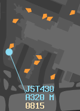

--8<-- "includes/abbreviations.md"

## Splitting
Never ever ever ever ever (ever) deny an offer to split up your sector! It could be someone offering to take:  
- **ELW** from **BLA**  
- **BIK** from **GUN**  
- **SY_DEP** from **SY_APP**  
- **SY-W_GND** from **SY_GND**  
The event gets busy every week, and denying offers to split takes away from the potential pool of controllers to help the event run smoothly. It is better to have a bit of a quieter half an hour, then be ready for the busy rush, than it is to have a decent amount of traffic for half an hour, and get completely snowed under after that.

### Prioritisation
Some sectors generally require splitting more than others. For example, the Melbourne TMA can usually operate without the need for a Departures controller for the whole event (although if there's no room for an S3 anywhere else, it's still worth having), whilst a second/third controller in the Sydney TMA is always extremely beneficial. Enroute splits such as WOL and BLA are also extremely beneficial to balancing the workload of the event.

It can also be beneficial to redistribute the ratings across the event. For example, if Sydney TMA has two or three C1+ controllers on, whilst BLA is covering an offline GUN, it would be prudent for one of the Sydney TMA controllers to move up and cover GUN.

### Projecting
Project **ahead of time** when your sector will be busy, by looking at things like:  
- ADEP Strip List Length  
- Announced Strip List Length  
- Number of Blue Announced tracks on screen  
- Number of Blue Announced tracks when zoomed out  

Use this information to know that you will be busy soon, and put out a request for a split in the [atc-coordination](https://discord.com/channels/343999482737721354/613736441717194755){target=new} discord channel. If you start to encounter things like:  
- Aircraft stepping on each other  
- Multiple aircraft having to ask for further climb/descent  
- Aircraft not listening to your calls  
It may already be too late! And to make matters worse, if you wait too long to ask, there might not be any controllers available to split the sector.

## Pushback Requests on ACD
During the event, the **SMC** controllers may end up with a much higher workload than the **ACD** controllers. Additionally, delays may need to be implemented for aircraft requesting pushback, so as to not overload the taxiways and holding points.

To mitigate this, pushback requests may be done on **ACD** frequency, to balance the workload. See [Pushback Requests on ACD](../../controller-skills/grounddelaymanagement.md#pushback-requests-on-acd) for detailed procedures.

## COBT Slot Times
When the Event plugin is being used to manage slot bookings, aircraft that are compliant with their booked slot time should be moved to the **front** of the queue.

<figure markdown>
{ width="200" }
  <figcaption>COBT Slot Time</figcaption>
</figure>

## Coordination
Regular Coordination with your peers is critical to the efficient operation of a Milk Run. Not only from a control perspective (eg, asking for an early handoff, requesting an amended route, suggested heading for separation between TMA/ENR, etc), but also from a more long-term event management perspective. If things are getting too busy in your airspace, or are about to get very busy, you may elect to:  
- Ask the ADC controller for additional departure spacing  
- Temporarily Stop departures  
- Ask the adjacent Enroute controller for additional spacing  
- (As the TMA Controller) Ask the Enroute controller for an additional **2 minute delay for all aircraft**, due to a **go-around**

It is also important to not accept aircraft that are in conflict! If the TMA controller is trying to handoff two aircraft pointed at each other at the same level, give them a call on the Hotline, and ask them to fix it before handing off to you. Of course you may offer/suggest a solution, but it should not be your conflict to solve.