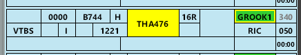

--8<-- "includes/abbreviations.md"

## Runway Modes

| Priority | Mode |
| ---------- | --- |
|  1 | 01 PROPS |
|  2  | 19 PROPS |

*Single Runway* Operations and *SODPROPS* shall not be used.

## Workload Management
Due to the extreme workload expected for all positions, the use of the OzStrips plugin for managing aerodrome positions is **mandatory**. Controllers should familiarise themselves with the plugin and the VATPAC [recommended workflow](../../../../client/towerstrips/#recommended-workflow).

## Airways Clearance Delivery (ACD)
### Flight Plan Compliance
Ensure **all flight plans** are checked for compliance with the approved WF Route:

`DCT SANEG H91 IGDAM H652 TESAT DCT`

**OzStrips** will flag any *non-compliant* WF route.

If an aircraft has filed an *incorrect* route and you need to give an amended clearance, this amendment must be specified by **individual private message**, prior to the PDC.

!!! phraseology
    **BN ACD:** *"AMENDED ROUTE CLEARANCE. CLEARED TO YSSY VIA SANEG H91 IGDAM H652 TESAT DCT. READBACK AMENDED ROUTE IN FULL DURING PDC READBACK. STANDBY FOR PDC."*

### WorldFlight Teams
[WorldFlight Teams](../../../../#official-team-callsigns) will be highlighted by OzStrips and should receive priority at all stages of flight.

<figure markdown>
{ width="500" }
<figcaption>WF Team Highlight in OzStrips</figcaption>
</figure>

### Runway Selection
Runway **01R/19R** will be the primary runway for departures.

**Heavy** and **Super** aircraft **must** be assigned Runway **01R/19R**.

**Medium** and **Light** aircraft *may* be assigned Runway **01L/19L** at the discretion of the ACD controller to balance departing traffic.

!!! note
    Be mindful that 01L/19L Departures will incur additional delays, due to it being the primary arrival runway.

### SID Selection

| Runway | SID |
| ---------- | --- |
| 01L  | BN4 |
| 01R  | SANEG2 |
| 19L  | BN4 |
| 19R  | BN4 |

### Departure Frequency
Departures from Runway 01L and 19L shall be given the BDN frequency (133.45).  
Departures from Runway 01R and 19R shall be given the BDS frequency (118.45).

### PDCs
PDCs will be in use by default, to avoid frequency congestion. ACD shall send a PDC to each aircraft as they connect, prioritising those who connected first. Upon successful readback of the PDC, ACD shall direct the pilot to contact SMC when ready for pushback or taxi.

The [PDC Indicator](../../../client/towerstrips.md#strips) will be displayed on a strip when a PDC has been sent to that pilot.

!!! tip
    OzStrips displays strips in the Preactive bay ordered by connection time. Aircraft who connected first are shown down the bottom of the bay.

Work through the OzStrips Preactive bay from *bottom to top* when sending PDCs.

## Surface Movement Control (SMC)
### Pushback Delays
SMC Domestic and South will be responsible for delaying aircraft's pushback requests, in order to avoid overloading the taxiways.

If there are more than **5** aircraft in the queue at the Holding Point for *any runway*, do not approve any more pushback requests.

#### OzStrips
All aerodrome controllers must be familiar with the VATPAC [recommended workflow](../../../../client/towerstrips/#recommended-workflow) for OzStrips.

Ensure the Queue function is used to actively to keep track of the order of requests.

### A388 Parking
There are only 6 stands suitable for A388 parking (refer to YBBN Apron Chart). If these are all occupied, A388 aircraft must be instructed to park off-apron on grass.

## Tower Control (ADC)
### Departure Spacing
Ensure that a minimum of **90 second** spacing is applied between subsequent departures from the same runway.

### BN4 Assigned Heading
Runway 01L, 19L and 19R Departures will be assigned the **BN4** RADAR SID, with the following Assigned Heading:

| Runway | Assigned Heading |
| ---------- | --- |
| 01L      | H340 |
| 19L      | H090 |
| 19R      | H210 |

## ATIS
### Approach Expectation
#### 01 PROPS

| Cloud Base             | Visibility     | Approach                             |
| -----------------------| -------------- | -------------------------------------|
| >3000FT                | >5000M         | `EXP INDEP VISUAL APCH. DO NOT PASS THRU ASSIGNED RWY CL` |
| Between 2000FT & 3000FT| >5000M         | `EXP INST APCH THEN INDEP VISUAL APCH WHEN VISUAL. DO NOT PASS THRU ASSIGNED RWY CL`|
| Below 2000FT **or**    | <5000M         | `EXP INSTR APCH`                |

#### 19 PROPS

| Cloud Base / Visibility             | Approach                             |
| -----------------------| -------------------------------------|
| >1700FT **and** >5000m  | `EXP INDEP VISUAL APCH. DO NOT PASS THRU ASSIGNED RWY CL` |
| <1700FT **or** <5000m    | `EXP INSTR APCH`                |

### OPR INFO
The ATIS OPR INFO shall include:  
`EXP CLR VIA PDC. INDEPENDENT PARL APPROACHES AND DEPS IN PROGRESS`

## Coordination
### BDN/BDS
#### Auto Release
Available for aircraft assigned `A060`, and:

| Runway | SID | Assigned Heading |
| ---------- | --- | --- |
| 01L  | BN4 | H340 |
| 01R  | SANEG2 | - |
| 19L  | BN4 | H090 |
| 19R  | BN4 | H210 |

#### Departures Controller
Departures from Runway 01L and 19L shall be handed off to BDN.  
Departures from Runway 01R and 19R shall be handed off to BDS.