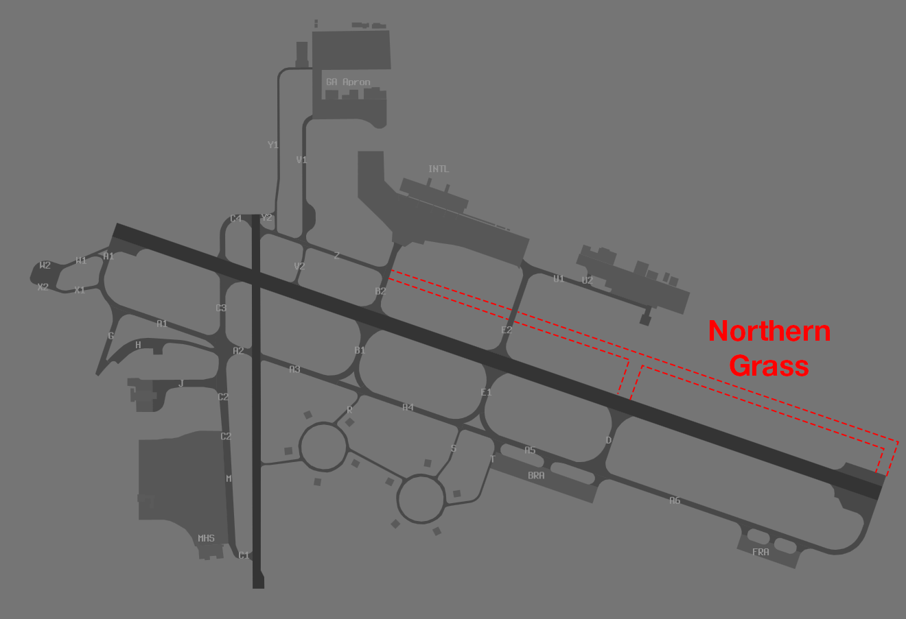

--8<-- "includes/abbreviations.md"

## Workload Management
Due to the extreme workload expected for all positions, the use of the OzStrips plugin for managing aerodrome positions is **mandatory**. Controllers should familiarise themselves with the plugin and the VATPAC [recommended workflow](../../../../client/towerstrips/#recommended-workflow).

## Airways Clearance Delivery (ACD)
### Flight Plan Compliance
Ensure **all flight plans** are checked for compliance with the approved WF Route:

`DCT CS Y177 BN DCT`

**OzStrips** will flag any *non-compliant* WF route.

If an aircraft has filed an *incorrect* route and you need to give an amended clearance, this amendment must be specified by **individual private message**, prior to the PDC.

!!! phraseology
    **CS ACD:** *"AMENDED ROUTE CLEARANCE. CLEARED TO AYPY VIA CS Y177 BN DCT. READBACK AMENDED ROUTE IN FULL DURING PDC READBACK. STANDBY FOR PDC."*

### WorldFlight Teams
[WorldFlight Teams](../../../../#official-team-callsigns) shall have `STS/STATE` added to their remarks, and `WF TEAM` added to their Global Ops Field, to ensure they receive priority.

!!! tip
    The [vatSys Events Plugin](https://github.com/badvectors/EventsPlugin){target=new} will also highlight WF Teams, as shown below. Click on the link to install it, or alternatively, use the [Plugin Manager](https://github.com/badvectors/PluginManager){target=new}

    <figure markdown>
    { width="400" }
    <figcaption>WF Team Highlight with Events Plugin</figcaption>
    </figure>

### SID Selection
Runway 15 Departures shall be issued the **AKROM1** SID.  
Runway 33 Departures shall be issued the **CS2** RADAR SID.  

### Departure Frequency
Regardless of runway in use, departure frequency shall be CS1 (**118.4**).

### PDCs
PDCs will be in use by default, to avoid frequency congestion. ACD shall send a PDC to each aircraft as they connect, prioritising those who connected first. Upon successful readback of the PDC, ACD shall direct the pilot to contact SMC when ready for pushback or taxi.

The [PDC Indicator](../../../client/towerstrips.md#strips) will be displayed on a strip when a PDC has been sent to that pilot.

!!! tip
    OzStrips displays strips in the Preactive bay ordered by connection time. Aircraft who connected first are shown down the bottom of the bay.

Work through the OzStrips Preactive bay from *bottom to top* when sending PDCs.

## Surface Movement Control (SMC)
### Pushback Delays
SMC will be responsible for delaying aircraft's pushback requests, in order to avoid overloading the taxiways.

If there are more than **5** aircraft in the queue at any Holding Point, do not approve any more pushback requests. Instead, use the queue function to keep track of who is awaiting push.

#### OzStrips
All aerodrome controllers must be familiar with the VATPAC [recommended workflow](../../../../client/towerstrips/#recommended-workflow) for OzStrips.

Ensure the Queue function is used to actively to keep track of the order of requests.

### Taxi Routes
#### Grass Taxiing
Due to the taxiway layout at YBCS, a temporary grass taxiway has been established to minimise delays.

<figure markdown>
{ width="700" }
  <figcaption>YBCS Grass Taxiway</figcaption>
</figure>

#### Runway 15
Aircraft from the RPT apron should taxi outbound via **B** and the **grass taxiway** to the full length of runway 15. Aircraft from the GA apron should taxi outbound to holding point **A3** for an intersection departure. If this is not suitable, they should be instructed to taxi via the **western grass** to the full length of runway 15. 

#### Runway 33
Aircraft from the RPT apron should taxi outbound via **B** to holding point **B5** for an intersection departure. Aircraft from the GA apron should taxi outbound to holding point **A4** for an intersection departure.

Backtracks to full length will not be available.

## Tower Control (ADC)
### Departure Spacing
Ensure that a minimum of **90 second** spacing is applied between subsequent departures from the same runway.

### CS2 Assigned Heading
Departures from runway 33 shall be assigned **heading 040**.

### Wake Turbulence Separation
Due to the tight sequence, there are times that [Wake Turbulence Separation](../../../../../../separation-standards/waketurb/#runways) cannot practically be applied.

When a following aircraft is of a *lighter* [Wake Turbulence Category](../../../../../../separation-standards/waketurb/#categories) than the preceding aircraft, a traffic statement and wake turbulence **caution** shall be issued.

!!! phraseology
    **CS ADC:** "BNZ1193, A380 has just departed ahead. Caution Wake Turbulence. Runway 33, Cleared for Takeoff"  
    **BNZ1193:** "Cleared for Takeoff Runway 33, BNZ1193"

## ATIS
The ATIS OPR INFO shall include:  
`EXP CLR VIA PDC, ALL ACFT EXP INTERSECTION DEPARTURE, EXP DEPARTURE DELAYS DUE EVENT`

## Coordination
### CS TCU
Autorelease is available for aircraft assigned `A060`, and:

| Runway | SID | Assigned Heading |
| ---------- | --- | --- |
| 15  | AKROM1 | - |
| 33  | CS2 | H040 |

#### Departures Controller
All departures shall be handed off to CS1.