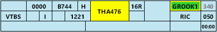

--8<-- "includes/abbreviations.md"

## Temporary Positions
### Aerodrome Controllers
**KA ACD**, a temporary Delivery position, is responsible for all of the [functions of ACD](#airways-clearance-delivery-acd) during the event.

### Terminal Airspace
For the duration of the event, YPKA will be reclassified as a Class C Radar Tower. **KA ADC is not responsible for any airspace**.

All existing Class D airspace is reclassified as Class C and two temporary surveillance TCU units are responsible for the airspace within 31 DME from `SFC` to `F185`. **KA APP** is responsible for the airspace north of the extended runway centreline, **KA DEP** is responsible for the airspace to the south.

## Workload Management
Due to the high workload expected for all positions, the use of the OzStrips plugin for managing aerodrome positions is **mandatory**. Controllers should familiarise themselves with the plugin and the VATPAC [recommended workflow](../../../../../client/towerstrips/#workflow).

!!! tip
    The following OzStrips [keyboard shortcuts](../../../../client/towerstrips.md#keyboard-shortcuts) may assist controllers managing busy frequencies:

    - `T`: Selects the strip of the last aircraft to transmit on frequency  
    - `W`: Highlight the strip of the last aircraft to transmit on frequency

## Airways Clearance Delivery (ACD)
### Flight Plan Compliance
Ensure **all flight plans** are checked for compliance with the approved WorldFlight route:

!!! note "Official Route"
    TODO: YPKA-YBAS: `DCT RAFFY T85 SCHEE DCT`

**OzStrips** will flag any *non-compliant* WF route.

If an aircraft has filed an *incorrect* route and you need to give an amended clearance, this amendment must be specified by **individual private message**, prior to the PDC.

!!! phraseology
    TODO: *"AMENDED ROUTE CLEARANCE. DCT SANEG H91 IGDAM H652 TESAT DCT. READBACK AMENDED ROUTE IN FULL DURING PDC READBACK. STANDBY FOR PDC."*

### WorldFlight Teams
WorldFlight Teams will be highlighted by OzStrips and should receive priority at all stages of flight.

<figure markdown>
{ width="500" }
<figcaption>WF Team Highlight in OzStrips</figcaption>
</figure>

### Departure Instructions
There are no SIDs at YPKA. All airways clearances must continue to follow the standard Class D airways clearance format (i.e. no SID or departure instructions issued in the clearance itself).

### Standard Assignable Level
The [standard assignable level](#auto-release) has been changed for the event. All aircraft must be assigned the lower of RFL and `A040`.

### Departure Frequency
The departure frequency for all aircraft shall be KA DEP (**XXX.X**). TODO:

### PDCs
PDCs will be in use by default, to avoid frequency congestion. ACD shall send a PDC to each aircraft as they connect, prioritising those who connected first. Upon successful readback of the PDC, ACD shall direct the pilot to contact SMC when ready for pushback or taxi.

The [PDC Indicator](../../../../client/towerstrips.md#strips) will be displayed on a strip when a PDC has been sent to that pilot.

!!! tip
    OzStrips displays strips in the Preactive bay ordered by connection time. Aircraft who connected first are shown down the bottom of the bay.

Work through the OzStrips Preactive bay from *bottom to top* when sending PDCs.

## Surface Movement Control (SMC)
### Temporary Aprons & Taxiways
A temporary **WorldFlight Apron** has been established between the main apron and taxiway E, accessible from taxiway F. Taxiway F has also been extended to the runway 26 threshold.

### Pushback Delays
SMC is responsible for delaying aircraft's pushback/taxi requests, in order to avoid overloading the taxiways.

If there are more than **5** aircraft in the queue at the holding point, do not approve any more pushback requests.

!!! note
    The real-world bays are all 'power off' and do not require a pushback for most aircraft. These aircraft will generally request taxi on first contact with SMC and should be queued in the **Cleared Bay** until a departure slot is available.

#### OzStrips
All aerodrome controllers must be familiar with the VATPAC [recommended workflow](../../../../../client/towerstrips/#workflow) for OzStrips.

Ensure the Queue function is used to actively to keep track of the order of requests.

## Tower Control (ADC)
### Departure Spacing
Ensure that a minimum of **2 minutes** spacing is applied between subsequent event departures.

### Departure Instructions
There are no SIDs at YPKA. All aircraft shall be instructed to fly a heading with their takeoff clearance, in accordance with [auto release](#auto-release).

!!! phraseology
    **KA ADC**: "QFA421, turn left heading 180, runway 26, cleared for takeoff"

## ATIS
The ATIS OPR INFO shall include:  
`EXP CLR VIA PDC. EXP DEPARTURE DELAYS DUE EVENT`

## Coordination
### KA TCU
#### Auto Release
Available for aircraft assigned the lower of `A040` and RFL, and:

| Runway | Assigned Headings |
| ------ | ----------------- |
| 08     | H050 H100      |
| 26     | H180 H280      |

Next coordination is required for all non-event aircraft.