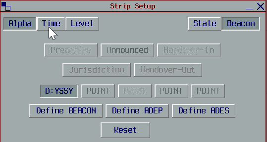
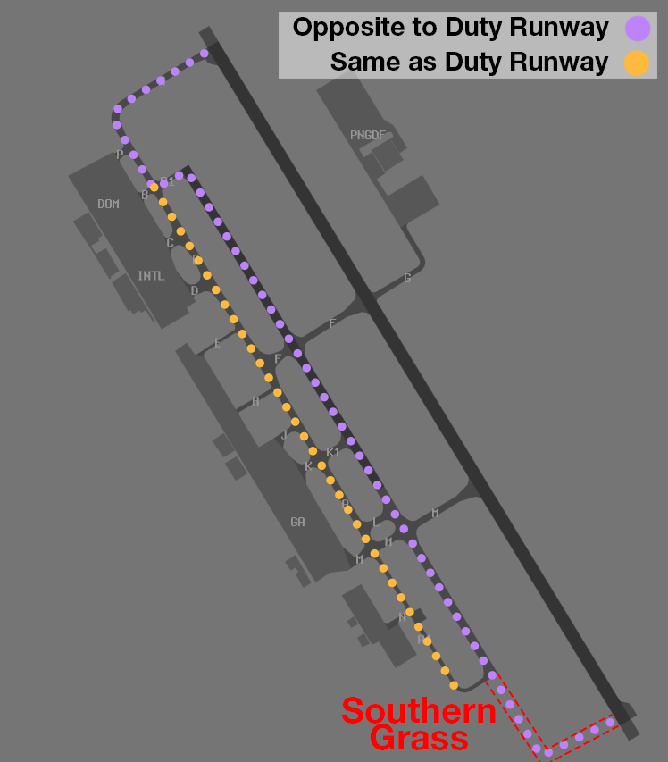

--8<-- "includes/abbreviations.md"

## Positions
An additional Non-Standard position for AYPY ACD will be used

| Name               | ID      | Callsign       | Frequency        | Login ID              |
| ------------------ | --------------| -------------- | ---------------- | --------------------------------------|
| Port Moresby Delivery       | AYPY ACD | Jacksons Delivery             | 124.400 | AYPY_DEL                              |

## Workload Management
Due to the extreme workload expected for all positions, the use of the OzStrips plugin for managing aerodrome positions is **mandatory**. Controllers should familiarise themselves with the plugin and the VATPAC [recommended workflow](../../../../client/towerstrips/#recommended-workflow).

## Airways Clearance Delivery (ACD)
### Flight Plan Compliance
Ensure **all flight plans** are checked for compliance with the approved WF Route:

`DCT PY DCT NUPTA DCT APISO B462 MK V153 MUNAR Y61 RUROX Y177 BN DCT`

**OzStrips** will flag any *non-compliant* WF route.

If an aircraft has filed an *incorrect* route and you need to give an amended clearance, this amendment must be specified by **individual private message**, prior to the PDC.

!!! example
    **AYPY ACD:** *"AMENDED ROUTE CLEARANCE. CLEARED TO YBBN VIA NUPTA DCT APISO B462 MK V153 MUNAR Y61 RUROX Y177 BN DCT. READBACK AMENDED ROUTE IN FULL DURING PDC READBACK. STANDBY FOR PDC."*

### WorldFlight Teams
[WorldFlight Teams](../../#official-team-callsigns) shall have `STS/STATE` added to their remarks, and `WF TEAM` added to their Global Ops Field, to ensure they receive priority.

!!! tip
    The [vatSys Events Plugin](https://github.com/badvectors/EventsPlugin){target=new} will also highlight WF Teams, as shown below. Click on the link to install it, or alternatively, use the [Plugin Manager](https://github.com/badvectors/PluginManager){target=new}

    <figure markdown>
    { width="400" }
    <figcaption>WF Team Highlight with Events Plugin</figcaption>
    </figure>

### Strip Setup
By default, vatSys strips will be set to show in *Alphabetical* Order.  
This must be changed to be ordered by **Time**, as shown below.

<figure markdown>
{ width="500" }
    <figcaption>Strips Menu</figcaption>
</figure>

<figure markdown>
{ width="500" }
    <figcaption>Change to Time</figcaption>
</figure>

### SID Selection
All aircraft shall be issued the **NUPTA1** SID.  

### PDCs
PDCs will be in use by default, to avoid frequency congestion. ACD shall send a PDC to each aircraft as they connect, prioritising those who connected first. Upon successful readback of the PDC, ACD shall direct the pilot to contact SMC when ready for pushback or taxi.

!!! tip
    OzStrips displays strips in the Preactive bay ordered by connection time. Aircraft who connected first are shown down the bottom of the bay.

Work through the OzStrips Preactive bay from *bottom to top* when sending PDCs.

## Surface Movement Control (SMC)
### Runway 14R/32L
Runway 14R/32L will be used for taxiing. The Runway is released to SMC by default.

*Southern Grass* Taxiway shall be used for Runway 32R departures queuing. It may also be used for Runway 14L Arrivals vacating.

Standard taxi directions are shown below.

<figure markdown>
{ width="700" }
  <figcaption>AYPY Standard Taxi Routes</figcaption>
</figure>

### Pushback Delays
SMC will be responsible for delaying aircraft's pushback requests, in order to avoid overloading the taxiways.

If there are more than **5** aircraft in the queue at the Holding Point for the departure runway, do not approve any more pushback requests.

#### OzStrips
All aerodrome controllers must be familiar with the VATPAC [recommended workflow](../../../../client/towerstrips/#recommended-workflow) for OzStrips.

Ensure the Queue function is used to actively to keep track of the order of requests.

A Custom `PDC SENT` bar should be created in the Preactive window, to keep track of who has and hasn't received a PDC.

### A388 Parking
AYPY does not have any gates suitable for A388 parking. A388s must be instructed to park off-apron on the grass, to ensure they do not block any parking spots or taxiways.

## Tower Control (ADC)
### Runway 14R/32L Release
Runway 14R/32L will be used for taxiing. The Runway is released to SMC by default.

### Departure Spacing
Ensure that a minimum of **90 second** spacing is applied between subsequent departures from the same runway.

### Wake Turbulence Separation
Due to the tight sequence, there are times that [Wake Turbulence Separation](../../../../separation-standards/waketurb/#runways) cannot practically be applied.

When a following aircraft is of a *lighter* [Wake Turbulence Category](../../../../separation-standards/waketurb/#categories) than the preceding aircraft, a traffic statement and wake turbulence **caution** shall be issued.

!!! example
    **AYPY ADC:** "ANG3, 747 has just departed. Caution Wake Turbulence. Runway 32L, Cleared for Takeoff"  
    **ANG3:** "Cleared for Takeoff Runway 32L, ANG3"

### Runway Vacating Instructions
To minimise runway occupancy, it is essential that aircraft vacate the runway without delay. ADC shall instruct all arriving aircraft to vacate via the following exits when issued a landing clearance:

| Landing Runway | Exit |
| -------------- | ---- |
| 14L | M |
| 32R | F |

If aircraft miss these exits, they should be instructed to vacate via **A** (landing 32R) or via **the grass** (landing 14L) without delay.

## ATIS
The ATIS OPR INFO shall include:  
`EXP CLR VIA PDC`

## Coordination
#### Auto Release
Available for aircraft assigned:

- A Runway nominated on the ATIS; and
- The **NUPTA1** SID; and
- `A080`