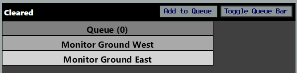
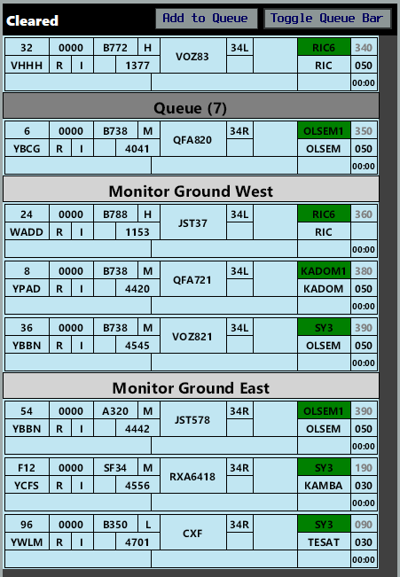

--8<-- "includes/abbreviations.md"

## Positions
An additional Non-Standard position for Sydney ACD will be used

| Name               | ID      | Callsign       | Frequency        | Login ID              |
| ------------------ | --------------| -------------- | ---------------- | --------------------------------------|
| [Sydney (Assistant) Delivery](#dual-acd-controller-operations)     | SY-C_DEL | N/A             | N/A | SY-C_DEL                              |

## Runway Modes
**16 PROPS** and **34 PROPS** are the available Runway Modes, with equal preference. Any other Runway Mode may **only** be used with approval from the Events Coordinator.

## Workload Management
Due to the extreme workload expected for all positions, the use of the OzStrips plugin for managing aerodrome positions is **mandatory**. Controllers should familiarise themselves with the plugin and the VATPAC [recommended workflow](../../../../client/towerstrips/#recommended-workflow). 

## Airways Clearance Delivery (ACD)
### Route Restrictions
Due to the limited capacity of NZAA, pilots must obtain a booking to fly from YSSY to NZAA. Any aircraft without a booking **will not** be issued with a clearance to NZAA and should instead disconnect and refile a flight plan to NZOH (the designated event alternate aerodrome).

**SY-C_DEL** should identify any aircraft who have planned to NZAA without a booking and send the following **private message** via vatSys:

!!! phraseology "Private Message"
    *Event bookings are required for all flights to NZAA. You do not have a valid booking. Clearance not available until after time 0000Z. Amended destination NZOH is available without additional delay if you'd like to refile. Please file route: DCT CAWLY M636 SASRO GULUT DCT*

### Flight Plan Compliance
Ensure **all flight plans** are checked for compliance with the approved WF Routes:

ADES **NZAA**: `DCT EVONN L521 LUNBI DCT`  
ADES **NZOH**: `DCT CAWLY M636 SASRO GULUT DCT`

**OzStrips** will flag any *non-compliant* WF route.

If an aircraft has filed an *incorrect* route and you need to give an amended clearance, this amendment must be specified by **individual private message**, prior to the PDC.

!!! phraseology "Private Message"
    *AMENDED ROUTE CLEARANCE. CLEARED TO NZAA VIA EVONN L521 LUNBI DCT. READBACK AMENDED ROUTE IN FULL DURING PDC READBACK. STANDBY FOR PDC.*

### WorldFlight Teams
[WorldFlight Teams](../../../../#official-team-callsigns) will be highlighted by OzStrips and should receive priority at all stages of flight.

<figure markdown>
{ width="500" }
<figcaption>WF Team Highlight in OzStrips</figcaption>
</figure>

### Dual ACD Controller Operations
YSSY will have a non-standard second ACD Controller.

#### SY-C_DEL
**SY-C_DEL** will be responsible for:

- Checking [Route Restrictions compliance](#route-restrictions)
- Checking [Flight Plan compliance](#flight-plan-compliance)
- Entering Flight Data (Setting [Runway](#runway-selection), [SID](#sid-selection) and [CFL](../../../../aerodromes/classc/Sydney/#auto-release))
- Entering [Assigned Heading](#sid-selection) to OzStrips [Departure Heading field](../../../client/towerstrips.md#strips)
- Sending [PDCs](#pdcs)

SY-C_DEL has *no frequency*, and will not talk to aircraft by voice.

Work through the OzStrips Preactive bay from *bottom to top* when sending PDCs.

#### SY_DEL
**SY_DEL** will be responsible for:

- Handling [PDC](#pdcs) Readbacks
- All the tasks of [SY-C_DEL](#sy-c_del) for aircraft that call for voice clearance

### Runway Selection
By default, assign aircraft the departure runway that corresponds to their departure apron (ie, **16L/34R** on *East* Apron, **16R/34L** on *West* Apron).

#### NZOH Exception
Aircraft with ADES **NZOH** shall be assigned Runway **16R** or **34L**, regardless of departure apron.

### SID Selection
The **SY3** RADAR SID will be in use for all Runways.

**SY-C_DEL** shall enter the appropriate assigned heading into the OzStrips [Departure Heading field](../../../client/towerstrips.md#strips) when assigning the SID, in accordance with the table below:

| Runway | Assigned Heading |
| ---------- | --- |
|  16L  | H140 |
|  16R  | ADES **NZAA**: H320 ADES **NZOH**: H170 |
|  34L  | H170 |
|  34R  | H070 |

### Departure Frequency
Departures Frequency will be as per the following table:

| Runway | ADES | Departures Frequency |
| ---------- | --- | --- |
|  16L  | All | 129.7 |
|  16R  | NZAA NZOH | 123.0 129.7 |
|  34L  | All | 129.7 |
|  34R  | All | 123.0 |

### PDCs
PDCs will be in use by default, to avoid frequency congestion. ACD shall send a PDC to each aircraft as they connect, prioritising those who connected first. Upon successful readback of the PDC, ACD shall direct the pilot to contact Coordinator when ready for pushback or taxi.

The [PDC Indicator](../../../client/towerstrips.md#strips) will be displayed on a strip when a PDC has been sent to that pilot.

!!! tip
    OzStrips displays strips in the Preactive bay ordered by connection time. Aircraft who connected first are shown down the bottom of the bay.

## Coordinator
Coordinator operations shall be conducted in accordance with the Sydney Aerodrome [Coordinator](../../../../aerodromes/classc/Sydney/#sydney-coordinator) procedures, using the OzStrips plugin.

!!! warning "Important"
    Official WorldFlight teams should be afforded priority when requesting pushback or taxi (if no pushback required), and placed ahead of other non-official aircraft.

### OzStrips
All aerodrome controllers must be familiar with the VATPAC [recommended workflow](../../../../client/towerstrips/#recommended-workflow) for OzStrips.

Coordinator must place a `MONITOR GROUND EAST` & `MONITOR GROUND WEST` bar in the **Cleared Bay Queue** and queue any aircraft who request pushback or taxi (if no pushback required) in the Cleared Bay.

<figure markdown>
{ width="500" }
</figure>

When less than **three** strips are present below a particular `MONITOR GROUND` bar, Coordinator may instruct the bottom most aircraft in the queue to monitor that SMC frequency.

<figure markdown>
{ width="500" }
    <figcaption>An example of the Coordinator layout</figcaption>
</figure>

If three strips are already present below a respective bar, any subsequent aircraft who request pushback must be instructed to remain on the Coordinator frequency, and an estimated delay given if known. Place these strips in the **Cleared Bay Queue**, but above the respective `MONITOR GROUND` bars. The bottom-most strip is always at the front of any queue.

!!! phraseology
    **QFA452**: "Sydney Coordinator, Qantas 452, bay 5, request pushback"  
    **SY COORD**: "Qantas 452, Sydney Coordinator, monitor ground 121.7"  
    ...  
    **VOZ318**: "Sydney Coordinator, Velocity 318, bay 39, request pushback"  
    **SY COORD**: "Velocity 318, Coordinator, remain this frequency, approximate 5 minute delay due traffic congestion"

!!! warning "Important"
    Ensure aircraft are [squawking mode C and the correct code](../../../../client/towerstrips/#strips) before instructing them to monitor ground.

### Delay Expectation
Aircraft can expect **extensive** delays for Pushback during the event, possibly *multiple hours*. Try to keep pilots informed of their delay expectation, either by providing a figure in minutes, or a position in the queue.

!!! phraseology
    **JST764**: "Sydney Coordinator, JST764, bay 55, request pushback"  
    **SY COORD**: "JST764, Coordinator, remain this frequency, number 22 in the queue"

## Surface Movement Control (SMC)
### OzStrips
With two SMC controllers online, utilise [strip bay bars](../../../../client/towerstrips/#multiple-adcsmc-positions) to keep the **Taxi** and **Holding Point** strip bays organised.

### Departures
With Coordinator online, aircraft will request pushback on the Coordinator frequency and be told to monitor the applicable SMC frequency when appropriate. These pilots will be waiting for you to initiate contact with them.

When workload (and holding point congestion) allows, issue pushback to the **bottom most** aircraft below the `MONITOR GROUND EAST` or `MONITOR GROUND WEST` bar (as appropriate) and move the strip to the **Pushback Bay**.

!!! warning "Important"
    It is preferable to hold aircraft on the bay (where they aren't blocking taxiways or burning their holding fuel) when congestion leads to blocked holding points. Issue pushback with enough lead time to prevent large gaps in the departure sequence.

### Non-Standard Taxiway Usage
To faciliate departures from both runways, during **34 PROPS only**, the following taxiways shall be utilised exclusively for their listed purpose:

| Taxiway | Usage |
| --- | --- |
| B | Southbound for **RWY 34L** only |
| C | Southbound for **RWY 34R** only |

!!! warning "Important"
    As a result of these taxiway usage assignments, it will not be possible to taxi arriving aircraft to the apron during 34 PROPS.

    Enroute controllers will strongly encourage any inbound aircraft to divert, but should an aircraft land, they should be instructed to disconnect on, or after vacating, the runway.

All departures from **RWY 34L** outbound from the **eastern aprons** (any apron east of RWY 34L) shall be assigned holding point **B10** or **L**.

### A388 Taxi Routes
The YSSY `Aerodrome Ground Movement Chart` specifies taxi routes for A388 aircraft. These must be **disregarded** for the event, and standard taxiways must be used for A388 aircraft to facilitate orderly flow of traffic.

### Eastern Apron to 34L
Aircraft from the *Eastern Apron* assigned Runway **34L** (which may include Heavy traffic and/or NZOH departures) shall be instructed to taxi via **Charlie**, and use Holding Point **Lima** for departure, aircraft performance permitting.

### Separation Assurance
Both SMC positions must be careful to ensure separation is assured at all times, particularly through the complex taxiway intersections at Sydney.

With runways 34L/R in use for departures, SMC East should consider instructing aircraft taxiing southbound on **Charlie** to initially hold short of **Golf** (to avoid conflict with aircraft taxiing from DOM2 and eastward). After crossing the runway, consider instructing aircraft to hold short of **Bravo 10** (to avoid conflict with inbound aircraft from 34R). Inbound aircraft should be instructed to hold short of **Bravo 8** (to give way to aircraft vacating 34L at the rapid exit).

During PROPS, maximum use of runway **07/25** should be utilised to enable an east/westbound split between taxiway **Golf** and the runway.

SMC West should protect the **Alpha 2** rapid exit and utilise taxiways **Yankee** and **Juliet** as a second path for aircraft when **Golf** and **Alpha** are already occupied. Be careful taxiing outbound aircraft south of **Juliet** while an aircraft is landing on runway 34L, as they will plan to vacate via **Alpha 2**.

## Tower Control (ADC)
### OzStrips
With two SMC controllers online, utilise [strip bay bars](../../../../client/towerstrips/#multiple-adcsmc-positions) to keep the **Holding Point** and **Runway** strip bays organised.

### Departure Spacing
While PROPS are in use, subsequent departures from the same runway **must** be spaced by **2 minutes**, to assist with arrival flow in to NZAA.

!!! note
    This spacing may be amended at any time during the event by the Event Coordinator

### SY3 Assigned Heading
Aircraft assigned the **SY3** RADAR SID shall be assigned a heading in accordance with the table below:

| Runway | ADES | Assigned Heading |
| ---------- | --- | --- |
|  16L  | All | H140 |
|  16R  | NZAA NZOH | H320 H170 |
|  34L  | All | H170 |
|  34R  | All | H070 |

!!! note
    **SY-C_DEL** will enter the relevant assigned heading into the OzStrips [Departure Heading field](../../../client/towerstrips.md#strips) when formatting the strip. Ensure the assigned heading is correct, paying particular attention to departures from runway 16R.

### Runway Vacating Instructions
To avoid creating conflict for SMC, ADC shall instruct all arriving aircraft to vacate via the following exits when issued a landing clearance:

| Landing Runway | Exit |
| -------------- | ---- |
| 16R | B7 (left) or A4 (right) |
| 16L | T3 or T4 (depending on aircraft type) |
| 34L | A2 (left) or B9 (right) |
| 34R | T2 or U1 (depending on aircraft type) |

!!! phraseology
    **SY ADC**: "JST554, vacate via B9 to the right, runway 34L, cleared to land"

## ATIS
In addition to all normal OPR INFO entries, the OPR INFO shall include:  
`EXP CLR VIA PDC, ALL ACFT EXP INTERSECTION DEPARTURE, EXP DEPARTURE DELAYS DUE EVENT, DESTINATION AUCKLAND ONLY AVBL WITH EVENT BOOKING FM TIME 2100 TIL TIME 0000`

## Coordination
### SY TCU
#### Auto Release
Standard as per [YSSY Local Instructions](../../../../aerodromes/classc/Sydney/#auto-release), with the exception of auto-release being available for aircraft assigned the SY3 SID with the [Standard Assignable Heading](#sy3-assigned-heading)

#### Departures Controller
Departures Controller will be as per the following table:

| Runway | ADES | Departures Controller |
| ---------- | --- | --- |
|  16L  | All | SDS |
|  16R  | NZAA NZOH | SDN SDS |
|  34L  | All | SDS |
|  34R  | All | SDN |