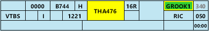
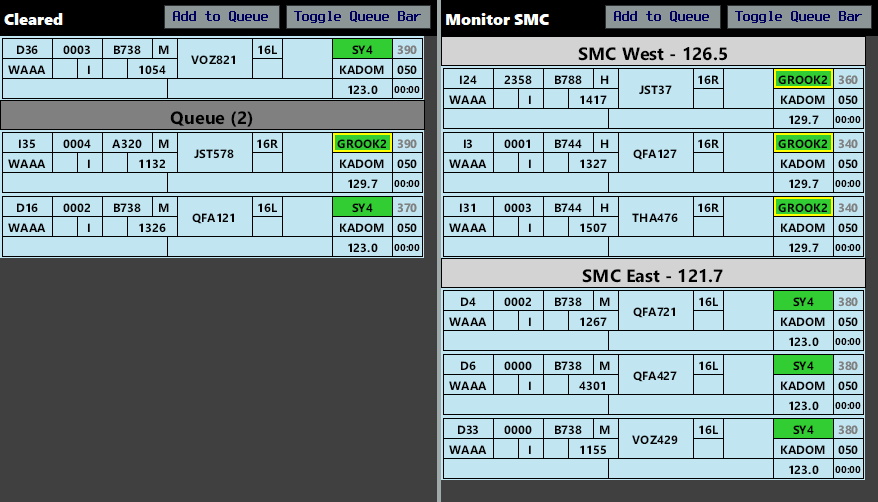

--8<-- "includes/abbreviations.md"

## Positions
An additional Non-Standard position for Sydney ACD will be used

| Name               | ID      | Callsign       | Frequency        | Login ID              |
| ------------------ | --------------| -------------- | ---------------- | --------------------------------------|
| [Sydney (Assistant) Delivery](#dual-acd-controller-operations)     | SY-C_DEL | N/A             | N/A | SY-C_DEL                              |

## Runway Modes
**16 PROPS** and **34 PROPS** are the *preferred* Runway Modes, with equal preference.

Due to the nature of the event, a non-standard maximum crosswind limitation has been approved up to **30 knots**. A single runway mode should only be considered if the crosswind exceeds this figure.

## Workload Management
Due to the high workload expected for all positions, the use of the OzStrips plugin for managing aerodrome positions is **mandatory**. Controllers should familiarise themselves with the plugin and the VATPAC [recommended workflow](../../../../../client/towerstrips/#workflow). 

!!! tip
    The following OzStrips [keyboard shortcuts](../../../../client/towerstrips.md#keyboard-shortcuts) may assist controllers managing busy frequencies:

    - `T`: Selects the strip of the last aircraft to transmit on frequency  
    - `W`: Highlight the strip of the last aircraft to transmit on frequency

## Airways Clearance Delivery (ACD)
### Connection Restrictions
To stagger the flow of traffic, pilots are expected to obtain a connection slot from the WorldFlight website. Controllers **are not** required to monitor compliance with connection slots and the slots do not impact pushback or departure spacing.

### Flight Plan Compliance
Ensure **all flight plans** are checked for compliance with the approved WorldFlight route:

!!! note "Official Route"
    TODO: YSSY-WAAA: `DCT EVONN L521 LUNBI DCT`

**OzStrips** will flag any *non-compliant* route.

If an aircraft has filed an *incorrect* route and you need to give an amended clearance, this amendment must be specified by **individual private message**, prior to the PDC.

!!! phraseology "Private Message"
    TODO: *AMENDED ROUTE CLEARANCE. CLEARED TO WAAA VIA EVONN L521 LUNBI DCT. READBACK AMENDED ROUTE IN FULL DURING PDC READBACK. STANDBY FOR PDC.*

### WorldFlight Teams
WorldFlight Teams will be highlighted by OzStrips and should receive priority at all stages of flight.

<figure markdown>
{ width="500" }
<figcaption>WF Team Highlight in OzStrips</figcaption>
</figure>

### Dual ACD Controller Operations
YSSY will have a non-standard second ACD Controller.

#### SY-C_DEL
**SY-C_DEL** will be responsible for:

- Checking [Flight Plan compliance](#flight-plan-compliance)
- Entering Flight Data (Setting [Runway](#runway-selection), [SID](#sid-selection) and [CFL](../../../../../aerodromes/classc/sydney/#auto-release))
- Sending [PDCs](#pdcs)

SY-C_DEL has *no frequency*, and will not talk to aircraft by voice.

Work through the OzStrips Preactive bay from *bottom to top* when sending PDCs.

#### SY_DEL
**SY_DEL** will be responsible for:

- Handling [PDC](#pdcs) Readbacks
- All the tasks of [SY-C_DEL](#sy-c_del) for aircraft that call for voice clearance

### Runway Selection
By default, assign aircraft the departure runway that corresponds to their departure apron (ie, **16L/34R** on *East* Apron, **16R/34L** on *West* Apron).

### SID Selection
Aircraft departing from runways 16R/34L shall be assigned a SID as per normal [YSSY SID selection](../../../aerodromes/classc/sydney.md#sid-selection).

All aircraft departing from runways 16L/34R shall be assigned the **SY (RADAR)** SID.

### Departure Frequency
Departures Frequency will be as per the following table:

| Runway | ADES | Departures Frequency |
| ---------- | --- | --- |
|  16L  | All | 123.0 |
|  16R  | All | 129.7 |
|  34L  | All | 123.0 |
|  34R  | All | 129.7 |
|  07  | All | As per normal ops |
|  25  | All | As per normal ops |

### PDCs
PDCs will be in use by default, to avoid frequency congestion. SY-C_DEL shall send a PDC to each aircraft as they connect, prioritising those who connected first. Upon successful readback of the PDC, ACD shall direct the pilot to contact Coordinator when ready for pushback or taxi.

The [PDC Indicator](../../../../client/towerstrips.md#strips) will be displayed on a strip when a PDC has been sent to that pilot.

!!! tip
    OzStrips displays strips in the Preactive bay ordered by connection time. Aircraft who connected first are shown down the bottom of the bay.

## Coordinator
Coordinator operations shall be conducted in accordance with the Sydney Aerodrome [Coordinator](../../../../../aerodromes/classc/sydney/#sydney-coordinator) procedures, using OzStrips.

!!! warning "Important"
    Official WorldFlight teams should be afforded priority when requesting pushback or taxi (if no pushback required), and placed ahead of other non-official aircraft.

### OzStrips
All aerodrome controllers must be familiar with the VATPAC [recommended workflow](../../../../../client/towerstrips/#workflow) for OzStrips.

Coordinator must place bars in the **Monitor SMC Bay** to split the bay between the East and West SMC positions.

When an aircraft requests pushback (or taxi, if no pushback is required), they should be queued in the **Cleared Bay**. When less than **three** strips are present below a particular `STANDBY FOR GROUND` bar in the **Monitor SMC Bay**, Coordinator may instruct the bottom most aircraft in the queue to standby for that SMC frequency.

<figure markdown>
{ width="800" }
</figure>

If three strips are already present below a respective bar, any subsequent aircraft who request pushback must be instructed to remain on the Coordinator frequency, and an estimated delay given if known. Place these strips in the **Cleared Bay Queue**, but above the respective `STANDBY FOR GROUND` bars. The bottom-most strip is always at the front of any queue.

!!! phraseology
    **QFA452**: "Sydney Coordinator, Qantas 452, bay 5, request pushback"  
    **SY COORD**: "Qantas 452, Sydney Coordinator, standby for ground 121.7"  
    ...  
    **VOZ318**: "Sydney Coordinator, Velocity 318, bay 39, request pushback"  
    **SY COORD**: "Velocity 318, Coordinator, remain this frequency, approximate 15 minute delay due traffic congestion, you're number four in the queue"

!!! warning "Important"
    Ensure aircraft are [squawking mode C and the correct code](../../../../../client/towerstrips/#strips) before instructing them to standby for ground.

### Delay Expectation
Aircraft can expect **extensive** delays for pushback during the event, possibly *over an hour*. Try to keep pilots informed of their delay expectation, either by providing a figure in minutes, or a position in the queue.

!!! phraseology
    **JST764**: "Sydney Coordinator, JST764, bay 55, request pushback"  
    **SY COORD**: "JST764, Coordinator, remain this frequency, number 22 in the queue"

!!! tip
    Where delays are excessive, it is recommended that Coordinator provide regular broadcasts to all pilots regarding the next few aircraft to receive pushback approval. The queue can also be viewed by pilots by accessing the [Ops Dashboard](https://cdm.maxrumsey.xyz/ops).

## Surface Movement Control (SMC)
### OzStrips
With two SMC controllers online, utilise [strip bay bars](../../../../../client/towerstrips/#multiple-adcsmc-positions) to keep the **Taxi** and **Holding Point** strip bays organised.

### Departures
With Coordinator online, aircraft will request pushback on the Coordinator frequency and be told to standby for the applicable SMC frequency when appropriate. These pilots will be waiting for you to initiate contact with them.

When workload (and holding point congestion) allows, issue pushback to the **bottom most** aircraft below the `STANDBY FOR GROUND EAST` or `STANDBY FOR GROUND WEST` bar (as appropriate) and move the strip to the **Pushback Bay**.

!!! warning "Important"
    It is preferable to hold aircraft on the bay (where they aren't blocking taxiways or burning their holding fuel) when congestion leads to blocked holding points. Issue pushback with enough lead time to prevent large gaps in the departure sequence.

### Separation Assurance
Both SMC positions must be careful to ensure separation is assured at all times, particularly through the complex taxiway intersections at Sydney.

With runways 34L/R in use for departures, SMC East should consider instructing aircraft taxiing southbound on **Charlie** to initially hold short of **Golf** (to avoid conflict with aircraft taxiing from DOM2 and eastward). After crossing the runway, consider instructing aircraft to hold short of **Bravo 10** (to avoid conflict with inbound aircraft from 34R). Inbound aircraft should be instructed to hold short of **Bravo 8** (to give way to aircraft vacating 34L at the rapid exit).

During PROPS, maximum use of runway **07/25** should be utilised to enable an east/westbound split between taxiway **Golf** and the runway.

SMC West should protect the **Alpha 2** rapid exit and utilise taxiways **Yankee** and **Juliet** as a second path for aircraft when **Golf** and **Alpha** are already occupied. Be careful taxiing outbound aircraft south of **Juliet** while an aircraft is landing on runway 34L, as they will plan to vacate via **Alpha 2**.

### A388 Taxi Routes
The YSSY `Aerodrome Ground Movement Chart` specifies taxi routes for A388 aircraft. These must be **disregarded** for the event, and standard taxiways must be used for A388 aircraft to facilitate orderly flow of traffic.

## Tower Control (ADC)
### OzStrips
With two SMC controllers online, utilise [strip bay bars](../../../../../client/towerstrips/#multiple-adcsmc-positions) to keep the **Holding Point** and **Runway** strip bays organised.

### Departure Instructions
All aircraft departing from runway 16L/34R will be assigned the **SY (RADAR)** SID. The standard assignable heading shall be used for these aircraft.

To simplify operations in the TMA, all aircraft from runway 16R/34L shall be transferred to SDS (129.7) and all aircraft from runway 16L/34R shall be transferred to SDN (123.0).

### Runway Vacating Instructions
To avoid creating conflict for SMC, ADC shall instruct all arriving aircraft to vacate via the following exits when issued a landing clearance:

| Landing Runway | Exit |
| -------------- | ---- |
| 16R | B7 (left) or A4 (right) |
| 16L | T3 or T4 (depending on aircraft type) |
| 34L | A2 (left) or B9 (right) |
| 34R | T2 or U1 (depending on aircraft type) |

!!! phraseology
    **SY ADC**: "JST554, vacate via B9 to the right, runway 34L, cleared to land"

## ATIS
In addition to all normal OPR INFO entries, the OPR INFO shall include:  
`EXP CLR VIA PDC, EXP DEPARTURE DELAYS DUE EVENT`