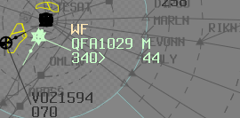

--8<-- "includes/abbreviations.md"

## Sector Responsibilities
### Ocean (OCN)
OCN will receive two NZAA-bound flows from SY TCU. These flows must be merged by GEROS.

!!! warning "Important"
    Ensure adequate vertical separation exists between nearby aircraft and provide proactive level assignments if necessary to maintain separation assurance for all downstream sectors.

OCN will also receive a single NZOH-bound flow from SY TCU, positioned south of the NZAA flows.

### Tasman (TSN)
TSN will have temporary surveillance coverage provided by additional floating ADS-B stations in the sector. Normal surveillance separation standards may be used between all identified aircraft.

### All Other Sectors
Due to the sheer volume of traffic departing from YSSY, arrivals will **not be possible** during the departure event. Any aircraft inbound to YSSY should be strongly encouraged to divert to another aerodrome.

## WorldFlight Teams
[WorldFlight Teams](../../../../#official-team-callsigns) will be highlighted by default and should receive priority at all stages of flight.

<figure markdown>
{ width="400" }
<figcaption>WF Team Highlight</figcaption>
</figure>

## Coordination
### SY TCU to OCN
Voiceless for all aircraft:

- Assigned the lower of `F280` or the `RFL`; and  
- Tracking via **GEROS** or **PLUGA**; or  
- Assigned **H070**

All other aircraft going to OCN CTA will be **Heads-up** Coordinated.

### OCN and WOL
WOL will have *No Restrictions or Requirements* on Event traffic. Aircraft transiting WOL airspace can be handed off directly from SY TCU to OCN.

### OCN to TSN
Voiceless for all aircraft tracking via **GEROS**.

All other aircraft going to TSN CTA will be **Heads-up** Coordinated.

### TSN to NZZO
Voiceless for all aircraft tracking via **LEGAN**.

All other aircraft going to NZZO CTA will be **Heads-up** Coordinated.