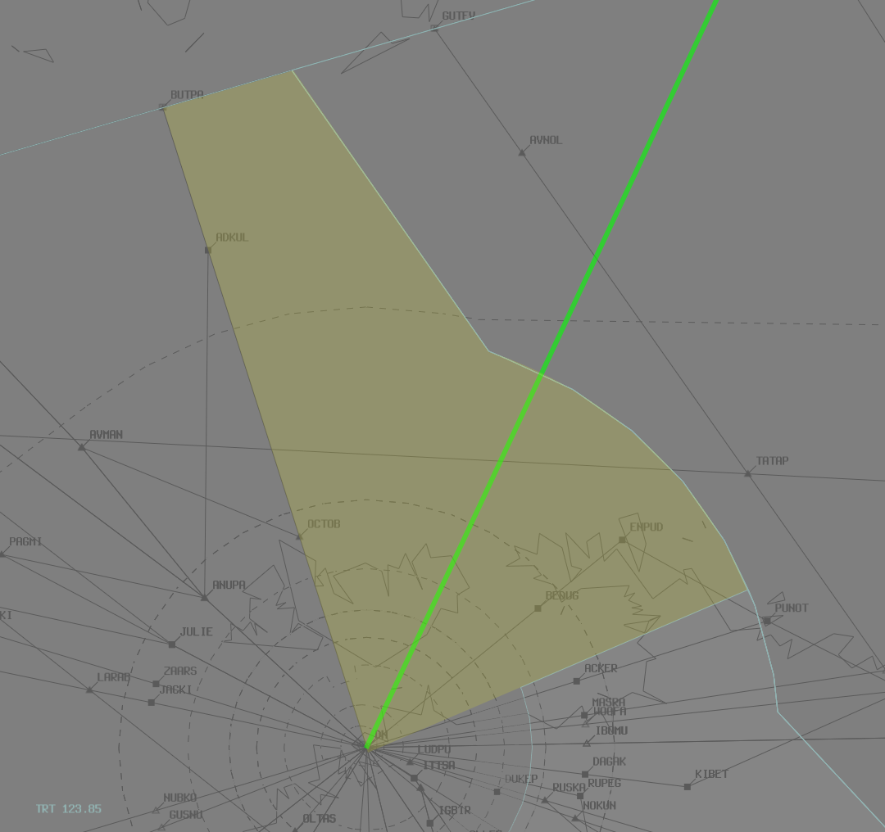

--8<-- "includes/abbreviations.md"

## Sector Responsibilities
### Territory (TRT)
TRT is responsible for issuing STAR Clearances and all sequencing actions in to YPDN.

TRT will be responsible for the TRT subsector **only**.

See below for details on the [TRT Release](#trt-release) when ARA is online.

#### STARs
All aircraft shall be issued the **ANUPA1A** STAR.  

#### Sequencing
**All aircraft** must be instructed to cross **ANUPA** at **250 knots**, then *published STAR speeds*.

!!! note
    This instruction is not required for aircraft that have a clear gap in front of them in the sequence (>30nm).

Minimum distance between arrivals at handoff to DAW is **10nm** (with no significant closing speed). It is important to try not to exceed **15nm**, due to the large number of arrivals.

##### MAESTRO
If a Flow controller is online, the [MAESTRO](../../../client/maestro.md) plugin should be used to determine the landing sequence. Enroute positions must ensure they comply with any sequencing instructions set out by Flow and communicated through the plugin.

!!! note
    The MAESTRO plugin has been included in the Australia dataset by default for the event.

## WorldFlight Teams
[WorldFlight Teams](../../../../#official-team-callsigns) will be highlighted by default and should receive priority at all stages of flight.

<figure markdown>
{ width="400" }
<figcaption>WF Team Highlight</figcaption>
</figure>

## Coordination
### WAAF CTR to TRT
As per [standard TRT coordination procedures](../../../../../../enroute/Brisbane Centre/TRT/#international-waaf), all aircraft should be **Heads-up Coordinated** by WAAF CTR prior to **30 mins** from boundary.

!!! tip
    It may be prudent (especially if they are using vatSys) to set up a Voiceless Coordination Agreement with WAAF CTR, in order to reduce workload for both controllers.

### TRT to DAW
Standard as per [TRT Local Instructions](../../../../../../enroute/Brisbane Centre/TRT/#arrivalsoverfliers).

### TRT Release
When ARA is online, the highlighted portion of TRT is released to ARA to facilitate YPDN departures to WAJJ

<figure markdown>
{ width="500" }
<figcaption>TRT Airspace Release</figcaption>
</figure>