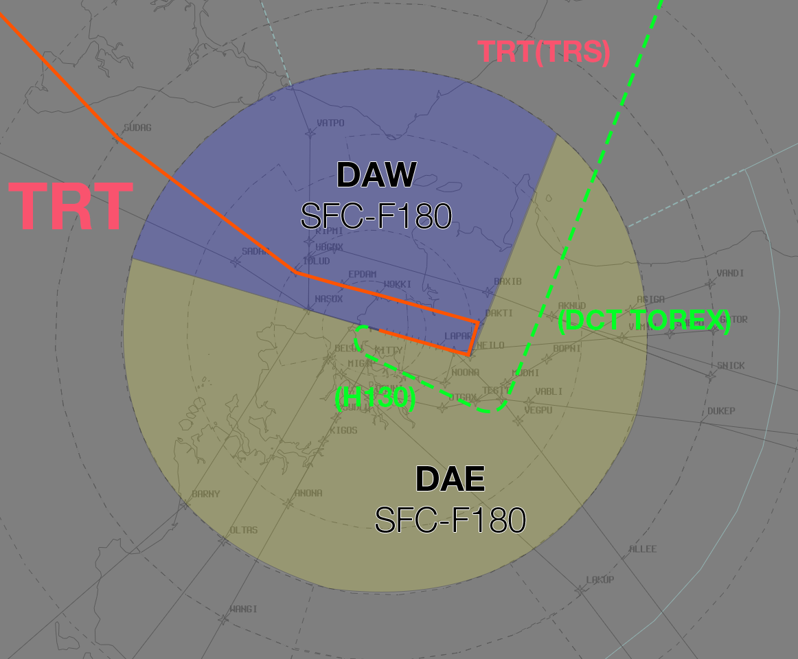
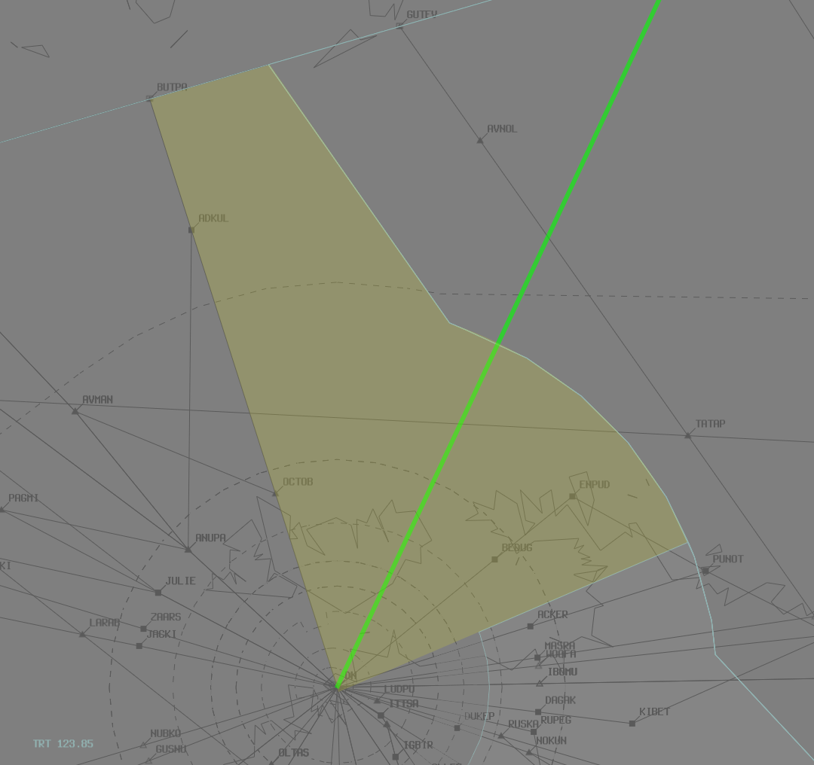

--8<-- "includes/abbreviations.md"

## Airspace Division
### Runway 11
Standard airspace division will be in use as per [DN TCU Local Instructions](../../../../../../terminal/darwin/#airspace-division).

### Runway 29
Non-Standard airspace division will be in use.

The solid red line represents the ANUPA STAR.  
The dashed green line represents the recommended vectors for departing aircraft.

<figure markdown>
{ width="700" }
  <figcaption>Runway 29 Airspace Division</figcaption>
</figure>

## Runway 29 Departures
Departures from Runway 29 will call DAE on an assigned heading of **H130**. These aircraft should be climbed to the south and then cleared DCT **TOREX** when clear of the arrival corridor.

## Flow
### Speeds
TRT will instruct all arrivals to cross **ANUPA** at **250 knots**, then *published STAR speeds*.

## WorldFlight Teams
[WorldFlight Teams](../../../../#official-team-callsigns) will be highlighted by default and should receive priority at all stages of flight.

<figure markdown>
{ width="400" }
<figcaption>WF Team Highlight</figcaption>
</figure>

## Coordination
### DN ADC
#### Auto Release
Available for aircraft assigned `A050`, and:

| Runway | SID | Assigned Heading |
| ---------- | --- | --- |
| 11 | DN7 | H030 |
| 29 | DN7 | H130 |

### DAE to ARA
An airspace release from TRT will allow ARA to take ownership of all airspace from the southeastern boundary, north to the outbound leg route. All event aircraft shall be handed to ARA, **not TRT**.

<figure markdown>
{ width="500" }
<figcaption>TRT Airspace Release</figcaption>
</figure>

Voiceless for all aircraft:

- Assigned the lower of `F180` or the `RFL`; and  
- Tracking via **TOREX**

All other aircraft going to ARA CTA will be **Heads-up** Coordinated.

### TRT to DN TCU
Standard as per [DN TCU Local Instructions](../../../../../../terminal/darwin/#arrivals)