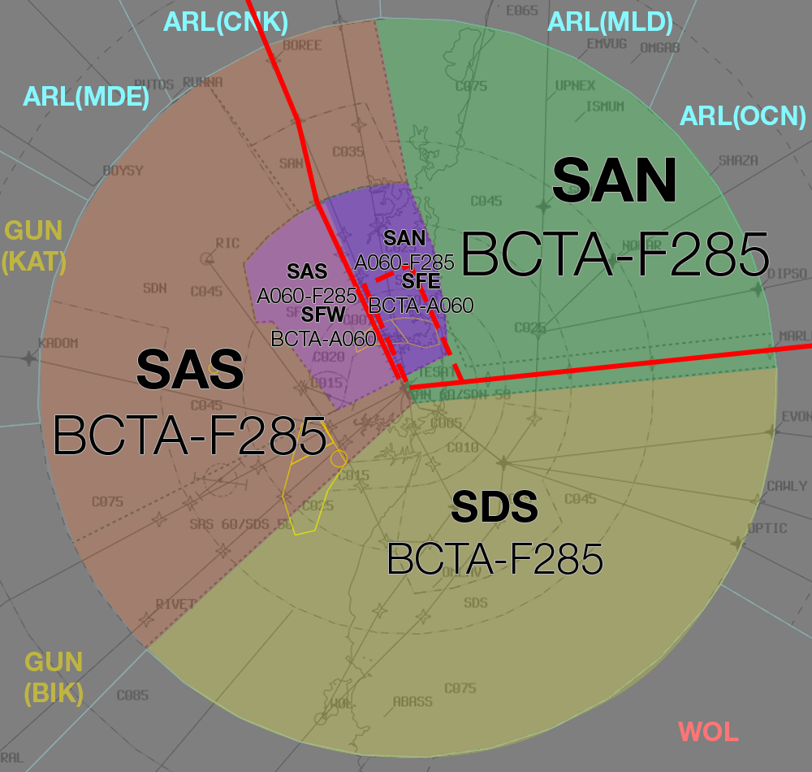

--8<-- "includes/abbreviations.md"

## Airspace Division
Non-Standard airspace division will be in use.

SAS shall handle all arrivals from the north and west via **BOREE**, **MEPIL**, **RIVET**, and **WELSH**. These aircraft will be processed for RWY 16R/34L.

SAN shall handle all arrivals from the east via **MARLN**. These aircraft will be processed for RWY 16L/34R.

### 16 PROPS

<figure markdown>
{ width="700" }
  <figcaption>16 PROPS Airspace Division</figcaption>
</figure>

### 34 PROPS

<figure markdown>
{ width="700" }
  <figcaption>34 PROPS Airspace Division</figcaption>
</figure>

### Approach Expectation
All arrivals will be cleared for the Approach type indicated on the ATIS.

#### Independent Visual Approaches
IVAs can be expected to be in use for WorldFlight, to facilitate the high volume of traffic for both runways.

Aircraft must report the **runway in sight** (or **visual** if established on the final approach course) in order to be cleared for an IVA (Runway in Sight implies Visual).

!!! tip
    The [Label Data Annotations](../../../../../../client/annotations/#miscellaneous) for these are `V` for *Visual*, and `R` for *Runway in Sight*

Ensure you familiarise yourself with the applicable [Separation Standards](../../../../../../separation-standards/parallelapps/#independent-visual-approaches)

Pass *Traffic Information* on aircraft that will come within **1nm** of each other on parallel approaches.

!!! phraseology
    **SFW:** "NPT11W, traffic is a 767 ahead for the parallel runway"

## WorldFlight Scenic Arrival
Most offical WorldFlight teams will conclude the event by flying the Scenic Arrival, including a low-level flight through Sydney Harbour. This procedure is flown OCTA until east of Harbour Bridge (HBB).

Aircraft will be transferred to SAN assigned `A090` tracking from **WLM** to **LRF**. Clear these aircraft to leave CTA on descent with a requirement to be established **OCTA by LRF**.

!!! phraseology
    *'QFA25, leave controlled airspace descending, requirement to be established OCTA by LRF'*

From LRF, the aircraft will descend to `A005` and track `LRF HSY RYB HBB`. Passing HBB to the east, they will climb to `A015` and turn direct to YSSY to join the circuit for RWY 16L/34R. 

Participating aircraft will transfer to SY ADC on their own as they approach the circuit.

<figure markdown>
{ width="600" }
</figure>

[WorldFlight Teams](../../../../#official-team-callsigns) will be highlighted by default and should receive priority at all stages of flight.

<figure markdown>
{ width="400" }
<figcaption>WF Team Highlight</figcaption>
</figure>

### Late Arrivals
When the first wave of participating aircraft arrive, RWY 16L/34R will be blocked off for a period of approximately 30 minutes. During this window, only participating aircraft may land on the runway.

Once the window closes, all event aircraft will be divided between the parallel runways and the scenic arrival will not be available. If an official team aircraft misses the window and requests the scenic arrival, **SFL** must be informed. They will determine whether the procedure is available.

## Sector Distribution
In order to balance workload effectively, it is recommended to distribute responsibility for the Sydney TCU sectors accordingly:

### Two Controllers Online

- SAS and SFW combined
- SAN and SFE combined
- No SFL

### Three Controllers Online

- SAS and SFW combined
- SAN and SFE combined
- SFL on its own

### Four Controllers Online

- SAS and SAN combined
- SFW on its own
- SFE on its own
- SFL on its own

## Flow
SFL will formulate the sequence in accordance with the [SY TCU Flow Table](../../../../../../terminal/sydney/#flow). Ensure that event traffic gets priority over non-event traffic.

!!! warning "Important"
    It is likely that during the event, there will be **no opportunity** for non-event traffic to be sequenced for a landing at YBBN. Flow should determine whether an approach slot is available and inform the appropriate enroute controller if a diversion to another aerodrome is necessary.

SFL will construct the sequence via the [Arrivals List Window](../../../../../../controller-skills/sequencing/#arrivals-list).

Appropriate annotations for the Arrivals List Window can be found [here](../../../../../../client/annotations/#sequencingflow).

### Speeds
CNK/OCN will instruct all arrivals to cross the feeder fix at **250 knots**, then *published STAR speeds*.

## Coordination
### APP to DIR
Standard as per [SY TCU Local Instructions](../../../../../../terminal/sydney/#app-dir).

### CNK to SAS/SAN
Standard as per [SY TCU Local Instructions](../../../../../../terminal/sydney/#arrivals).

#### Between ARL/CNK/OCN and SFL
SFL must **voice coordinate** any changes to instructions after ARL/CNK has put a `<` on it.

SFL must **voice coordinate** to ARL/CNK any aircraft that must be rerouted via **RIKNI MARLN** for **16L/34R**.

!!! phraseology
    **SFL** -> **ARL**: "ANZ361 via MARLN for 34R please"  
    **ARL** -> **SFL**: "ANZ361 via MARLN for 34R, will be"  

ARL/CNK/OCN must **voice coordinate** any requests for *Track Shortening* or *CSR* to SFL.