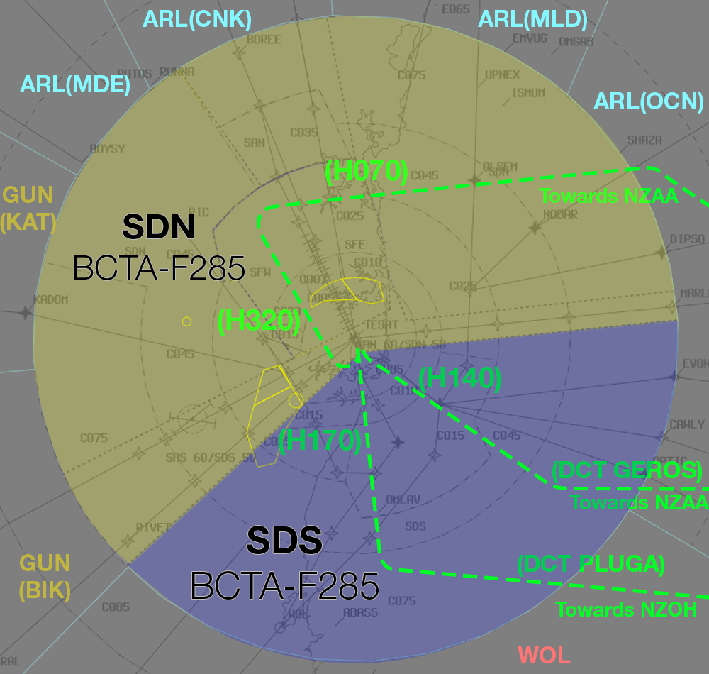
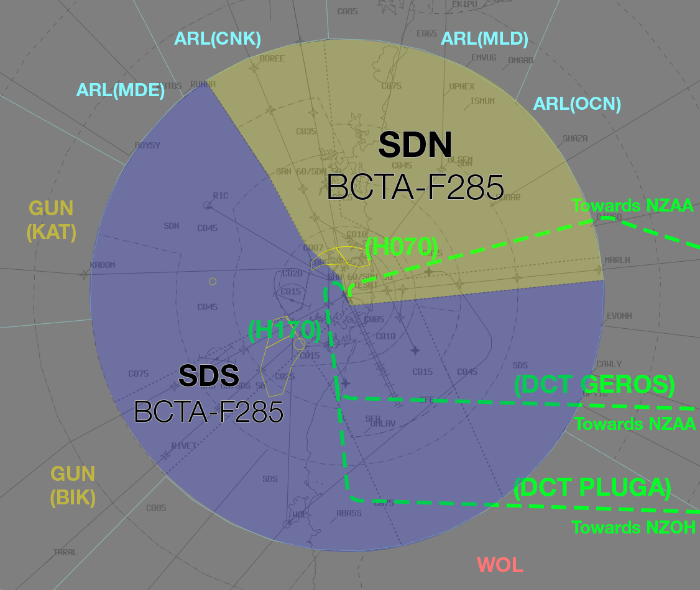

--8<-- "includes/abbreviations.md"

## Airspace Division
Non-Standard airspace division will be in use.

The **dashed** green lines represent the suggested vectors for [SY3 departures](#sy3-departures).

### 16 PROPS

<figure markdown>
{ width="700" }
  <figcaption>16 PROPS Airspace Division</figcaption>
</figure>

### 34 PROPS

<figure markdown>
{ width="700" }
  <figcaption>34 PROPS Airspace Division</figcaption>
</figure>

## SY3 Departures
Departures from all runways will be assigned the **SY3** SID with an assigned heading in accordance with the table below:

| Runway | ADES | Assigned Heading |
| ---------- | --- | --- |
|  16L  | All | H140 |
|  16R  | NZAA NZOH | H320 H170 |
|  34L  | All | H170 |
|  34R  | All | H070 |

Aircraft for **NZAA** shall be subsequently processed with the following tracking instructions:

| Departure Runway | Tracking Instructions |
| --- | --- |
| 16L | **H140** until approx 30DME, then **DCT GEROS** |
| 16R | **H320** until approx 15DME, then **H070** |
| 34L | **H170** until approx 20DME, then **DCT GEROS** |
| 34R | **H070** |

Aircraft for **NZOH** shall be subsequently processed with the following tracking instructions:

| Departure Runway | Tracking Instructions |
| --- | --- |
| 16R | **H170** until south of the NZAA stream, then **DCT PLUGA** |
| 34L | **H170** until south of the NZAA stream, then **DCT PLUGA** |

Aircraft shall be handed off to OCN assigned the **final instruction** in the tables above.

## WorldFlight Teams
[WorldFlight Teams](../../../../#official-team-callsigns) will be highlighted by default and should receive priority at all stages of flight.

<figure markdown>
{ width="400" }
<figcaption>WF Team Highlight</figcaption>
</figure>

## Coordination
### SY ADC
#### Auto Release
Standard as per [YSSY Local Instructions](../../../../aerodromes/classc/Sydney/#auto-release), with the exception of auto-release being available for aircraft assigned the SY3 SID with the [Standard Assignable Heading](#sy3-assigned-heading)

#### Departures Controller
Departures Controller will be as per the following table:

| Runway | ADES | Departures Controller |
| ---------- | --- | --- |
|  16L  | All | SDS |
|  16R  | NZAA NZOH | SDN SDS |
|  34L  | All | SDS |
|  34R  | All | SDN |

### OCN
Voiceless for all aircraft:

- Assigned the lower of `F280` or the `RFL`; and  
- Tracking via **GEROS** or **PLUGA**; or  
- Assigned **H070**

All other aircraft going to OCN CTA will be **Heads-up** Coordinated.

!!! tip
    Ensure assigned headings are [annotated appropriately](../../../../client/annotations/#route-and-positions) in the aircraft's label data field, to provide situational awareness to receiving controllers

### WOL
WOL will have *No Restrictions or Requirements* on Event traffic. Aircraft transiting WOL airspace can be handed off directly to OCN.