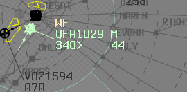
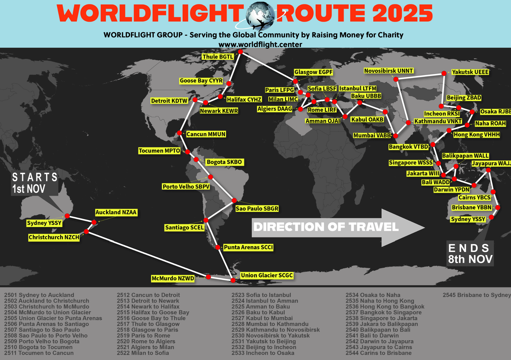

--8<-- "includes/abbreviations.md"

Welcome to the controller briefing material for WorldFlight!

WorldFlight 2026 is currently in the planning stages. Event-specific procedures will be released closer to the date of the event. See the [WorldFlight website](https://www.worldflight.center/){target=new} for the latest updates on this year's instalment!

### Previous WorldFlight Instalments
The controller briefing material for each WorldFlight are tailored specifically to that instalments' route and traffic levels. Previous controller briefings are available below, for archival reference.

- **[WorldFlight 2024](../archive/worldflight-2024)**
- **[WorldFlight 2025](../archive/worldflight-2025)**

!!! note
    The material in the WorldFlight archive is provided for reference only, and is not actively maintained. While every effort is taken to ensure the material remains accessible, there may be references to other parts of the SOPs which have since been made obsolete.

<!--

Event-specific procedures are sorted by position type and should be read in conjunction with the existing SOPs for that position/location.

## Official Team Callsigns
Official WorldFlight teams should be afforded priority at all stages of flight. 

OzStrips will flag official WorldFlight teams and the Events Plugin will highlight team aircraft for TCU and enroute controllers.

<figure markdown>
{ width="500" }
<figcaption>WF Team Highlight in OzStrips</figcaption>
</figure>

<figure markdown>
{ width="400" }
<figcaption>WF Team Highlight</figcaption>
</figure>

The list of callsigns is below:

| Callsign | Aircraft Type | Team Name | 
| -------- | ------------- | --------- |
| ANZ361 | B738 | Hamilton |
| ANZ362 | B738 | Hamilton |
| ANZ363 | B738 | Hamilton |
| ASY121 | A332 | Simflite AU |
| BAW47C | B744 | Simfest UK |
| CVY44N | B744 | Team Covey |
| DAL209 | B738 | WorldFlight USA |
| DAL2507 | B738 | Cali Crew |
| EXS25N | B738 | Ness Aviation |
| GTI1471 | B744 | WorldFlight Perth |
| JHL44 | A320 | Team JeeHell |
| KLM2064 | B738 | Amsterdam 737 Club |
| NPT11W | B738 | Velocity UK |
| NWA179 | B743 | Jurrasic Jets |
| QFA25 | B744 | WorldFlight AU |
| RYR7MA | B738 | Ascent Aviation |

## Route
<figure markdown>
{ width="800" }
</figure>
-->