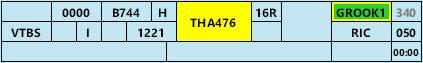

Welcome to the controller briefing material for WorldFlight! Event-specific procedures are sorted by position type and should be read in conjunction with the existing SOPs for that position/location.

## Official Team Callsigns
Official WorldFlight teams should be afforded priority at all stages of flight. 

OzStrips will flag official WorldFlight teams and the Events Plugin will highlight team aircraft for TCU and enroute controllers.

<figure markdown>
{ width="500" }
<figcaption>WF Team Highlight in OzStrips</figcaption>
</figure>

<figure markdown>
{ width="400" }
<figcaption>WF Team Highlight</figcaption>
</figure>

The list of callsigns is below:

| Callsign | Aircraft Type | Team Name | 
| -------- | ------------- | --------- |
| ANZ361 | B738 | Hamilton |
| ANZ362 | B738 | Hamilton |
| ANZ363 | B738 | Hamilton |
| ASY121 | A332 | Simflite AU |
| BAW47C | B744 | Simfest UK |
| CVY44N | B744 | Team Covey |
| DAL209 | B738 | WorldFlight USA |
| DAL2507 | B738 | Cali Crew |
| EXS25N | B738 | Ness Aviation |
| GTI1471 | B744 | WorldFlight Perth |
| JHL44 | A320 | Team JeeHell |
| KLM2064 | B738 | Amsterdam 737 Club |
| NPT11W | B738 | Velocity UK |
| NWA179 | B743 | Jurrasic Jets |
| QFA25 | B744 | WorldFlight AU |
| UAL1120 | B738 | Virginia |
| *TBA* | B738 | Ascent Aviation |

## Route
<figure markdown>
{ width="800" }
</figure>