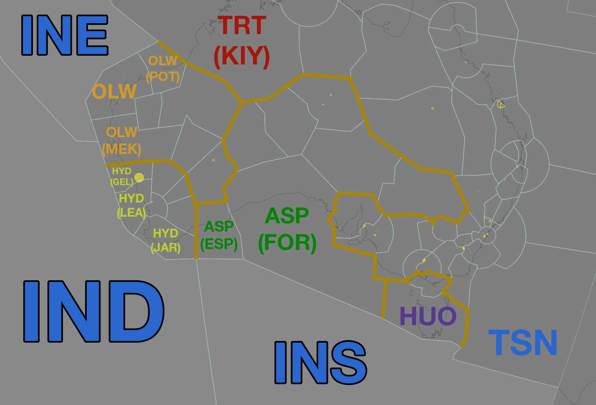
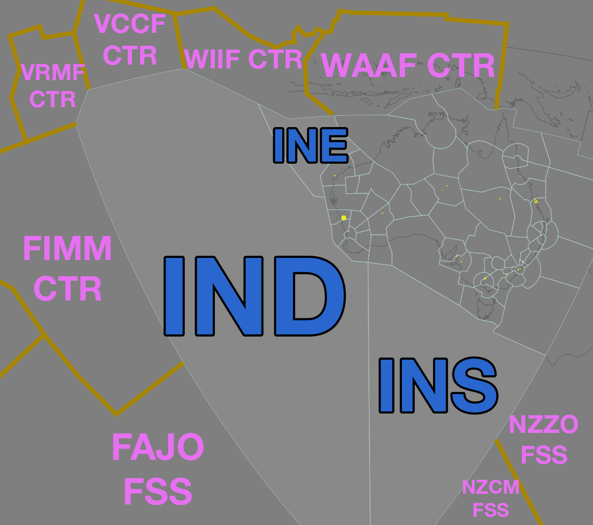

--8<-- "includes/abbreviations.md"
## Positions

| Name | Callsign | Frequency | Login ID |
| ---- | -------- | --------- | -------- |
| **Indian** | **Brisbane Radio** | **129.250 (5.634)** | **ML-IND_FSS** |
| Indian East† | Brisbane Radio | 123.650 (17.961) | ML-INE_FSS |
| Indian South† | Brisbane Radio | 123.200 (3.476) | ML-INS_FSS |

† *Non-standard positions* may only be used in accordance with [VATPAC Air Traffic Services Policy](https://vatpac.org/publications/policies){target=new}

### CPDLC
The Primary Communication Method for IND is [CPDLC](../../../client/cpdlc).

The CPDLC Station Code is `YIND`.

Voice may be used in lieu when applicable.

## Airspace

<figure markdown>
{width="700" }
  <figcaption>Indian Airspace (Zoomed)</figcaption>
</figure>

<figure markdown>
{width="700" }
  <figcaption>Indian Airspace</figcaption>
</figure>

## Extending
!!! Warning
    IND (and its subsectors) are **not permitted** to extend to any adjacent Domestic/International sectors

## STAR Clearance Expectation
### Handoff
Aircraft being transferred to the following sectors shall be told to Expect STAR Clearance on handoff:

| Transferring Sector | Receiving Sector | ADES | Notes |
| ---- | -------- | --------- | --------- |
| IND | PIY(All) | YPPH | |

## Coordination
### Domestic Enroute
As per [Standard coordination procedures](../../../controller-skills/coordination/#enr-enr), Voiceless, no changes to route or CFL within **50nm** to boundary.

### IND Internal
As per [Standard coordination procedures](../../../controller-skills/coordination/#pacific-units), Voiceless, no changes to route or CFL within **15 mins** to boundary.

### TSN/NZZO/NZCM (Pacific Oceanic)
As per [Standard coordination procedures](../../../controller-skills/coordination/#pacific-units), Voiceless, no changes to route or CFL within **15 mins** to boundary.

### International Non-Pacific
As per [Standard coordination procedures](../../../controller-skills/coordination/#other-units), Heads-up Coordination required for all aircraft prior to **30 mins** from boundary.

!!! example
    **IND** -> **FAJO FSS**: "Estimate, SAA281, XEKOT time 44, F360"  
    **FAJO FSS** -> **IND**: "SAA281, F360"