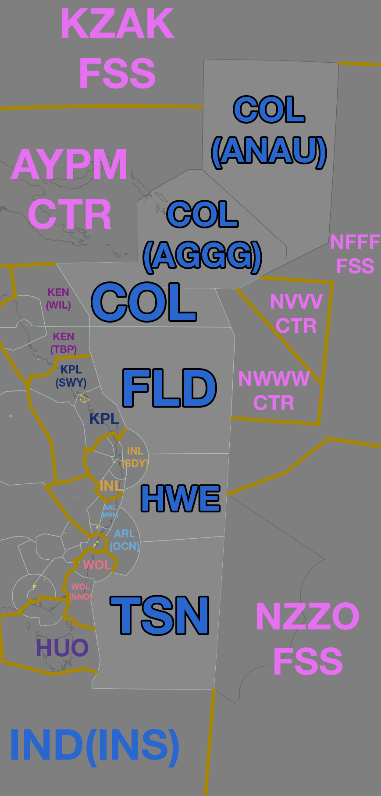

--8<-- "includes/abbreviations.md"
## Positions

| Name                | ID      | Callsign            | Frequency            | Login ID       |
| ------------------- | ------- | ------------------- | -------------------- | -------------- |
| **Tasman**          | **TSN** | **Brisbane Radio**  | **124.650 (17.904)** | **BN-TSN_FSS** |
| Coral :material-information-outline:{ title="Non-standard position"}    | COL | Brisbane Radio    | 133.150 (6.556)  | BN-COL_FSS   |
| Flinders :material-information-outline:{ title="Non-standard position"} | FLD | Brisbane Radio    | 132.850 (13.318) | BN-FLD_FSS   |
| *Howe :material-information-outline:{ title="Non-standard position"}^*  | HWE | *Brisbane Centre* | *124.950*        | *BN-HWE_CTR* |

^ Refer to [Howe](#howe-hwe)

!!! abstract "Non-Standard Positions"
    :material-information-outline: Non-standard positions may only be used in accordance with [VATPAC Air Traffic Services Policy](https://vatpac.org/publications/policies){target=new}.  
    Approval must be sought from the **bolded parent position** prior to opening a Non-Standard Position, unless [NOTAMs](https://vatpac.org/publications/notam){target=new} indicate otherwise (eg, for events).
	
### CPDLC
The Primary Communication Method for TSN is [CPDLC](../../../client/cpdlc). Voice may be used in lieu when applicable. The CPDLC Station Code is `YTSN`.

## Airspace

<figure markdown>
{width="500" }
  <figcaption>Tasman Airspace</figcaption>
</figure>

### Howe (HWE)
HWE is a non-standard subsector that sits within TSN. Unlike TSN, it operates as a **VHF Surveillance** sector when it is open.

Due to limitations in VHF/HF coupling, HWE **cannot** extend to adjacent HF units.

### Coral (COL)
The COL subsector includes the AGGG and ANAU FIRs. These FIRs **do not** have their own positions, and **cannot** be split off from COL.

## Extending
!!! warning "Important"
    TSN (and its subsectors) are **not permitted** to extend to any adjacent Domestic/International sectors

## Sector Ownership
Due to limitations in vatSys, TSN cannot relinquish sector ownership of the HWE sector when HWE is online. Tracks inbound to HWE airspace will appear as Blue Announced tracks to both TSN and HWE.

## Surveillance Coverage
Limited surveillance coverage exists for aircraft in CTA greater than **250nm** from LHI. [Procedural Standards](../../../separation-standards/procedural/) must be implemented **prior** to losing surveillance coverage

## STAR Clearance Expectation
### Handoff
Aircraft being transferred to the following sectors shall be told to Expect STAR Clearance on handoff:

| Transferring Sector | Receiving Sector | ADES | Notes |
| ---- | -------- | --------- | --------- |
| TSN, HWE | ARL(OCN) | YSSY | |
| FLD, HWE | INL(SDY) | YBBN, YBCG, YBSU | |
| FLD | KEN(All) | YBCS, YBTL | |

## Coordination
### Domestic Enroute
As per [Standard coordination procedures](../../../controller-skills/coordination/#pacific-units), Voiceless, no changes to route or CFL within **15 mins** to boundary.

### TSN Internal
As per [Standard coordination procedures](../../../controller-skills/coordination/#pacific-units), Voiceless, no changes to route or CFL within **15 mins** to boundary.

!!! warning "Important"
    Aircraft separated by a surveillance separation standard must be re-established at an applicable procedural standard prior to handoff to a procedural enroute sector. 

Aircraft leaving HWE in it's surveillance configuration must have their identification terminated and be instructed to make a position report on first contact with the next (procedural) sector.

!!! phraseology
    **HWE**: "UAE845, identification terminated, report position to Brisbane Radio, 124.65"

### NWWWA/NVVVA
The vertical limits of CTA within TSN and NWWWA/NVVVA mean it is not possible for an aircraft to transit directly from either TCU into TSN CTA and vice versa. As per [Standard coordination procedures](../../../controller-skills/coordination/#octa-coordination) no coordination is required, provided there are no changes to route or level within **5 mins** to boundary.

### Pacific Oceanic + AYPM
As per [Standard coordination procedures](../../../controller-skills/coordination/#pacific-units), Voiceless, no changes to route or CFL within **15 mins** to boundary.

!!! warning "Important"
    Aircraft separated by a surveillance separation standard must be re-established at an applicable procedural standard prior to handoff to a procedural enroute sector. Aircraft entering VATNZ airspace on the same track must be either vertically separated or laterally separated by a 10 minute longitudinal standard prior to handoff.

Aircraft leaving HWE in it's surveillance configuration must have their identification terminated and be instructed to make a position report on first contact with the next (procedural) sector.

!!! phraseology
    **HWE**: "QFA121, identification terminated, report position to Auckland Radio, 129.0"
