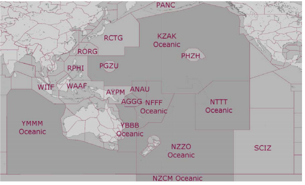

--8<-- "includes/abbreviations.md"

## Airspace

The following oceanic FIRs are owned by VATPAC and are covered under the [Pacific Oceanic Agreement.](https://drive.google.com/file/d/1xRWTTwpDOek2mkRbXQx53ee2uuot0ofB/view)

YBBB - Brisbane Oceanic  
YMMM - Melbourne Oceanic  
NFFF - Nadi Oceanic  
AGGG - Honiara FIR  
ANAU - Nauru FIR  

Other FIRs which are covered under the Pacific Oceanic Agreement are:  

NZZO - Auckland Oceanic  
NZCM - McMurdo Oceanic  
KZAK - Oakland Oceanic  
NTTT - Tahiti Oceanic  

!!! information
    Auckland, McMurdo and Tahiti Oceanic are owned and operated by VATNZ, and Oakland Oceanic is owned and operated by VATUSA.  
    Under the agreement, a controller holding an oceanic endorsement may control positions within any of these FIRs.

<figure markdown>
{ width="500" }
</figure>

### Control Positions

| Name  | 	Callsign  | 	Frequency   |	Logon Identifier |
| ----------------- | --------------- | ----------------- | ----------- | 
| KZAK - Oakland Oceanic  (East) |  San Francisco Radio | 131.950  |  ZAK_E_FSS |
| KZAK - Oakland Oceanic (West) | San Francisco Radio |  122.500 |  ZAK_W_FSS |
| YBBB - Brisbane Oceanic (Tasman)  | Brisbane Radio | 128.600  |  BN-TSN_FSS |
| AGGG - Honiara FIR	 |  Brisbane Radio |  128.600 |  BN-TSN_FSS |
| ANAU - Nauru FIR |  Brisbane Radio |  128.600 |  BN-TSN_FSS |
| YMMM - Melbourne Oceanic (Indian Ocean) |  Brisbane Radio | 122.400  |  ML-IND_FSS |
| NZZO - Auckland Oceanic  |  Auckland Radio |  128.900 |  NZZO_FSS |
| NZCM - McMurdo Oceanic  |  McMurdo Radio |  128.700 |  NZCM_FSS |
| NFFF - Nadi Oceanic  | Nadi Radio  |  123.600 |  NFFF_FSS |
| NTTT - Tahiti Oceanic  |  Tahiti Radio |  125.500 |  NTTT_FSS |

!!! Note 
    KZAK oceanic positions may be further subdivided by the shift supervisor, in which case the subsector shall add a numeral to the text callsign E/W element. For example, ZAK_W1_FSS.

    Honiara (AGGG) and Nauru (ANAU) FIR ATS are provided by Brisbane Oceanic (Tasman).  

## Currency Requirements

- A Participating Organisation must require a permitted controller to log 1 hour on a permitted oceanic position, within the previous 3 months, for them to be considered active, and
- A permitted controller who does not meet the hour requirement specified above, will be considered inactive; and
- An inactive permitted controller may become active again, by performing a buddy session with a permitted controller who is approved to do so by that PO; and
- Any additional currency or activity requirements imposed by a PO on local or visiting controllers do not apply to permitted controllers.