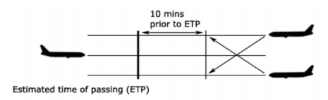
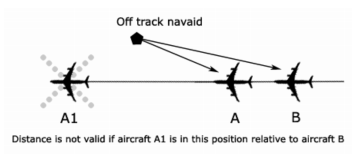

--8<-- "includes/abbreviations.md"

## Airspace

The following oceanic FIRs are owned by VATPAC and are covered under the Pacific Oceanic Agreement:

YBBB - Brisbane Oceanic  
YMMM - Melbourne Oceanic  
NFFF - Nadi Oceanic  
AGGG - Honiara FIR  
ANAU - Nauru FIR  

Other FIRs which are covered under the Pacific Oceanic Agreement are:  

NZZO - Auckland Oceanic  
NZCM - McMurdo Oceanic  
KZAK - Oakland Oceanic  
NTTT - Tahiti Oceanic  

!!! information
    Auckland, McMurdo and Tahiti Oceanic are owned and operated by VATNZ, and Oakland Oceanic is owned and operated by VATUSA.  
    Under the agreement, a controller holding an oceanic endorsement may control positions within any of these FIRs.

<figure markdown>
{ width="500" }
</figure>

### Control Positions

| Name  | 	Callsign  | 	Frequency   |	Logon Identifier |
| ----------------- | --------------- | ----------------- | ----------- | 
| KZAK - Oakland Oceanic  (East) |  San Francisco | 131.950  |  ZAK_E_FSS |
| KZAK - Oakland Oceanic (West) | San Francisco  |  122.500 |  ZAK_W_FSS |
| YBBB - Brisbane Oceanic (Tasman)  | Brisbane  | 128.600  |  BN-TSN_FSS |
| AGGG - Honiara FIR	 |  Brisbane	 |  128.600 |  BN-TSN_FSS |
| ANAU - Nauru FIR |  Brisbane	 |  128.600 |  BN-TSN_FSS |
| YMMM - Melbourne Oceanic (Indian Ocean) |  Brisbane | 122.400  |  ML-IND_FSS |
| NZZO - Auckland Oceanic  |  Auckland |  128.900 |  NZZO_FSS |
| NZCM - McMurdo Oceanic  |  McMurdo |  128.700 |  NZCM_FSS |
| NFFF - Nadi Oceanic  | Nadi  |  123.600 |  NFFF_FSS |
| NTTT - Tahiti Oceanic  |  Tahiti |  125.500 |  NTTT_FSS |

!!! Note 
    KZAK oceanic positions may be further subdivided by the shift supervisor, in which case the subsector shall add a numeral to the text callsign E/W element. For example, ZAK_W1_FSS.

    Honiara (AGGG) and Nauru (ANAU) FIR ATS are provided by Brisbane Oceanic (Tasman).  

    The word ‘radio’ is appended to the applicable voice callsign, eg. ‘San Francisco Radio’.

## Procedures

### Transition Levels

| Name  | 	Transition Altitude  | 	Transition Level   |
| ----------------- | --------------- | ----------------- |
| KZAK - Oakland Oceanic |  18,000ft | FL180 |
| YBBB - Brisbane Oceanic  | 10,000ft  | FL110  | 
| AGGG - Honiara FIR	 |  11,000ft	 |  FL120 | 
| ANAU - Nauru FIR |  11,000ft	 |  FL120 |  
| YMMM - Melbourne Oceanic |  10,000ft | FL110  | 
| NZZO - Auckland Oceanic  |  13,000ft |  FL150 |  
| NZCM - McMurdo Oceanic  |  19,500ft |  FL200 |
| NFFF - Nadi Oceanic  | 11,000ft  |  FL130 | 
| NTTT - Tahiti Oceanic  |  9,000ft |  By ATC |

!!! Note 
    Standard Altimeter setting (29.92 inHg/1013 hPa) should be used when more than 100 nm from McMurdo.

!!! Information
    Auckland Oceanic airspace does not have a transition layer, except within the Rarotonga, Samoa and Norfolk Island QNH zones.  
    
    Aircraft within Auckland Oceanic airspace should use the standard altimeter setting of 1013.2hpa unless within the aforementioned QNH zones.

## Seperation Standards

### Longitudinal

<figure markdown>

</figure>

Longitudinal separation shall only be applied between aircraft on same or reciprocal tracks. There is an exception to this rule where a 15 minute standard may be used for crossing tracks.  

Longitudinal time separation must be established by using pilot estimates and ensuring that the time between two aircraft is equal or greater than the longitudinal time separation minimum.  

!!! Example
    "ABC, Cross ALPHA at time 1051 or later"  
    "DEF, Hold at BRAVO to leave BRAVO at time 2215 or later"

#### Same Track
Aircraft that are on the same track, including situations where one aircraft is climbing or descending through the level of another, are to be separated by **10 minutes**
<figure markdown>

</figure>

#### Crossing Track
Aircraft that are on crossing tracks, including situations where one aircraft is climbing or descending through the level of another, are to be separated by **15 minutes** at the point of intersection
<figure markdown>

</figure>

Where a difference 15 minutes does not exist at the crossing point, vertical separation shall be applied from the time at which the second aircraft is 15 minutes from the crossing point until the first aircraft is 15 minutes past the crossing point.
<figure markdown>

</figure>

#### Reciprocal Track
Aircraft flying on reciprocal tracks may only be separated vertically. Such separation must exist **at least 10 minutes** prior to the estimated time of passing
<figure markdown>

</figure>

After the estimated time of passing, aircraft may not climb or descend through the level of the opposite direction aircraft until **10 minutes** after the estimated time of passing. It is possible to reduce this requirement if definite passing has been achieved, and this will be explained later in this section.

#### Distance

##### DME
For all DME-based standards, distance reports using "off-track" navaids may be used provided that the position of both aircraft is such that both of their DME readings are either increasing or decreasing.
<figure markdown>

</figure>

For aircraft on the "same track", the minimum distance standard is 20nm.
<figure markdown>

</figure>

For aircraft that are climbing or descending on the "same track", 15nm may be used while vertical separation does not exist provided that one aircraft is maintaining a level while vertical separation does not exist and that separation is established by obtaining simultaneous DME readings from the aircraft.
<figure markdown>

</figure>

!!! Note
    For aircraft on "crossing tracks", a DME-based standard is not available.  
    
    For aircraft on "reciprocal tracks", aircraft utilising on-track DME may be cleared to climb or descend to or through the levels occupied by other aircraft utilising on-track DME, provided that it has been positively established that the aircraft have passed each other and are at least 10nm apart.

##### RNAV
RNAV RNP10 aircraft climbing, cruising or descending on the same track must be separated by at least 50nm in conjunction with the Mach Number Technique, provided that each aircraft reports its distance to or from the same waypoint 

<figure markdown>

</figure>

##### Distance Checks
When running a distance standard with no closing between aircraft, distance checks must be made no less often than every **30 minutes**.  

When running a distance standard with closing between aircraft, distance checks must be made no later than every **15 minutes**.

!!! Note
    The maximum closing speed permitted between two aircraft when running a distance standard is M.06.

!!! Example
    "ACA522 and QFA127, in turn, report your DME distance from Lord Howe Island"

#### Definite Passing

Aircraft are considered to have definitely passed when reports indicate any of the following:  

10 DME between aircraft;  
50 RNAV between aircraft; or  
Passage over a positive radio fix (NDB, VOR)  

An alternative method to establish definite passing is to instruct pilots to "sight & pass" each other. This can be done using the following phraseology:

!!! Example
    "QFA11 report sighting and passing UAL812, B744, 1000ft above you, estimated time of passing 1715."

!!! Note
    When using the sight & pass method, both aircraft must confirm they have visually sighted & passed the other aircraft. TCAS may not be used in lieu of a visual sighting.

#### Mach Number Technique

The mach number technique is something that a controller can use in conjunction with a time-based standard to allow two jets to operate with closing between them. The mach number technique may only be used on the same or diverging tracks, and may only be used between jet aircraft.  

The mach number technique operates on the basis that for a given amount of closing between two aircraft (‘Difference in Mach column’), a certain amount of time is required between the aircraft at the time they enter conflict. This time depends on the distance the aircraft are flying and is always greater than 10 minutes, to ensure that 10 minutes will be maintained until the aircraft exit conflict.  

The following table contains the information needed to use the technique to maintain separation over a specifed route sector/interval length:

|  Difference in Mach |   	0-600nm  |	601-1200nm  |	1201-1800nm  |	1801-2400nm | 	2401-3000nm|
|---|---|---|---|---|---|
|0.01	|11	|12	|13	|14	|15|
|0.02	|12	|14	|16	|18	|20|
|0.03	|13	|16	|19	|22	|25|
|0.04	|14	|18	|22	|26	|30|
|0.05	|15	|20	|25	|30	|35|
|0.06	|16	|22	|28	|34	|40|
|0.07	|17	|24	|31	|38	|45|
|0.08	|18	|26	|34	|42	|50|
|0.09	|19	|28	|37	|46	|55|
|0.10	|20	|30	|40	|50	|60|

!!! Example
    A & B, that will be on the same track for 700nm with a closing speed of M.04. Using the table above, we see that there must be 18 minutes of separation between these aircraft at the entry point if there is to be 10 minutes of separation between them at the exit point.

### Lateral Separation

Along with longitudinal separation, lateral separation is a method of separating aircraft 'horizontally', or in other words, separating aircraft that are at the same altitude/flight level. Longitudinal separation is used to separate aircraft at a given time using their position, whereas lateral separation is something used to separate aircraft over a period of time using their heading.

| Angle |	 Distance 	| Angle 	| Distance |	 Angle 	| Distance |	 Angle |	 Distance |
|--|--|--|--|--|--|--|--|
|**20**|	287|	**38**|	147|	**56**|	96|	**74**|	68|
|**21**|  273|  **39**|	143|	**57**|	94|	**75**|	67|
|**22**|	261|	**40**|	139|	**58**|	92|	**76**|	66|
|**23**|	249|	**41**|	136|	**59**|	90|	**77**|	64|
|**24**|	238|	**42**|	132|	**60**|	88|	**78**|	63|
|**25**|	229|	**43**|	129|	**61**|	87|	**79**|	62|
|**26**|	220|	**44**|	126|	**62**|	85|	**80**|	61|
|**27**|	211|	**45**|	123|	**63**|	83|	**81**|	60|
|**28**|	203|	**46**|	120|	**64**|	82|	**82**|	59|
|**29**|	196|	**47**|	117|	**65**|	80|	**83**|	58|
|**30**|	189|	**48**|	114|	**66**|	79|	**84**|	57|
|**31**|	183|	**49**|	112|	**67**|	77|	**85**|	56|
|**32**|	177|	**50**|	109|	**68**|	76|	**86**|	55|
|**33**|	171|	**51**|	107|	**69**|	74|	**87**|	54|
|**34**|	166|	**52**|	104|	**70**|	73|	**88**|	53|
|**35**|	161|	**53**|	102|	**71**|	72|	**89**|	52|
|**36**|	156|	**54**|	100|	**72**|	70|	**90**|	51|
|**37**|	152|	**55**|	98| 	**73**|	69|	

!!! Note
    For tracks with an angular difference of 35 degrees, aircraft enter lateral conflict at 161nm from the common point.

!!! Example
    “UAE406, due to converging traffic at TATOD a level change is required. Climb to reach FL350 by 161nm from TATOD."

### Vertical

Vertical separation is the most common form of separation that is employed within oceanic airspace as a controller can have two aircraft flying at vertically separated levels with no risk of a loss of separation until one needs to climb or descend.

The primary source of aircraft altitudes and levels shall be pilot reports. 

!!! Note
    You cannot clear an aircraft to climb/descend into levels that were previously occupied by another aircraft until that aircraft reports clear of the levels in question.

| Altitude/Flight Level | Separation standard |
| --------------------- | ------------------- |
| **BLW FL290** | 1000FT |
| **FL290 - FL410** | RVSM: 1000FT, NON-RVSM: 2000FT |
| **FL410 - FL600** | 2000FT | 
| Supersonic Aircraft | 3000FT |

!!! Note
    RVSM airspace exists between FL290 and FL410

## Coordination

### Oceanic / Oceanic

Controllers must provide an estimate and level to the next sector no less than **30 minutes** prior to the aircraft's estimate for the sector boundary.

!!! example
    **BN-TSN_FSS** -> **NZZO_FSS**: "Estimate ANZ52, LEGAN 0243, FL370"  
    **NZZO_FSS** -> **BN-TSN_FSS**: "ANZ52, FL370"  
    `AIP GEN 3.4`

Once coordination has been completed, the controller must advise the next sector of any change in estimate greater than two minutes. Additionally, no changes to level or tracking are allowed without first checking with the next controller.

!!! example
    **BN-TSN_FSS** -> **NZZO_FSS**: "Estimate ANZ52, requesting FL390"  
    **NZZO_FSS** -> **BN-TSN_FSS**: "Concur FL390, ANZ52"  
    `AIP GEN 3.4`

### Oceanic / Domestic
Oceanic sectors must provide coordination to continental/domestic sectors in accordance with published policies of the respective Agreement parties.  
In situations where a policy does not specify coordination requirements, coordination for aircraft passing from an oceanic sector to a continental/domestic sector shall entail provision of an estimate and level to the continental/domestic sector, no less than **15 minutes prior** to the aircraft's estimate for the sector boundary.

!!! example
    **BN-TSN_FSS** -> **ML-ELW_CTR**: "Estimate ANZ52, GEMAC 0420, FL370"  
    **ML-ELW_CTR** -> **BN-TSN_FSS**: "ANZ52, FL370"  
    `AIP GEN 3.4`

## Phraseology

### HF Radio

HF radio is used as the primary long-range radio communications medium. The nature of HF radio makes it highly vulnerable to atmospheric distortion and noise, and so radiotelephony (R/T) procedures on HF tend to be more formal in order to maximise clarity.

!!! Example
    **UAL873** -> **ZAK_W_FSS**: "San Francisco Radio, San Francisco Radio, UAL873 on 122.5"  
    **ZAK_W_FSS** -> **UAL873**: "UAL873, San Francisco Radio, go-ahead"  
    **UAL873** -> **ZAK_W_FSS**: "San Francisco Radio, UAL873 request climb FL390"

### SELCAL

Given the background noise level experienced on HF radio frequencies, flight crews usually prefer to turn down the audio level of their HF receiver. SELCAL uses a unique 4-letter code for each aircraft (eg. QR-AC) transmitted over the communications frequency to sound an alert for the flight crew.

Controllers must check each aircraft’s flight plan for a discrete SELCAL code. If aircraft have nominated a discrete code (for example “QR-AC”), then a SELCAL Check shall be completed

!!! Example
    **BN-TSN_FSS** -> **QFA43**: "QFA43 good afternoon, Brisbane accepts primary guard 128.6, secondary 122.1, standby SELCAL check."  
    *The aircraft awaits the SELCAL check before replying.*  
    **QFA43** -> **BN-TSN_FSS**: "SELCAL check OK, secondary 122.1, QFA43."  
    **BN-TSN_FSS** -> **QFA43**: "QFA43, request your estimate VIROG."  
    *From now on ATC will preface communications with a text SELCAL*

### Position Reports

|Position Report Elements|
|------------------------|
|Callsign| 
|Position| 
|Time | 
|Flight level|
|Next position and time over  |
|Ensuing significant point  |
|Specified Speed|

!!! Note
    If after making a position report an estimate has changed by more than 2 minutes, the new estimate shall be passed to ATC.  

If an aircraft fails to report its position within 3 minutes of its estimated time, controllers must attempt to establish contact with that aircraft and obtain a position report.

ATC shall acknowledge a position report by using the aircraft's callsign. A readback of the report is not required.

!!! Example
    **UAL873** -> **ZAK_W_FSS**: "San Francisco Radio, San Francisco Radio, UAL873 Position"  
    **ZAK_W_FSS** -> **UAL873**: "UAL873, San Francisco Radio, go-ahead"  
    **UAL873** -> **ZAK_W_FSS**: "UAL873 position LHI time 1853, FL360, estimate PANDA at 1953, SANDO next. Maintaining Mach 0.84”  
    **ZAK_W_FSS** -> **UAL873**: "UAL873, San Francisco Radio, Copied Position" 