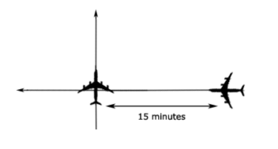
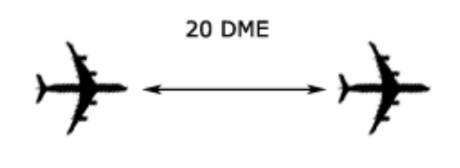
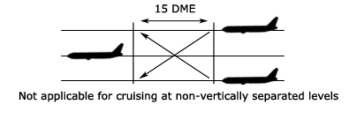
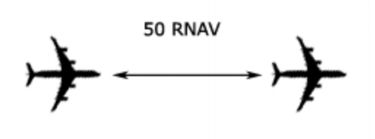

--8<-- "includes/abbreviations.md"

## Separation Standards

### Longitudinal

<figure markdown>

</figure>

Longitudinal separation shall only be applied between aircraft on same or reciprocal tracks. There is an exception to this rule where a 15 minute standard may be used for crossing tracks.  

Longitudinal time separation must be established by using pilot estimates and ensuring that the time between two aircraft is equal or greater than the longitudinal time separation minimum.  

!!! Example
    "ABC, Cross ALPHA at time 1051 or later"  
    "DEF, Hold at BRAVO to leave BRAVO at time 2215 or later"

#### Same Track
Aircraft that are on the same track, including situations where one aircraft is climbing or descending through the level of another, are to be separated by **10 minutes**
<figure markdown>

</figure>

#### Crossing Track
Aircraft that are on crossing tracks, including situations where one aircraft is climbing or descending through the level of another, are to be separated by **15 minutes** at the point of intersection
<figure markdown>

</figure>

Where a difference 15 minutes does not exist at the crossing point, vertical separation shall be applied from the time at which the second aircraft is 15 minutes from the crossing point until the first aircraft is 15 minutes past the crossing point.
<figure markdown>

</figure>

#### Reciprocal Track
Aircraft flying on reciprocal tracks may only be separated vertically. Such separation must exist **at least 10 minutes** prior to the estimated time of passing
<figure markdown>

</figure>

After the estimated time of passing, aircraft may not climb or descend through the level of the opposite direction aircraft until **10 minutes** after the estimated time of passing. It is possible to reduce this requirement if definite passing has been achieved, and this will be explained later in this section.

#### Distance

##### DME
For all DME-based standards, distance reports using "off-track" navaids may be used provided that the position of both aircraft is such that both of their DME readings are either increasing or decreasing.
<figure markdown>

</figure>

For aircraft on the "same track", the minimum distance standard is 20nm.
<figure markdown>

</figure>

For aircraft that are climbing or descending on the "same track", 15nm may be used while vertical separation does not exist provided that one aircraft is maintaining a level while vertical separation does not exist and that separation is established by obtaining simultaneous DME readings from the aircraft.
<figure markdown>

</figure>

!!! Note
    For aircraft on "crossing tracks", a DME-based standard is not available.  
    
    For aircraft on "reciprocal tracks", aircraft utilising on-track DME may be cleared to climb or descend to or through the levels occupied by other aircraft utilising on-track DME, provided that it has been positively established that the aircraft have passed each other and are at least 10nm apart.

##### RNAV
RNAV RNP10 aircraft climbing, cruising or descending on the same track must be separated by at least 50nm in conjunction with the Mach Number Technique, provided that each aircraft reports its distance to or from the same waypoint 

<figure markdown>

</figure>

##### Distance Checks
When running a distance standard with no closing between aircraft, distance checks must be made no less often than every **30 minutes**.  

When running a distance standard with closing between aircraft, distance checks must be made no later than every **15 minutes**.

!!! Note
    The maximum closing speed permitted between two aircraft when running a distance standard is M.06.

!!! Example
    "ACA522 and QFA127, in turn, report your DME distance from Lord Howe Island"

#### Definite Passing

Aircraft are considered to have definitely passed when reports indicate any of the following:  

10 DME between aircraft;  
50 RNAV between aircraft; or  
Passage over a positive radio fix (NDB, VOR)  

An alternative method to establish definite passing is to instruct pilots to "sight & pass" each other. This can be done using the following phraseology:

!!! Example
    "QFA11 report sighting and passing UAL812, B744, 1000ft above you, estimated time of passing 1715."

!!! Note
    When using the sight & pass method, both aircraft must confirm they have visually sighted & passed the other aircraft. TCAS may not be used in lieu of a visual sighting.

### Lateral Separation

The Quickest and easiest way to assess lateral conflict scenarios is with the *Conflict Area tool*. Unfortunately, whilst its quick and easy to *use*, it's fairly complex and long to understand the rules and concepts.  
The first thing to note, is that there are many different unusual remarks and equipment codes that pilots file on VATSIM, primarily because not everyone knows what they mean. A little bit of background knowledge is required to understand these concepts.

#### NAVCAPs
All aircraft have a NAVCAP, associated with a ***Circular Error of Position***. This determines which number to select when using the Conflict Area Tool:

| NAVCAP Code | Meaning | Cicular Error of Position (CEP) |
| ---- | ----------- | -------- |
| A | All | 7nm |
| 2 | RNP2 | 7nm |
| 4 | RNP4 | 14nm |
| 5 | RNAV5 | 14nm |
| T | RNAV10 | 14nm |
| Z | None | 30nm |

<figure markdown>
{ width="300" }
  <figcaption>NAVCAP Z Example</figcaption>
</figure>

<figure markdown>
{ width="300" }
  <figcaption>NAVCAP 2 Example</figcaption>
</figure>

The minimum number you must select when using the tool, is equal to: **Aircraft 1 CEP + Aircraft 2 CEP + 1nm**

!!! example
    Aircraft 1 NAVCAP: 4  
    Aircraft 2 NAVCAP: Z  
    14+30+1=**45**  

!!! example
    Aircraft 1 NAVCAP: 2  
    Aircraft 2 NAVCAP: A  
    7+7+1=**15**  

!!! tip
    The best scenario is to have 2 aircraft that are RNP2 approved. "Feed the beast" in order to get what you want, that is to say "QFA12, confirm you are RNP2 approved?", and they'll probably say yes. Enter `NAV/RNP2` in the flight plan remarks, and you can use a 7nm CEP.

#### Working with Conflict Area

<figure markdown>
{ width="300" }
  <figcaption>Conflict Area Example 1</figcaption>
</figure>

Once you've established the Conflict area, you now know the area in which the aircraft are in **lateral conflict**. You can now either separate from the conflict area using a Time Standard, or a Distance Standard:  
**Time standard** (**5 minutes** prior to time shown at entry, or **5 minutes** after time shown at exit); or  
**Distance standard** (Use BRL to measure a distance to/from a waypoint that is outside of the conflict area, and use it to implement a vertical standard after exiting, or prior to entering the lateral conflict area)

#### Time Standard (5 in, 5 out)

Using the time standard, aircraft are considered to have entered the conflict area **5 minutes prior** to the estimate shown, and to have left the conflict area **5 minutes after** the estimate shown.

<figure markdown>
{ width="600" }
<figcaption>Conflict Area Example 2</figcaption>
</figure>

!!! example
    JST801 estimate for entering conflict area: **0250**  
    JST801 **enters lateral conflict** 0250-5: **0245**  
    JST801 estimate for leaving conflict area: **0257**  
    JST801 **leaves lateral conflict** 0257+5: **0302**  
    JST801 is considered to be **in the conflict area** from time **0245** until time **0302**  
    SIA7286 estimate for entering conflict area: **0230**  
    SIA7286 **enters lateral conflict** 0230-5: **0225**  
    SIA7286 estimate for leaving conflict area: **0238**  
    SIA7286 **leaves lateral conflict** 0238+5: **0243**  
    SIA7286 is considered to be **in the conflict area** from time **0225** until time **0243**  
    SIA7286 **leaves lateral conflict** prior to the time that JST801 **enters lateral conflict**. Therefore, the 2 aircraft are **not** in lateral conflict

When the aircraft **are** in lateral conflict, a vertical standard must be applied for that period.

!!! example
    "Climb to reach (vertically separated level) by (prior to entering lateral conflict)"  
    "Expect requested level at (time aircraft leaves lateral conflict)"  

#### Distance Standard
Use BRL to measure a distance to/from a waypoint that is outside of the conflict area, and use it to implement a vertical standard after exiting, or prior to entering the lateral conflict area

!!! example
    "Climb to reach (vertically separated level) by (GNSS distance outside entry of conflict area)"  
    "Report (GNSS distance outside exit of conflict area) for requested level"  
### Vertical

Vertical separation is the most common form of separation that is employed within oceanic airspace as a controller can have two aircraft flying at vertically separated levels with no risk of a loss of separation until one needs to climb or descend.

The primary source of aircraft altitudes and levels shall be pilot reports. 

!!! Note
    You cannot clear an aircraft to climb/descend into levels that were previously occupied by another aircraft until that aircraft reports clear of the levels in question.

| Altitude/Flight Level | Separation standard |
| --------------------- | ------------------- |
| **BLW FL290** | 1000FT |
| **FL290 - FL410** | RVSM: 1000FT, NON-RVSM: 2000FT |
| **FL410 - FL600** | 2000FT | 
| Supersonic Aircraft | 3000FT |

!!! Note
    RVSM airspace exists between FL290 and FL410
    