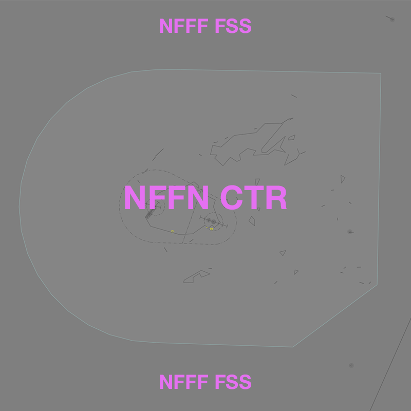

--8<-- "includes/abbreviations.md"

## Positions

| Name | Callsign | Frequency | Login ID |
| ---- | -------- | --------- | -------- |
| **Nadi Control** | **Nadi Control** | **120.100** | **NFFN_CTR** |

## Airspace
<figure markdown>
{ width="700" }
  <figcaption>NFFN_CTR Airspace</figcaption>
</figure>

All controlled airspace within the Fiji Domestic up to `F600` is classified as Class D.

### Reclassifications
#### NFNA CTR
When **NFNA ADC** is offline, NFNA TCU below `A065` is reclassified as Class G and is administed by NFFN_CTR. Alternatively, NFFN_CTR may provide a [top-down approach service](../Nausori/TCU) if they wish.

!!! tip
    If choosing *not* to provide a top down service, consider publishing an **ATIS Zulu** for the aerodrome, to inform pilots about the airspace reclassification. The *More ATIS* plugin has a formatted Zulu ATIS message.
<!--	
## Extending
-->
## CPDLC
The Primary Communication Method for NFFN_CTR is Voice.

[CPDLC](../../../client/cpdlc) may be used in lieu when applicable.

The CPDLC Station Code is `NFFJ`.

!!! tip
    Even though NFFN_CTR's Primary Communication Method is Voice, CPDLC may be used for Overfliers.
	
<!---## Sector Responsibilities
## Runway Modes

## Surveillance Coverage

## STAR Clearances

## STAR Clearance Expectation
--->
## Coordination
### NFFNA
#### Departures
Voiceless for all aircraft:

- Tracking via a Procedural SID terminus^; and
- Assigned the lower of `F240` and `RFL`.

!!! note
    ^Aircraft are *not required* to be tracking via the **SID procedure**, simply tracking via any of the terminus waypoints (Regardless of *departure airport* or *assigned SID*) is sufficient to meet the criteria for **voiceless coordination**

All other aircraft going to NFFN_CTR CTA must be **Heads-up** Coordinated by NFFNA prior to the boundary.

!!! phraseology
    **NFFNA** -> **NFFN_CTR**: "via GUSOS, RON18"  
    **NFFN_CTR** -> **NFFNA**: "RON18, F240"  

#### Arrivals
Voiceless for all aircraft:

- With ADES **NFFN**; and
- Assigned `A070`; and
- When **Runway 02** is in use for arrivals:
	- Tracking *from* any of the following points, DCT **MI NDB**;
    	- **AGTOS**
    	- **AGTAG**
    	- **VIBEX**
    	- **TUTMU**
    	- **AGUTA**; or
	- Tracking *from* any of the following points, DCT **NN VOR**;
    	- **BEGIT**
    	- **ISMOP**
    	- **GUSOS**
    	- **PAGBO**
    	- **TARON**
    	- **KALPO**
    	- **BEDOK**; or
- When **Runway 20** is in use for arrivals:
	- Assigned a STAR.

All other aircraft coming from NFFN_CTR CTA will be **Heads-up** Coordinated to NFFNA.

### NFNAA
#### Departures
Voiceless for all aircraft:

- Tracking via a Procedural SID terminus^; and
- Assigned the lower of `F240` and `RFL`.

!!! note
    ^Aircraft are *not required* to be tracking via the **SID procedure**, simply tracking via any of the terminus waypoints (Regardless of *departure airport* or *assigned SID*) is sufficient to meet the criteria for **voiceless coordination**

All other aircraft going to NFFN_CTR CTA must be **Heads-up** Coordinated by NFNAA prior to the boundary.

!!! phraseology
    **NFNAA** -> **NFFN_CTR**: "via ANRIK, FJI281"  
    **NFFN_CTR** -> **NFNAA**: "FJI281, F240"  

#### Arrivals
Voiceless for all aircraft:

- With ADES **NFNA**;
- Tracking via a published airway to **NA VOR**; and
- Assigned `A070`

All other aircraft coming from NFFN_CTR CTA will be **Heads-up** coordinated to NFNAA.

### NFFF (Oceanic)
As per [Standard coordination procedures](../../../controller-skills/coordination/#pacific-units), Voiceless, no changes to route or CFL within **15 mins** to boundary.

Aircraft must have their identification terminated and be instructed to make a position report on first contact with the next (procedural) sector.

!!! phraseology
    **NFFN_CTR**: "VOZ196, identification terminated, report position to Nadi Radio, 123.600"

<!---## Charts--->
