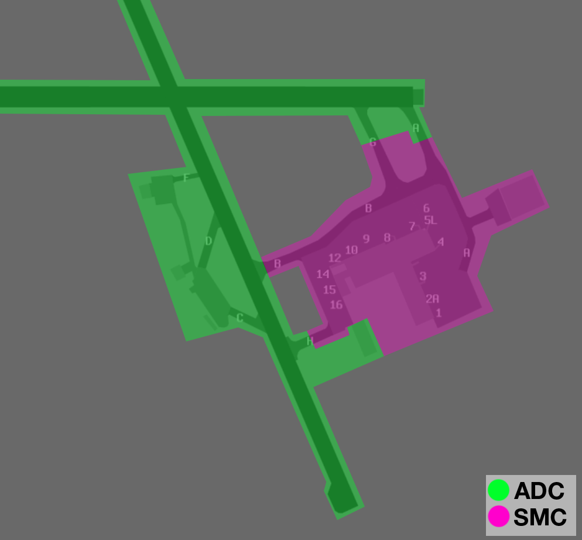
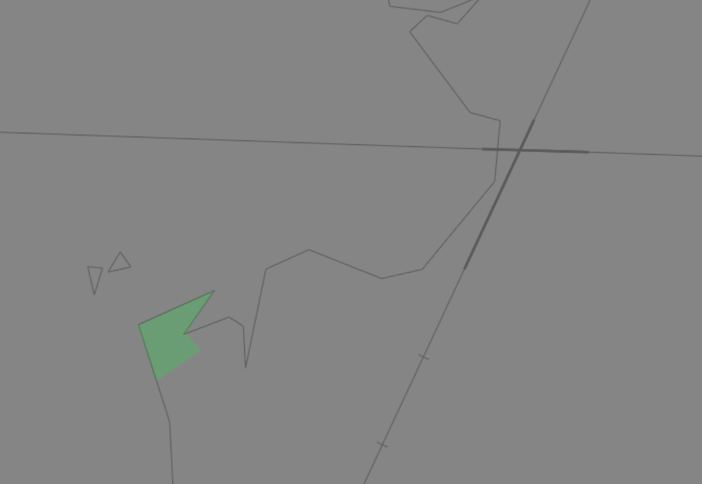
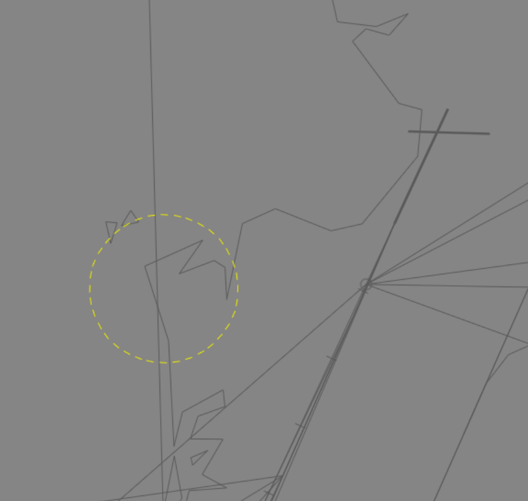
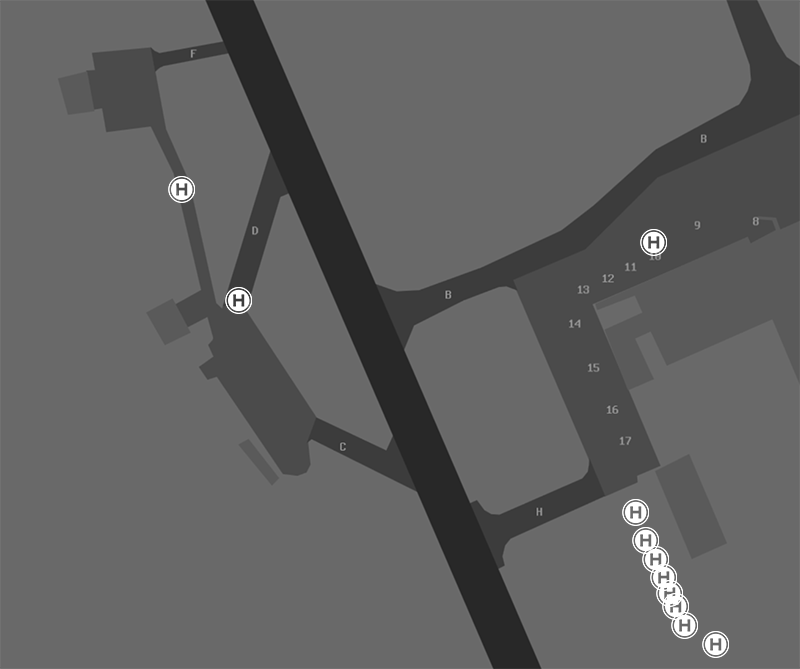

--8<-- "includes/abbreviations.md"

## Positions

| Name | Callsign | Frequency | Login ID |
| ---- | -------- | --------- | -------- |
| **Nadi ADC** | **Nadi Tower**	| **118.100** | **NFFN_TWR** | 
| **Nadi SMC** | **Nadi Ground** | **121.900** | **NFFN_GND** | 
| **Nadi ATIS**	| | **127.900** | **NFFN_ATIS** | 

!!! note
	Nadi is pronounced *Nandi* (nahn-dee). 
	
## Airspace
NFFN ADC is responsible for the NFFN CTR consisting of Class D airspace `SFC` to `A025` within a **10nm** radius of NFFN ARP.

<figure markdown>
{ width="700" }
  <figcaption>NFFN ADC Airspace</figcaption>
</figure>

Refer to [Class D Tower Separation Standards](../../../../separation-standards/classd) for more information.

## Maneuvering Area
### Responsibility
ADC is responsible for the **C**, **D**, and **F** taxiways, as well as the grass area east of **H**.
<figure markdown>
{ width="700" }
  <figcaption>NFFN Maneuvering Area Responsibility</figcaption>
</figure>

### Taxiway Restrictions
Category D aircraft cannot use **Taxiway B** south of Taxiway G is restricted to Code C aircraft. **Taxiway H** is restricted to aircraft no larger than a `AT72`.

### Pushback Clearance
The view of the terminal from the control tower is restricted, and Gates 1 to 5 are not visible to controllers. Aircraft pushing back from these gates will be given a discretionary clearance.

!!! phraseology
	*SOL703 is at Gate 1 and has already received their airways clearance.*  
    **SOL703**: "Nadi Ground, SOL703, with information A, request pushback."  
    **NFFN SMC**: "SOL703, pushback at your discretion, call when ready for taxi."  
    **SOL703**: "Pushback at our discretion, wilco, SOL703."

## Separation
### Reciprocal Runway Operations in IMC
When instrument approaches are in use to Runway 02, and visual separation is not possible due to the weather conditions, do not issue a takeoff clearance to an aircraft departing Runway 20 if:

- An aircraft arriving on the **ILS** or **TWIN NDB** approach has commenced their procedural turn, or has reached **MI NDB**.
- An aircraft arriving on the **RNP** approach has reached **FNNSI**.

## Local Procedures
### Runway 02 and Runway 09 Departures
Departures from Runway 02 and Runway 09 require non-standard manoeuvres due to terrain.

Aircraft departing Runway 02 are required to commence a left turn to heading 260° before the DER. Aircraft departing Runway 09 are required to turn right heading 270° after take-off.

!!! note
	This departure procedure means aircraft will be flying west towards the NN VOR-MI NDB track, regardless of the aircraft's destination. Take care to ensure positive separation between these departures and any aircraft performing an instrument approach.

### Night Restrictions
By night, the use of **Runway 09** for takeoffs and **Runway 27** for landings is **not** permitted. Refer to the [Runway Modes](#runway-modes) for acceptable runway configurations at night.

### Denarau Island Operations
Denarau Island sits within the NFFN CTR, approximately **2.5nm** west of the NFFN ARP. It is densely populated with luxury resorts, and sees regular private helicopter activity and parachuting activity.

<figure markdown>
{ width="700" }
  <figcaption>Denarau Island (approx.)</figcaption>
</figure>

In VMC, NFFN ADC shall visually separate aircraft operating in the Denarau Island area from aircraft on the extended **Runway 02/20** centreline. 

#### Parachute Drop Zone
A Parachute Drop Zone (FJPDZ2) is established overhead Denarau Island, within 1 NM of the golf course, `SFC` to `F140`.

<figure markdown>
{ width="700" }
  <figcaption>FJPDZ2 Denarau Island</figcaption>
</figure>

Pilots choosing to simulate [Parachute Operations](../../../../controller-skills/airwork/#parachute-operations) (PJE) will contact NFFN ADC for clearance. ADC will coordinate with NFFNA to ensure the FJPDZ2 zone is activated.

!!! phraseology
    **NFFN ADC** -> **NFFNA**: "For Ident, DQIBT, conducting Parachute Operations at Denauru Island, do you have any restrictions or requirements?"  
    **NFFNA** -> **NFFN ADC**: "DQIBT, no restrictions, no requirements"

### Tiliva Training Area
The Tiliva Training Area is established north of the NFFN CTR, from `A005` to `A040`, can be activated by NFFNA upon pilot request. Aircraft transiting between the NFFN CTR and the training area will track inbound/outbound via Vitogo.

<figure markdown>
{ width="700" }
  <figcaption>Tiliva Training Area</figcaption>
</figure>

When the Tiliva Training Area is activated, aircraft departing via **KABAR** [shall be assigned](#sid-selection) the **CHARLIE** SID instead of the **ALPHA** SID.

### Seaplane Operations
Seaplanes regularly operate from a private seaplane base 500 metres west of Runway 02/20, in Nadi Bay. Departures and Arrivals are generally processed via the 'Turtle' VFR transit route ([see above](#vfr-transit-lanes)).

As with [private helipads](#helicopter-operations), aircraft departing or arriving at the base will be instructed to  'report on the ground'/'report when airbourne' in lieu of an explicit takeoff/landing clearance.

## VFR Operations
### Departure/Arrival Gates
Aircraft should report at the standard VFR Departure/Arrival Gates.

<figure markdown>
{ width="500" }
  <figcaption>NFFN VFR Departure/Arrival Gates</figcaption>
</figure>

| Direction from NFFN | Name | Dep/Arr |
| ------------------- | ---- | ------- |
| North | Vitogo | Both |
| North | Bekana Island | Both |
| Northeast | Gap | Both |
| Northeast | Highland | Both |
| Southeast | Vunamoli | Both |
| Southwest | Nabila | Both |
| West | Kadavulailai Island | Both |
| West | Beachcomber | Both |
| Northwest | Tivua Island | Both |

### VFR Transit lanes
VFR transit lanes are established to allow aircraft to transit through the NFFN CTR, by day.

| VFR Route Name | Description | Altitude |
| ------ | ------- | ------ |
| FJV1 Turtle | Seaplane Base-Abeam Kadavulailai Island, then along CTR boundary to Nabila-Yakuilau-Nadi River Mouth, then along coast back to Seaplane Base | `SFC` to `A005` |
| FJV2 Victor | NFFN-Lololomo Beach-Vitogo | `A050` to `A015` |
| FJV4 Kadavulailai Helicopter Lane | Heliport-The Bridge-ABM Labone Island-Kadavulailai Island | `SFC` to `A005` |
| FJV5 Tivua Helicopter Lane | Heliport-The Bridge-ABN Labone Island-ABM Viseisei Village-ABM Vuda Marina-Tivua Island | `SFC` to `A005` |

## Helicopter Operations
VFR helicopters are generally processed via a VFR transit route ([see above](#vfr-transit-lanes)).

IFR helicopters should conform to fixed wing operations and be processed via a radar departure from an appropriate runway, unless a visual departure is acceptable.

### Helipads and Landing Areas
There are no controlled helipads at NFFN. Gate 10 has been reserved for helicopter operations, and multiple uncontrolled helipads have been established on the apron by private operators.

<figure markdown>
{ width="700" }
  <figcaption>Uncontrolled NFFN Helipads</figcaption>
</figure>

There are also several privately managed helipads within the NFFN CTR, most notably near [Denarau Island](#denarau-island-operations).

These helipads are outside the controlled maneuvering area and do not receive explicit takeoff/landing clearance. Helicopters using these helipads be instructed to 'report on the ground'/'report when airbourne' in lieu of an explicit clearance.

## Runway Modes
### Preferred Runway Modes
The preferred runway for arrivals is **Runway 02**. The preferred runway for departures is **Runway 20**. Reciprocal runway operations are **strongly** preferred at all times and should be used unless the tailwind (in either direction) exceeds **10 knots**.

| Priority - Mode | Arrivals | Departures |
| --------------- | -------- | ---------- |
| 1 - 02A/20D | **02** | **20** |
| 1 - 02A/20D27(A)D | **02** 27 [(by day only)](#night-operational-restrictions) | **20** **27** |
| 1 - 02A09A(D)/20D | **02** **09** | **20** 09 [(by day only)](#night-operational-restrictions) |
| 2 - 02AD | **02** | **02** |
| 3 - 20AD | **20** | **20** |

Most international jets will require Runway 02/20, even with strong crosswinds, although medium category departures will be able to depart Runway 27 in favourable conditions. For optimal airport efficiency, light aircraft should be assigned Runway 09/27 where possible.

#### Night Operational Restrictions
Due to the surrounding mountainous terrain, the following restrictions are to be applied at night:

- **Runway 20** is only available to aircraft flying the **RNP AR** approach. Visual approaches are not permitted.
- **Runway 09** is not available for departures.
- **Runway 27** is not available for arrivals.

### Circuits
| Runway | Direction |
| ------ | --------- |
| 02 | Left |
| 20 | Left |
| 09 | Right |
| 27 | Left |

## SID Selection
There are several Procedural SIDs at NFFN which terminate at the same waypoint. During normal operations, aircraft should be assigned SIDs according to the priorities set out below, unless the pilot requests a specific departure. 

Jet Aircraft **not** planned via any of these waypoints shall receive amended routing via the most appropriate SID terminus, unless the pilot indicates they are unable to accept a Procedural SID. These aircraft will receive either a **visual** or **radar** departure.

| Via | Preferred SID | 2nd | 3rd |
| ---- | ------------ | ----| ---- |
| TUTRI KABAR^ | **ALPHA** | | |
| BIDNA PACKO MAKSO |  **CHARLIE** | | |
| GODAP LUPLO EXORA | **DELTA** | **CHARLIE** | |
| NA VOR NAVUA | **HOTEL** | **ECHO** | **DELTA**/**CHARLIE**† |
| AGTOS | **FOXTROT** | | |
| BEACH ALBAB TEPEK VIPOB | **GOLF** | | |

!!! note
	^ When the [Tiliva Training Area](#tiliva-training-area) is active, aircraft tracking via KABAR shall be assigned the **CHARLIE** SID, NN VOR transition, thence direct KABAR.
	
	† Aircraft planned via an airway commencing at **VK NDB** shall be assigned the **DELTA** SID. Aircraft planned via an airway commencing at **NN VOR** shall be assigned the **CHARLIE** SID.

During busy periods NFFNA and NFFN ADC may coordinate and lower-priority departures for better traffic management purposes.

!!! example
	NFFNA might choose to coordinate assigning aircraft departing Runway 27 the CHARLIE SID in lieu of the HOTEL or ECHO SIDs to avoid conflicts with a sequence of Runway 02 arrivals from the southeast.

## ATIS
### Approach Expectation
If visual approaches are in operation the APCH field must state `EXP VISUAL APCH`.

## Coordination
### NFFNA
#### Departures
Next coordination is required from NFFN ADC to NFFNA for all aircraft entering **NFFNA CTA**

The Standard Assignable Level from **NFFN ADC** to **NFFNA** is:

| Aircraft | Level |
| -------- | ----- |
| Jet | The lower of `A060` and `RFL` |
| Non-Jet | The lower of `A030` and `RFL` |

#### Arrivals/Overfliers
NFFNA will heads-up coordinate arrivals/overfliers to NFFN ADC.

IFR aircraft will be cleared for the coordinated approach (Instrument or Visual) prior to handoff to NFFN ADC, unless NFFN ADC nominates a restriction.

VFR aircraft require a level readback.

!!! phraseology
    **NFFNA** -> **NFFN ADC**: "via MI NDB for the ILS RWY 02, JST119"  
    **NFFN ADC** -> **NFFNA**: "JST119, ILS RWY 02"

<!---## Charts --->