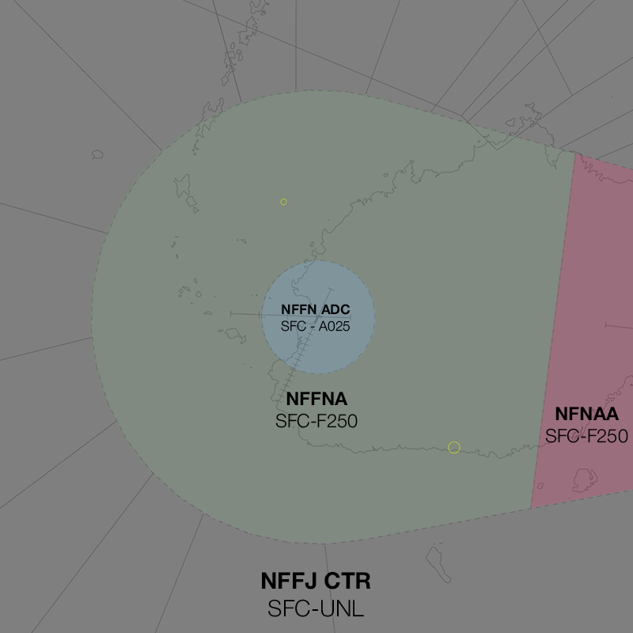

--8<-- "includes/abbreviations.md"

## Positions

| Name | Callsign | Frequency | Login ID |
| ---- | -------- | --------- | -------- |
| **Nadi Approach** | **Nadi Approach** | **119.100** | **NFFN_APP** | 

## Airspace
The vertical limits of the NFFN TCU are `SFC` to `F250`. **NFFN ADC** is responsible for the airspace within the NFFN CTR from `SFC` to `A025`.

<figure markdown>
{ width="700" }
  <figcaption>NFFN TCU Structure</figcaption>
</figure>
<!---## Separation --->
## Local Procedures
### Tiliva Training Area
The Tiliva Training Area is established north of the NFFN CTR, from `A005` to `A040`, can be activated by NFFNA upon pilot request. Aircraft transiting between the NFFN CTR and the training area will track inbound/outbound via Vitogo Village.

<figure markdown>
{ width="700" }
  <figcaption>Tiliva Training Area</figcaption>
</figure>

When the Tiliva Training Area is activated:

- Aircraft inbound from the north should be kept above `A050` until south of the **NN VOR**
- Aircraft should not be cleared **Twelve North VOR** approach.

### Night Operational Restrictions
Due to the surrounding mountainous terrain, the following restrictions are to be applied at night:

- **Runway 20** is only available to aircraft flying the **RNP AR** approach. Visual approaches are not permitted.
- **Runway 09** is not available for departures.
- **Runway 27** is not available for arrivals.

## Departure/Arrival Procedures
### Reciprocal Runway Operations
#### Departures
There is no separation "built in" to the arrival and departure procedures at NFFN. NFFNA should always be assessing the potential for conflicts between departing and arriving aircraft, noting:

- Aircraft departing **Runway 20** on the **ALPHA**, **CHARLIE**, **DELTA** and **HOTEL** SIDs only make a turn upon reaching `A025`. The exact point an aircraft will commence their turn cannot be assured.
- Aircraft departing via the **ECHO**, **FOXTROT** and **GOLF** SIDs will track outbound to cross **MI NDB** at or above `A030`, directly in conflict with arrivals descending to `A030` on the Runway 02 ILS approach.
- Aircraft departing via the **DELTA** and  **CHARLIE** SIDs will climb to cross **NN VOR** at or above `A050`, directly in conflict with arrivals on the Runway 02 ILS, Twelve North VOR or Twin NDB approach.

<figure markdown>
{ width="700" }
  <figcaption>Typical Arrival/Departure Tracks during RRO</figcaption>
</figure>

Upon receiving a '[Next](../../../../controller-skills/coordination/#boundary)' call NFFNA should assess the situation and, where a separation cannot be assured, should provide departure instructions to NFFN ADC.

!!! phraseology  
    **NFFN ADC** -> **NFFNA**: "Next, FJI267, RWY 20"  
	**NFFNA** -> **NFFN ADC**: "FJI267, cancel SID, right 270, unrestricted"  
	**NFFN ADC** -> **NFFNA**: "Cancel SID, right 270, FJI267"
	
!!! phraseology  
    **NFFN ADC** -> **NFFNA**: "Next, FJI211, RWY 20"  
	**NFFNA** -> **NFFN ADC**: "FJI211, traffic inbound, call you back"  
	**NFFN ADC** -> **NFFNA**: "Copy"  
	...  
	**NFFNA** -> **NFFN ADC**: "via MI NDB for the visual RWY 02, FJA82"  
	**NFFN ADC** -> **NFFNA**: "FJA82, Visual RWY 02"  
	...  
	**NFFNA** -> **NFFN ADC**: "FJI211, unrestricted"  
	**NFFN ADC** -> **NFFNA**: "FJI211"  
	
#### Sequencing
Consecutive arrivals sequenced **5 minutes or less** apart will not provide adequate spacing for a departure on the reciprocal runway. While aircraft in the air take priority over aircraft on the ground, where possible NFFNA should consider minor adjustments to extended delays for departures.
<!---## Tower Offline Procedure
## Runway Modes
## Helicopter Operations--->
<!---## Flow
### Local Knowledge
### Flow Tables--->
## Coordination
### Enroute
#### Departures
Voiceless for all aircraft:

- Tracking via a Procedural SID terminus; and
- Assigned the lower of `F240` and `RFL`.

!!! note
    Aircraft are *not required* to be tracking via the **SID procedure**, simply tracking via any of the terminus waypoints (Regardless of *departure airport* or *assigned SID*) is sufficient to meet the criteria for **voiceless coordination**

All other aircraft going to NFFN_CTR CTA must be **Heads-up** Coordinated by NFFNA prior to the boundary.

!!! phraseology
    **NFFNA** -> **NFFN_CTR**: "via GUSOS, RON18"  
    **NFFN_CTR** -> **NFFNA**: "RON18"  

#### Arrivals
Voiceless for all aircraft:

- With ADES **NFFN**; and
- Assigned `A070`; and
- When **Runway 02** is in use for arrivals:
	- Tracking from **AGTOS**, **AGTAG**, **VIBEX**, **TUTMU** or **AGUTA** DCT **MI NDB**; or
	- Tracking from **BEGIT**, **ISMOP**, **GUSOS**, **PAGBO**, **TARON**, **KALPO** or **BEDOK** DCT **NN VOR**.
- When **Runway 20** is in use for arrivals:
	- Assigned a STAR.

All other aircraft coming from NFFN_CTR CTA will be **Heads-up** Coordinated to NFFNA.

### NFFN ADC
#### Airspace
**NFFN ADC** is responsible for the airspace within the NFFN CTR from `SFC` to `A025`.

#### Departures
Next coordination is required from NFFN ADC to NFFNA for all aircraft entering **NFFNA CTA**

The Standard Assignable Level from **NFFN ADC** to **NFFNA** is:

| Aircraft | Level |
| -------- | ----- |
| Jet | The lower of `A060` and `RFL` |
| Non-Jet | The lower of `A030` and `RFL` |

#### Arrivals/Overfliers
NFFNA will heads-up coordinate arrivals/overfliers to NFFN ADC.

IFR aircraft will be cleared for the coordinated approach (Instrument or Visual) prior to handoff to NFFN ADC, unless NFFN ADC nominates a restriction.

VFR aircraft require a level readback.

!!! phraseology  
    **NFFNA** -> **NFFN ADC**: "via MI NDB for the ILS RWY 02, JST119"  
	**NFFN ADC** -> **NFFNA**: "JST119, ILS RWY 02"
	
### NFNAA
All aircraft transiting between NFFNA and NFNAA must be **Heads-up** coordinated.

!!! phraseology  
    **NFFNA** -> **NFNAA**: "via NOBOX, FJA15"  
	**NFNAA** -> **NFFNA**: "FJA15"

<!---## Charts--->