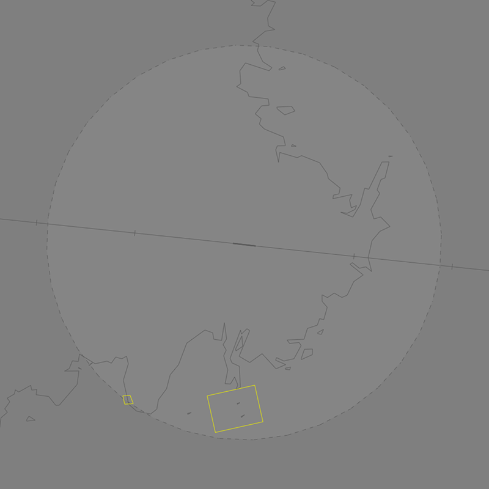

--8<-- "includes/abbreviations.md"

## Positions

| Name | Callsign | Frequency | Login ID |
| ---- | -------- | --------- | -------- |
| **Nausori ADC** | **Nausori Tower** | **118.700** | **NFNA_TWR**  | 
| **Nausori ATIS** | | **128.500** | **NFNA_ATIS** |  

## Airspace
NFNA ADC is responsible for the NFNA CTR consisting of Class D airspace `SFC` to `A025` within a **10nm** radius of NFNA ARP.

<figure markdown>
{ width="700" }
  <figcaption>NFNA ADC Airspace</figcaption>
</figure>

Refer to [Class D Tower Separation Standards](../../../separation-standards/classd) for more information.
<!--- ## Maneuvering Area

## Separation
--->
## Local Procedures

### Namuka Training Area
The Namuka Training Area is established west of the NFNA CTR, from `SFC` to `A040`, can be activated by NFNAA upon pilot request.

<figure markdown>
{ width="700" }
  <figcaption>Namuka Training Area</figcaption>
</figure>

When the Tiliva Training Area is activated, aircraft departing via **NAVUA** [shall be assigned](#sid-selection) the **CHARLIE** SID instead of the **ALPHA** SID.
<!--- ## VFR Operations --->
## Helicopter Operations
### Helipads and Landing Areas
While there are no controlled helipads at NFNA, there are privately managed helipads within the NFNA CTR, including a helipad at the Colonial War Memorial Hospital in central Suva.

Helicopters using these helipads be instructed to 'report on the ground'/'report when airbourne' in lieu of an explicit takeoff/landing clearance.
<!---## Runway Modes--->
## SID Selection
Aircraft planned via **LB VOR**, **MT NDB**, **NFNS**, **ATOLL**, **SAPIR**, **ISTOS**, **NAVUA**^, **NN VOR**, **MI NDB**, or **VK NDB** shall be assigned the **Procedural SID** that terminates at the appropriate waypoint. Jet Aircraft **not** planned via any of these waypoints shall receive amended routing via the most appropriate SID terminus, unless the pilot indicates they are unable to accept a Procedural SID.

!!! note
	^ When the [Namukla Training Area](#namuka-training-area) is active, aircraft tracking via NAVUA shall be assigned the **CHARLIE** SID, NA VOR transition, thence direct NAVUA.

### Approach Expectation
If visual approaches are in operation the APCH field must state `EXP VISUAL APCH`.

## Coordination
### NFNAA
#### Departures
Next coordination is required from NFNA ADC to NFNAA for all aircraft entering **NFNAA CTA**

The Standard Assignable Level from **NFNA ADC** to **NFNAA** is:

| Aircraft | Level |
| -------- | ----- |
| All | The lower of `A040` and `RFL` |

#### Arrivals/Overfliers
NFNAA will heads-up coordinate arrivals/overfliers to NFNA ADC.

IFR aircraft will be cleared for the coordinated approach (Instrument or Visual) prior to handoff to NFNA ADC, unless NFNA ADC nominates a restriction.

VFR aircraft require a level readback.

!!! phraseology
    **NFNAA** -> **NFNA ADC**: "via FNAWI for the RNP RWY 10, FJA81"  
    **NFNA ADC** -> **NFNAA**: "FJA81, RNP RWY 10"

<!---## Charts --->