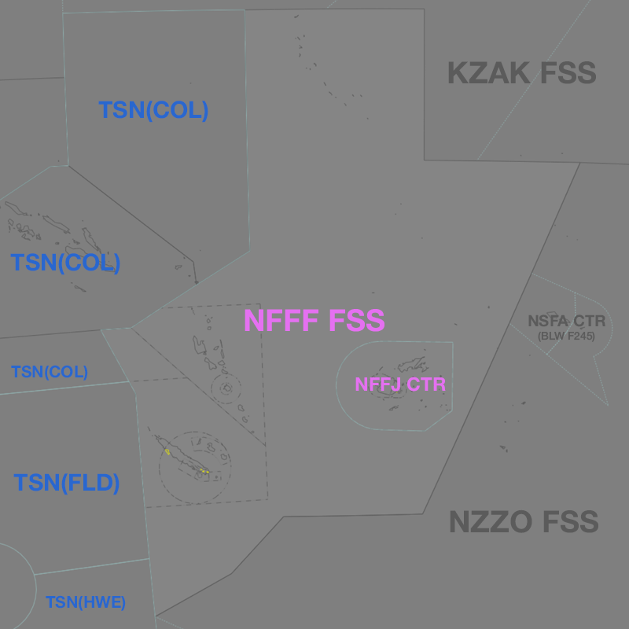

--8<-- "includes/abbreviations.md"

## Positions

| Name | ID | Callsign | Frequency | Login ID |
| ---- | ---- | ------ | --------- | -------- |
| **Nadi Oceanic Control** | **NFFF** | **Nadi Radio** | **8.846 (123.600)** | **NFFF_FSS**  |

## Airspace
<figure markdown>
{ width="700" }
  <figcaption>NFFF Airspace</figcaption>
</figure>

NFFF airspace from `A095` to `F200` is classified as Class D. NFFF airspace from `F200` to `F600` is classified as Class A.

### Reclassifications
#### NFFN_CTR
When NFFN_CTR is offline, the Fiji Domestic sector `SFC` to `UNL` remains uncontrolled.

!!! note
	Online coverage maps may incorrectly display the boundaries of NFFF with relation to NFFN_CTR, an pilots unfamiliar with the airspace may make contact requesting ATS within the domestic sector. Gently advise such pilots to switch to 122.800.

#### NWWW_CTR/NVVV_CTR
##### Online
When NWWW_CTR and NVVV_CTR are online, NFFF Class A airspace `F245`-`UNL` above their sector is released to the local controller, unless coordinated otherwise.

##### Offline
When NVVV_CTR or NWWW_CTR are offline, the Class D airspace `A095`-`F245` within their sector remains Class D but is delegated to NFFF. All controlled airspace below `A095`, including all offline TMA and CTR areas, are reclassified as Class G and administered by NFFF.

NFFF is **not permitted** to provide a top-down approach service in these circumstances.

## Extending
!!! warning "Important"
    NFFF is **not permitted** to extend to any adjacent domestic/international sectors.

## CPDLC
The Primary Communication Method for overfliers in NFFF is [CPDLC](../../../client/cpdlc).

The CPDLC Station Code is `NFFF`.

Voice may be used in lieu when applicable.

<!-- ## Sector Responsibilities

## Runway Modes
--->
## Surveillance Coverage
There are no radar services provided by NFFF; the sector is entirely [procedural](../../../separation-standards/procedural/).

!!! important
	In areas close to the domestic sector border limited surveillance coverage may be available. NFFF is **not permitted** use surveillance for separation.

<!---## STAR Clearances

## STAR Clearance Expectation--->

## Coordination
### NFFN_CTR
As per [Standard coordination procedures](../../../controller-skills/coordination/#pacific-units), Voiceless, no changes to route or CFL within **15 mins** to boundary.

### NSFA_CTR
As per [Standard coordination procedures](../../../controller-skills/coordination/#pacific-units), Voiceless, no changes to route or CFL within **15 mins** to boundary.

### Pacific Oceanic (NWWW/NVVV/TSN/NZZO/KZAK)
As per [Standard coordination procedures](../../controller-skills/coordination/#pacific-units), Voiceless, no changes to route or CFL within **15 mins** to boundary.

### NWWWA
When NWWW_CTR is [offline](#nwww_ctrnvvv_ctr) or when airspace above `F245` **has not** been released to NVVV_CTR, the following coordination applies.

#### Departures
Voiceless for all aircraft:

- Tracking via a Procedural SID terminus^; and
- Assigned the lower of `F240` or the `RFL`

All other aircraft going to NFFF CTA will be **Heads-up** coordinated by NWWWA.

!!! note
    ^Aircraft are *not required* to be tracking via the **SID procedure**, simply tracking via any of the terminus waypoints (Regardless of *departure airport* or *assigned SID*) is sufficient to meet the criteria for **voiceless coordination**

#### Arrivals/Overfliers
Voiceless for all aircraft:

- With ADES **NWWW**; and
- Assigned `A100`; and
- Assigned a STAR (if **Runway 11** is in use); or
- Tracking to **LTO VOR** (if **Runway 29** is in use).

All other aircraft coming from NFFF CTA must be **Heads-up** coordinated to NWWWA prior to **20nm** from the boundary.

### NVVV ADC
When NVVV_CTR is [offline](#nwww_ctr-nvvv_ctr) or when airspace above `F245` **has not** been released to NVVV_CTR, the following coordination applies.

#### Departures
[Next](../../controller-skills/coordination.md#next) coordination is required from NVVV ADC to NFFF for all aircraft **entering NFFF CTA**.

The Standard Assignable level from **NVVV ADC** to **NFFF** is:

| Aircraft | Level |
| -------- | ----- |
| All | The lower of `A090` and `RFL` |

### Arrivals/Overfliers
NFFF will heads-up coordinate arrivals/overfliers from Class D to NVVV ADC. 

The Standard Assignable level from NFFF to NVVV ADC is `A100`, any other level must be prior coordinated.

<!---## Charts--->