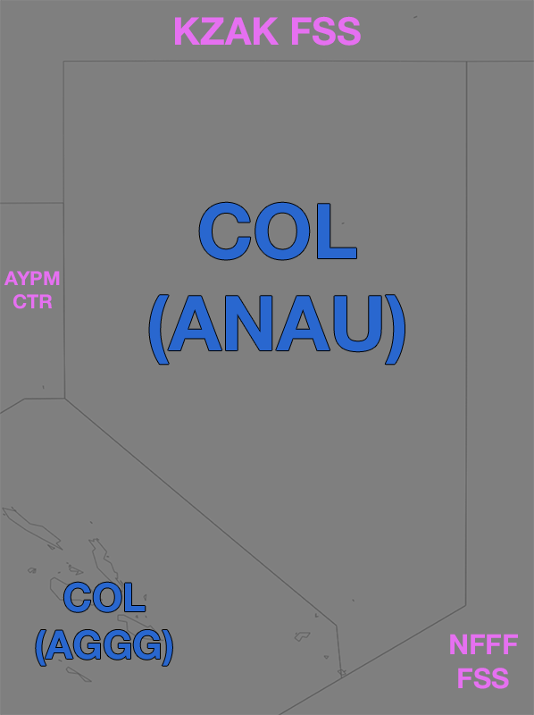
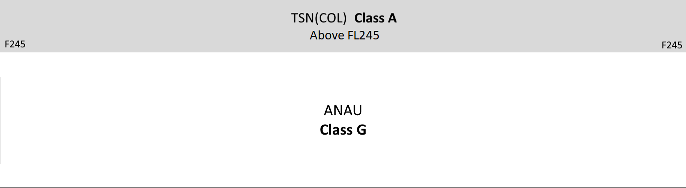

--8<-- "includes/abbreviations.md"

## Altimetry

### Transition Altitude 

In the Nauru FIR the transition altitude is 11,000 ft (`A110`).

### Transition Level

In the Nauru FIR the transition level is 12,000 ft (`F120`).

## Airspace
<figure markdown>
{ width="700" }
  <figcaption>ANAU FIR boundaries</figcaption>
</figure>

The Nauru FIR does not have any local ATS. All ATS above `F245` is provided by [TSN (COL)](../../oceanic/Positions/TSN/#coral-col).

<figure markdown>
{ width="700" }
  <figcaption>ANAU airspace diagram</figcaption>
</figure

Airspace below `F245` is classified as Class G.