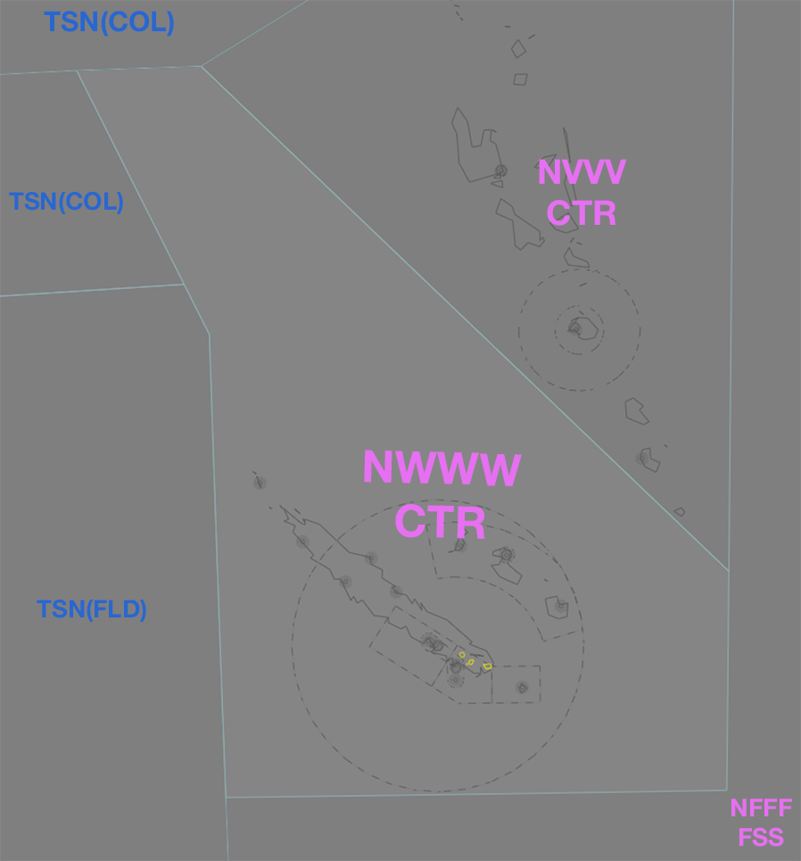

--8<-- "includes/abbreviations.md"

## Positions

| Name               | Callsign       | Frequency        | Login ID              |
| ------------------ | --------------| -------------- | ---------------- |
| **Tontouta Centre** | **Tontouta Control**  | **128.200**     | **NWWW_CTR**     |

!!! note
	In New Caledonia, French aviation rules and ATS terminology apply, which can differ significantly from that of other VATPAC areas. Ensure you have reviewed the [Phraseology](../#phraseology) section of the New Caledonia Local Instructions.

## Airspace
<figure markdown>
{ width="700" }
  <figcaption>NWWW Airspace</figcaption>
</figure>

The vertical limits of the NWWW Sector of the Nadi FIR are `SFC` to `F245`.

### NFFF Release
When NWWW_CTR is online, NFFF Class A airspace `F245`-`UNL` above the New Caledonia sector is released to NWWW_CTR, unless coordinated otherwise.
<!---### Reclassifications
### Special Positions

## Extending --->
## CPDLC
The Primary Communication Method for NWWW_CTR is Voice.

[CPDLC](../../../client/cpdlc) may be used in lieu when applicable.

The CPDLC Station Code is `NWWWC`.

!!! tip
    Even though NWWW_CTR's Primary Communication Method is Voice, CPDLC may be used for Overfliers.

<!---## Sector Responsibilities

## Runway Modes

## Surveillance Coverage

## STAR Clearances
## Star Clearance Expectation
--->
## Coordination
### NWWWA
#### Airspace
The vertical limits of the NWWW TCU are `SFC` to `F245`.

#### Arrivals/Overfliers
Voiceless for all aircraft:
- With ADES **NWWW**; and
- Assigned `A100`; and
- Assigned a STAR (if **Runway 11** is in use); or
- Tracking to **LTO VOR** (if **Runway 29** is in use).

All other aircraft coming from NWWW_CTR CTA must be **Heads-up** Coordinated to NWWWA prior to **20nm** from the boundary.

#### Departures
Voiceless for all aircraft:

- Tracking via a Procedural SID terminus^, **NIPOG**, **PULON**, **MESUS** or **ADKAD**; and
- Assigned the lower of `F240` or the `RFL`

All other aircraft going to NWWW_CTR CTA will be **Heads-up** Coordinated by NWWWA.

!!! note
    ^Aircraft are *not required* to be tracking via the **SID procedure**, simply tracking via any of the terminus waypoints (Regardless of *departure airport* or *assigned SID*) is sufficient to meet the criteria for **voiceless coordination**

### Pacific Oceanic (TSN/NFFF/NVVV)
As per [Standard coordination procedures](../../controller-skills/coordination/#pacific-units), Voiceless, no changes to route or CFL within **15 mins** to boundary.

## Charts
!!! abstract "Reference"
    Charts can be found on the [French AIS page](https://www.sia.aviation-civile.gouv.fr/){target=new}, available under AIP > eAIP PAC N.