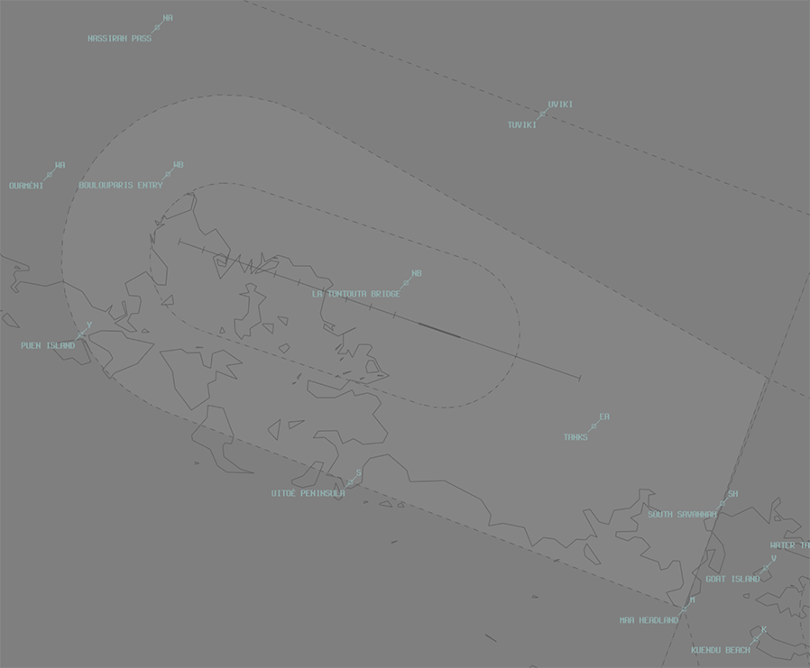
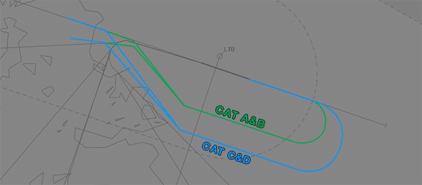
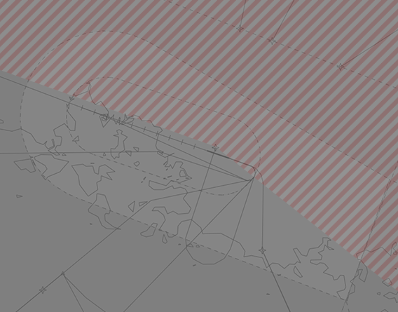

--8<-- "includes/abbreviations.md"

## Positions

| Name | Callsign | Frequency | Login ID |
| ---- | -------- | --------- | -------- |
| **Tontouta ADC** | **Tontouta Tower** | **118.100** | **NWWW_TWR** |
| **Tontouta SMC** | **Tontouta Ground** | **121.700** | **NWWW_GND** |
| **Tontouta ATIS** | | **126.200** | **NWWW_ATIS**	|

!!! note
	In New Caledonia, French aviation rules and ATS terminology apply, which can differ significantly from that of other VATPAC areas. Ensure you have reviewed the [Phraseology](../#phraseology) section of the New Caledonia Local Instructions.

## Airspace
NWWW ADC is responsible for:

- The Class D Airspace within the NWWW CTR Part 2 (the inner boundary) from `SFC` to `A015`.

<figure markdown>
{ width="700" }
  <figcaption>NWWW ADC Airspace</figcaption>
</figure>

Refer to [Class D Tower Separation Standards](../../../separation-standards/classd) for more information.

## Maneuvering Area
<!--### Responsibility
### Standard Taxi Routes --->
### Backtracking
**Taxiways B** and **C** are over a kilometre away from both runway thresholds. Category A and B aircraft, as well B738s and A320s, are permitted to turnaround on the runway at any intermediate point. Other aircraft must backtrack the entire length.

!!! warning "Important"
	Backtracking to the end of the runway, in both directions, can take between two to three minutes. This extra time must be taken into account when sequencing take-offs and landings.
<!--
### Taxiway Restrictions
## Separation --->

## Local Procedures
### Runway 29 VPT
Aircraft arriving via the **VPT** for Runway 29 will perform an **ILS** or **VOR** approach for Runway 11 before breaking right to follow the prescribed visual track.

<figure markdown>
{ width="700" }
</figure>

## VFR Operations
### Departures
VFR departures should advise their planned departure point and requested alitude to **NWWW SMC** with *taxi* call, and **NWWW ADC** with *ready* call. Departures will climb to at least `A015` (or `RFL`, if lower) in the circuit before tracking to their departure point.

!!! phraseology  
    **FOXYZ:** "Tontouta Ground, FOXYZ, Cessna 152, parking P2, information A, request taxi VFR to Koumac, via WA."  
    **NWWW SMC:** "FOXYZ, Tontouta Ground, squawk 7001, expect to exit control zone via WA. Taxi holding point C, Runway 29. Report ready for departure.  
    **FOXYZ:** "Squawk 7001, expect WA exit. Taxi holding point C, Runway 29. FOXYZ"

### Arrivals
VFR aircraft will report inbound at a VFR reporting point. NWWW ADC shall instruct aircraft to join the appropriate leg of the aerodrome circuit.

### VFR Reporting Points
| Code | Name (French) | Name (English) |
| ---- | ------------- | -------------- |
| EA | Réservoirs | Tanks |
| M | Pointe Maa | Maa headland |
| NB | Pont de la Tontouta | La Tontouta Bridge |
| NA | Col de Nassirah | La Nassirah Pass |
| PD | Passe de Dumbéa | Dumbéa Pass |
| S | Presqu'île de Uitoé | Uitoé Peninsula |
| SH | Sud Savannah | South Savannah |
| WA | Ouaméni | Ouaméni |
| WB | Entrée de Boulouparis | Boulouparis entry |
| Y | Ile Puen | Puen Island |

### Night Operations
At night, VFR aircraft are prohibited from performing a visual approach when arriving from the north, between **LTO VOR** radials 290° to 128°.

<figure markdown>
{ width="600" }
</figure>
<!---## Helicopter Operations--->

## Runway Modes
### Preferred Runway Modes
The preferred runway mode is reciprocal runway operations on **Runway 11/29**.

| Mode | Arrivals | Departures |
| ---- | -------- | ---------- |
| 1 - 29D11A | **11** | **29** |
| 2 - 11AD | **11** | **11** |
| 3 - 29AD | **29** | **29** |

If weather or traffic levels preclude reciprocal runway operations **Runway 11** shall be used for arrivals and departures, **except** when:

- Tailwind is greather than **10 kts**, or
- Tailwind is greather than **5 kts** and the runway is **wet**.

In those situations, **Runway 29** shall be used for arrivals and departures.

### Circuit Direction
| Runway | Direction |
| ------ | --------- | 
| 11 | Right |
| 29 | Left |

## SID Selection
Aircraft planned via **GOPRA**, **ONIBA**, **TEPAM**, **NISAS**, **POXAK**, **SCUBA**, or **VIRAR** shall be assigned the **Procedural SID** that terminates at the appropriate waypoint. Aircraft departing to the north-east shall be assigned the **Procedural SID** terminating at **LTO VOR**.

Jet aircraft **not** planned via any of these waypoints shall receive amended routing via the most appropriate SID terminus, unless the pilot indicates they are unable to accept a Procedural SID.

### ADES NWWM
Aircraft with ADES NWWM shall be assigned the **POGO** Procedural SID. This SID will allow aircraft to transition to the appropriate NWWM STAR at **GIRAD**. 

### Omnidirectional Departure
All IFR aircraft that cannot accept a Procedural SID shall be assigned an **[omnidirectional departure](../#omnidirectional-departures)**. Aircraft will follow the published omnidirectional procedure before following the tracking instructions given in their airwards clearance.

!!! phraseology  
    **NWWW SMC:** "KIW780, Tontouta Ground, Cleared to Whenuapai via flight planned route, omnidirectional departure runway 11 then direct VIRAR, inital climb 6000 feet, squawk 1234.

### Visual Departure
IFR aircraft can also be assigned a visual departure, when:

- Ceiling is greater than or equal to `A070`.
- Visibility is at least **5km**.

## ATIS
### Approach Expectation

If visual approaches are in operation the APCH field must state `EXP VISUAL APCH`.

If **Runway 11** is in use for arrivals and the cloud base is above `A030` but below `A060`, the APCH field shall also include:  
`ACFT ON THE ALPHA STAR EXP ILS APCH` 

## Coordination
### NWWWA
#### Auto Release

'Next' coordination is **not** required to NWWWA for aircraft that are:

- Assigned a **Procedural** SID
    - Departing from a runway nominated on the ATIS; and  
    - Assigned the standard assignable level.
- Not entering NWWWA CTA

All other aircraft require a 'Next' call to NWWWA.

'Next' coordination is additionally required for:

- Assigned the **POGO** SID with ADES NWWM.
- All aircraft during reciprocal runway operations.

The standard assignable level from NWWW ADC to NWWWA is:

| Aircraft | Level |
| -------- | ----- |
| All | The lower of `A060` and `RFL` |

#### Arrivals/Overfliers
NWWWA will heads-up coordinate arrivals/overfliers to NWWW ADC.  
IFR aircraft will be cleared for the coordinated approach (Instrument or Visual) prior to handoff to NWWW ADC, unless NWWW ADC nominates a restriction.

VFR aircraft require a level readback.

!!! phraseology
    **NWWWA** -> **NWWW ADC**: "via WW433 for the RNP RWY 11, ACI411"  
    **NWWA ADC** -> **NWWWA**: "ACI411, RNP RWY 11"  

## Charts
!!! abstract "Reference"
    Charts can be found on the [French AIS page](https://www.sia.aviation-civile.gouv.fr/){target=new}, available under AIP > eAIP PAC N.