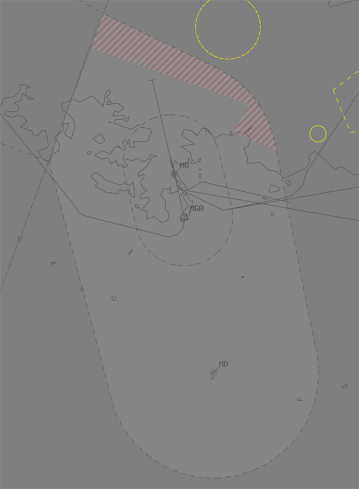
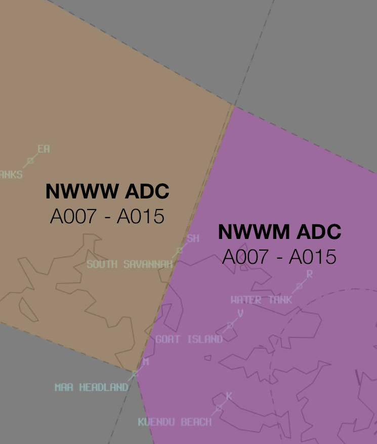

--8<-- "includes/abbreviations.md"

## Positions

| Name                    | Callsign         | Frequency | Login ID    |
| ----------------------- | --------- | ---------------- | --------- |
| **Magenta ADC** | **Magenta Tower** | **118.300**| **NWWM_TWR** | 
| **Magenta ATIS** |  | **126.600** | **NWWM_ATIS**	| 

!!! note
	In New Caledonia, French aviation rules and ATS terminology apply, which can differ significantly from that of other VATPAC areas. Ensure you have reviewed the [Phraseology](../#phraseology) section of the New Caledonia Local Instructions.

## Airspace
NWWM ADC is responsible for:

- The Class D Airspace within the NWWM CTR Part 1 (the outer boundary) from `A007` to `A015`, and
- The Class D Airspace within the NWWM CTR Part 2 (the inner boundary) from `SFC` to `A015`.

<figure markdown>
{ width="700" }
  <figcaption>NWWM ADC Airspace</figcaption>
</figure>

Refer to [Class D Tower Separation Standards](../../../separation-standards/classd) for more information.

<!---
## Maneuvering Area
### Responsibility
### Standard Taxi Routes
### Taxiway Restrictions
## Separation--->
## Local Procedures
### Runway 17 VPT
Aircraft arriving via the **VPT** for Runway 17 will perform a **VOR** approach for Runway 35 before breaking right to follow the prescribed visual track.

<figure markdown>
{ width="700" }
</figure>

## VFR Operations
### Departures
VFR departures should advise their planned departure point and requested alitude to **NWWM ADC** with *taxi* call. Departures will climb to at least `A015` (or `RFL`, if lower) in the circuit before tracking to their departure point.

!!! phraseology  
    **FOABC:** "Magenta Tower FOABC, Cessna 172, western general aviation parking, information A, request taxi VFR to Île des Pins, via WA."  
    **NWWW SMC:** "FOXYZ, Tontouta Ground, squawk 7001, expect to exit control zone via WA. Taxi holding point C, Runway 29. Report ready for departure.
    **FOXYZ:** "Squawk 7001, expect WA exit. Taxi holding point C, Runway 29. FOXYZ"

### Arrivals
VFR aircraft will report inbound at a VFR reporting point. NWWM ADC shall instruct aircraft to join the appropriate leg of the aerodrome circuit.

### VFR Reporting Points
| Code | Name (French) | Name (English) |
| ---- | ------------- | -------------- |
| B | Ilot Bailly | Bailly islet|
| C | La Coulée | La Coulée |
| K | Kuendu Beach | Kuendu Beach |
| I | Ilot Maitre | Maitre islet |
| L | La Croix | La Croix |
| M | Pointe Maa | Maa headland |
| NO | Ilot Nouaré | Nouaré |
| P | Ilot Porc-Epic | Porc-Epic islet |
| PD | Passe de Dumbéa | Dumbéa Pass |
| R | Réservoir d’eau | Water tank |
| SH | Sud Savannah | South Savannah |
| V | Ile aux Chèvres | Goat Island |

### Night Operations
At night, VFR aircraft are prohibited from performing a visual approach when arriving from the north within the shaded sector.

<figure markdown>
{ width="600" }
</figure>

## Helicopter Operations
The Magenta CTR contains the Nouméa Meridien Helipad (NWHH), as well as a military helipad at Artillery Point. Helicopters operating to and from these pads require a clearance from **NWWM ADC**.

## Runway Modes
### Runway Selection
The preferred runway mode is reciprocal runway operations on **Runway 17/35**.

| Mode | Arrivals | Departures |
| 1 - 17D35A | **35** | **17** |
| 2 - 35AD | **35** | **35** |
| 3 - 17AD | **17** | **17** |

If weather or traffic levels preclude reciprocal runway operations **Runway 35** shall be used for arrivals and departures, **except** when:

- Tailwind is greather than **10 kts**, or
- Tailwind is greather than **5 kts** and the runway is **wet**.

In those situations, **Runway 17** shall be used for arrivals and departures.

### Circuit Direction
| Runway | Direction |
| ------ | --------- | 
| 17 | Left |
| 35 | Right |

## SID Selection
Aircraft planned via **MR NDB**, **IP NDB**, or **LTO VOR** shall be assigned the **Procedural SID** that terminates at the appropriate waypoint. Unless the pilot indicates they are unable to accept a Procedural SID, aircraft **not** planned via any of these waypoints will:

- When **Runway 17** is in use, be assigned either the **SEP 1A** or **MG 1**, or
- When Runway **Runway 35** is in use, receive amended routing via the most appropriate SID terminus.

### ADES NWWW
Aircraft with ADES NWWW shall be assigned the **POGO** Procedural SID. This SID will allow aircraft to transition to the appropriate NWWW IAF at the **LTO VOR**. 

### Omnidirectional Departure
All IFR aircraft that cannot accept a Procedural SID shall be assigned an **[omnidirectional departure](../#omnidirectional-departures)**. Aircraft will follow the published omnidirectional procedure before following the tracking instructions given in their airwards clearance.

!!! phraseology  
    **NWWM ADC:** "VHABC, Magenta Tower, Cleared to Lord Howe Island via flight planned route, omnidirectional departure runway 35 then direct POXAK, inital climb 5000 feet, squawk 1234.

### Visual Departure
IFR aircraft can also be assigned a visual departure, when:

- Ceiling is greater than or equal to `A070`.
- Visibility is at least **5km**.

## ATIS
### Approach Expectation
If visual approaches are in operation the APCH field must state `EXP VISUAL APCH`.

## Coordination
### NWWWA
#### Departures
All aircraft departing into NWWWA Class D airspace must be 'Next' coordinated to NWWWA.

!!! phraseology
    **NWWM ADC** -> **NWWWA**: "Next, FEU"  
    **NWWWA** -> **NWWM ADC**: "FEU, Unrestricted"  
    **NWWM ADC** -> **NWWWA**: "FEU"

The standard assignable level from NWWM ADC to NWWWA is:

| Aircraft | Level |
| -------- | ----- |
| All | The lower of `A050` and `RFL` |

#### Arrivals/Overfliers
NWWWA will heads-up coordinate arrivals/overfliers to NWWM ADC.
  
IFR aircraft will be cleared for the coordinated approach (Instrument or Visual) prior to handoff to NWWM ADC, unless NWWM ADC nominates a restriction.

VFR aircraft require a level readback.

!!! phraseology
    **NWWWA** -> **NWWM ADC**: "Via the LU1N Arrival, TPC220 for the VPT”  
    **NWWM ADC** -> **NWWWA**: "TPC220, VPT"  

### NWWM ADC
NWWM ADC Class D Airspace adjoins the NWWW ADC Class D Airspace. Both ADC positions are jointly responsible for separation with traffic in the adjacent ADC airspace.

<figure markdown>
{ width="700" }
  <figcaption>The NWWW ADC/NWWM ADC border. (Not pictured - airspace above `A015`)</figcaption>
</figure>

#### Transiting aircraft
Aircraft transiting directly from ADC to ADC must be **heads-up** coordinated prior to **5 mins** from the boundary. VFR aircraft require a level readback.

!!! phraseology
    **NWWW ADC** -> **NWWM ADC**: "via SH, FOABC, `A010`"  
    **NWWM ADC** -> **NWWW ADC**: "FOABC, `A010`"  

#### Boundary
Aircraft operating within **1.5nm** of the boundary between the ADC's must be **[boundary coordinated](../../../controller-skills/coordination/#boundary**.

!!! phraseology
    **NWWM ADC** -> **NWWW ADC**: "For Ident, east of TINDU, TPC307"  
    **NWWW ADC** -> **NWWM ADC**: "TPC307"

## Charts
!!! abstract "Reference"
    Charts can be found on the [French AIS page](https://www.sia.aviation-civile.gouv.fr/){target=new}, available under AIP > eAIP PAC N.