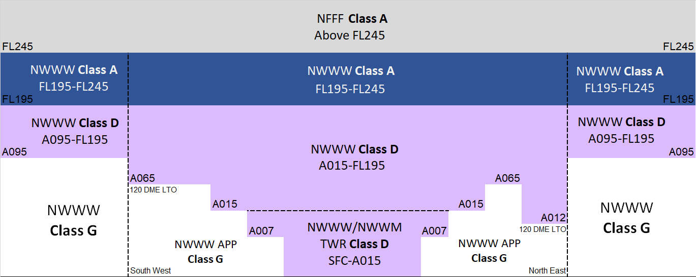

--8<-- "includes/abbreviations.md"

## Altimetry

### Transition Altitude 

In the New Caledonia sector the transition altitude is 11,000 ft (`A110`).

### Transition Level

| QNH (hPa) | Transition Level |
| --------- | ---------------- | 
| Less than 978 | `F140` | 
| Between 978 to 1012 | `F130` | 
| Between 1013 to 1048 | `F120` | 
| Greater than 1048 | `F110` | 

## Airspace
### Classes of Airspace
Within the New Caledonia sector, only three classes of airspace are used.

<figure markdown>
{ width="700" }
  <figcaption>New Caledonia Sector Airspace Structure</figcaption>
</figure>

| Class | Flight Rules | Separation provided | Service Provided | Airspace Speed Limitation | Radio Communication Requirements | Subject to ATC Clearance |
| ----- | ------------ | ------------------- | ---------------- | ------------------------- | -------------------------------- | ------------------------ |
| **A** | IFR | All aircraft | ATC Service | N/A | Continuous two-way | **Yes** |
| | VFR not permitted | | |  |  | |
| **D** | IFR | IFR from IFR | ATC Service IFR/VFR Traffic Info  | **250KT IAS** below **10,000FT AMSL** | Continuous two-way | **Yes** |
| | VFR | Nil | ATC Service VFR/VFR Traffic Info | As above | Continuous two-way | **Yes** |
| | SVFR | SVFR from IFR | ATC Service SVFR/VFR Traffic Info | As above | Continuous two-way | **Yes** |
| **G** | IFR | Nil | FIS upon request | **250KT IAS** below **10,000FT AMSL** | Continuous two-way | No |
| | VFR | Nil | FIS upon request | As Above | VHF radio required at aerodromes where carriage and use of radio is required. | No |

## Phraseology
New Caledonia is a French territory, and the French Directorate General for Civil Aviation (DGAC) is the governing civil aviation authority. French aviation rules and ATS terminology can differ significantly from that of other VATPAC areas.

A non-comprehensive list of noteworthy differences is detailed below. Pilots and controllers interested in extending their learning can refer to the [Manuel de phraséologie](https://www.sia.aviation-civile.gouv.fr/reglementation/).

### Callsigns
Some of the callsigns used in New Caledonia may be unfamiliar to controllers used to Australian airspace.

| ICAO | Callsign |
| ---- | -------- |
| ACI | AIRCALIN |
| CTM | COTAM |
| FAF | FRENCH AIR FORCE |
| FDO | FRENCH CUSTOM |
| FMY | FRENCH ARMY |
| FNY | FRENCH NAVY |
| RLY | LOYAUTE |
| TPC | AIRCAL |

#### Group Form
Group Form of callsigns is not used within the New Caledonia sector. Numbers in callsigns must be spoken individually, rather than grouped together.

!!! phraseology
    **NWWWA:** "Aussie Five Three Seven, climb flight level 220."
    **ASY537:** "Climb flight level 220, Aussie Five Three Seven."

#### Aircraft Registration
All aircraft will use their full callsign on first contact, and the abbreviated form thereafter. Locally registered aircraft (in the form F-Oxxx) will include the leading 'F'.

##### Examples
| Registration | Full Callsign | Abbreviated Form |
| ------------ | ------------- | ---------------- |
| F-OABC | FOABC | FBC |
| VH-X8N | VHX8N | V8N |
| N98765 | N98765 | N65 |

### Altitude
When referring to an altitude below the transition level, the word 'FEET' is included.

!!! phraseology
    **NWWWA:** "VBC, descend 7000 feet"  
	**VHABC:** "Descend 7000 feet, VBC"

!!! phraseology
    **NWWWA:** "N45, climb 11000 feet"  
	**N12345:** "Climb 11000 feet, N45"

### ACD/SMC Phraseology Differences
#### Airways Clearance
When requesting airways clearance, aircraft will state their aircraft type and gate, while confirming receipt of ATIS.

The structure of the airways clearance is broadly similar to Australian phraseology, though with some subtle wording changes. Notably, aircraft will be explicitly told that their readback is "correct".

!!! phraseology  
    **QFA92:** "Tontouta Ground, QFA92, Boeing 737-800, gate P2, request clearance to Sydney, information F on board."  
    **NWWW SMC:** "QFA92, Tontouta Ground, Cleared to Sydney via flight planned route, POXAK3E departure, runway 11, inital climb 6000 feet, squawk 1234.  
    **QFA92:** "Cleared to Sydney via flight planned route, POXAK3E departure, runway 11, initial climb 6000 feet, squawk 1234, QFA92."  
    **NWWW SMC:** "QFA92, correct, report ready for push and start."

##### Omnidirectional Departures
IFR aircraft that cannot accept a Procedural SID must be assigned an **omnidirectional departure**. Aircraft cleared for an omnidirectional departure will be given **either** tracking instructions, **or** a heading and initial altitude, in accordance with the published omnidirectional departure procedure.

!!! phraseology  
    **NWWW SMC:** "KIW780, Tontouta Ground, Cleared to Whenuapai via flight planned route, omnidirectional departure runway 11 then direct VIRAR, inital climb 6000 feet, squawk 1234.

#### VFR Operations
##### Waypoints
VFR waypoints in and around CTR in New Caledonia are given one or two letter codes that are used for reference in communications. The SOPs page for each airport contain a list of relevant waypoints and their names in English and French, for reference.

<figure markdown>
{ width="700" }
  <figcaption>VFR Waypoints in New Caledonia</figcaption>
</figure>

##### Departures
VFR Departures will be told to expect to depart the CTR via a VFR waypoint when given taxi clearance. 

!!! phraseology  
    **FOXYZ:** "Tontouta Ground, FOXYZ, Cessna 152, parking P2, information A, request taxi VFR to Koumac, via WA."  
    **NWWW SMC:** "FOXYZ, Tontouta Ground, squawk 7001, expect to exit control zone via WA. Taxi holding point C, Runway 29. Report ready for departure.  
    **FOXYZ:** "Squawk 7001, expect WA exit. Taxi holding point C, Runway 29. FOXYZ"

!!! note
	Both NWWW and NWWM sit within Class D airspace. As in [Australian airspace](../../controller-skills/circuitoperations/#clearance), a clearance to takeoff is a clearance to operate within a Class D control zone, so an explicit airways clearance is not given.

### ADC Phraseology Differences
#### Intersection Departures
When departing from an intermediate taxiway intersection, the taxiway identifier is included in the line up/takeoff clearance.

!!! phraseology  
    **NWWM ADC:** "FOLMN, line up and wait runway 17, intersection Z1."

#### Takeoff Clearance
Aicraft must be cleared to line-up before being given take off clearance. This can be achieved through separate transmissions, or by being issued together.

!!! phraseology 
    **NWWM ADC:** "TPC117, backtrack runway 35, line up and wait."  
	**TPC117:** "Backtrack Runway 35, line up and wait, TPC117."  
	*...*  
	**NWWM ADC:** "TPC117, Runway 35, cleared for takeoff."  
	**TPC117:** "Cleared for takeoff Runway 35, TPC117."
	
!!! phraseology 
    **NWWW ADC:** "TPC915, line up runway 29, intersection C, cleared for takeoff."  
	**TPC915:** "Lining up runway 29, intersection C and taking off, TPC117."
	
!!! note
	French pilots may also readback an instruction in verb form ie, "lining up and waiting", or "taking off". This phraseology is accepted in the New Caledonia sector.

## Charts
!!! abstract "Reference"
    Charts can be found on the [French AIS page](https://www.sia.aviation-civile.gouv.fr/){target=new}, available under AIP > eAIP PAC N.