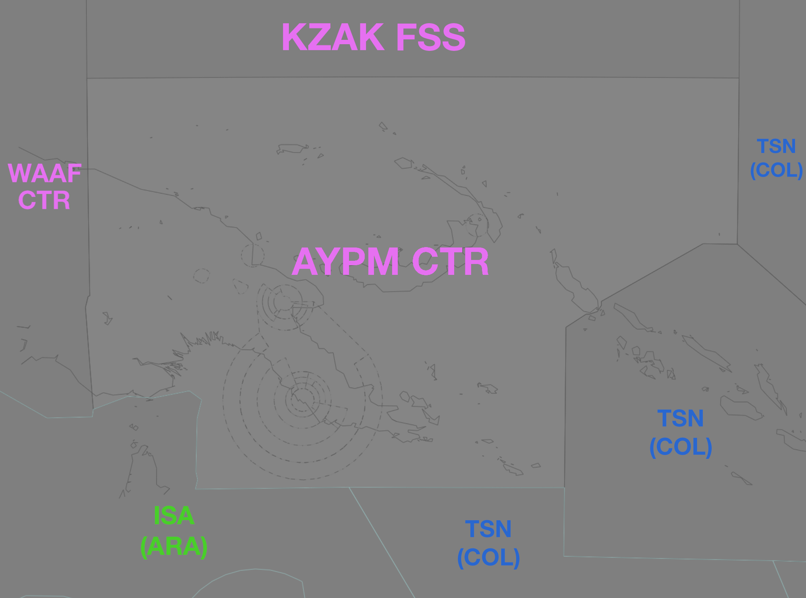

--8<-- "includes/abbreviations.md"

## Positions

| Name                    | ID |Callsign         | Frequency | Login ID    |
| ----------------------- | ---- | --------- | ---------------- | --------- |
| **Port Moresby Centre** | **AYPM** | **Moresby Control** | **123.400** | **AYPM_CTR** |
<!--- | Future HF frequency | -->

!!! warning "Important"
    VHF coverage is limited in the east of the sector, and in remote areas at lower levels.

## Airspace
<figure markdown>
{ width="700" }
  <figcaption>AYPM Airspace</figcaption>
</figure>

Airspace `SFC` to `BCTA` is considered Class F.

Refer to the [PNG Local instructions](../) for more information about Class F operations.

### Reclassifications
#### AYNZ CTR
When **AYNZ ADC** is offline, AYNZ CTR (Class C `SFC` to `A060`) is reclassified as Class F, and is administed by AYPM. Alternatively, AYPM may provide a [top-down procedural service](../Nadzab) if they wish.

#### Class F Aerodromes
When **AYGA ADC**, **AYMD ADC**, **AYMH ADC**, **AYTK ADC** are offline, the [ATZ](../#aerodrome-traffic-zones)'s of their respective aerodromes are inactive. The airspace remains Class F.
<!--- ## Extending --->
## CPDLC ##
The Primary Communication Method for AYPM west of 150°E is Voice, east of 150°E is [CPDLC](../../../client/cpdlc).

The CPDLC Station code is `AYPM`.

Both CPDLC or Voice may be used in lieu when applicable.
<!---## Sector Responsibilities

### Sequencing

## Runway Modes --->
## Surveillance Coverage
Limited surveillance coverage exists throughout the entire sector at lower levels, and beyond 200NM AYPY.  [Procedural Standards](../../../separation-standards/procedural/) must be implemented **prior** to losing surveillance coverage.

## STAR Clearances
AYPM is responsible for issuing STAR clearances for all aicraft inbound to AYPY. Aircraft shall be given STAR Clearance after first being advised "STAR CLEARANCE AVAILABLE".
<!--- ## STAR Clearance Expectation--->
## Coordination
### AYPY TCU
#### Departures
Voiceless coordination is in place from AYPYA to AYPM for aircraft assigned the lower of `A150` or the `RFL` and tracking via a procedural SID terminus.

Any aircraft not meeting the above requirements must be prior coordinated to AYPM.

#### Arrivals
Voiceless coordination for all aircraft:
- With ADES **AYPY**; and  
- Assigned a STAR; and  
- Assigned `A140`

All other aircraft coming from AYPM CTA must be **Heads-up** coordinated to AYPYA.

### AYNZ TCU
*To Do*

### Class F Aerodromes
#### Departures and Arrivals
As per [Standard coordination procedures](../../controller-skills/coordination/#octa-coordination), coordination between ADC and AYPM is **not required**. However, a **5 minute** change parameter applies to any aircraft that change level, route, or taxi within **5 minutes** of the next sector's airspace.

#### Overfliers
As per [Standard coordination procedures](../../controller-skills/coordination/#octa-coordination), coordination between ADC and AYPM is **not required**. However, a **5 minute** change parameter applies to any aircraft that change level, route, or taxi within **5 minutes** of the next sector's airspace.

IFR aircraft may either be handed off to the ADC frequency by AYPM, or held on the AYPM frequency following coordination if there is no relevant traffic.

!!! phraseology
    *DEF tracking YABAL H409 PAPTI*  
    **AYPM** -> **AYMH ADC**: "via LEMER, DEF, any traffic or frequency requirements?."  
    **AYMH ADC** -> **AYPM**: "DEF, No reported IFR traffic, no frequency requirements."  
    AYPM CTR will put *"AYMH NFR NIT"* in the label data, and the aircraft will remain on the ENR frequency.

### International (ISA(ARA)/KEN(WIL))
As per [Standard coordination procedures](../../controller-skills/coordination/#pacific-units), Voiceless, no changes to route or CFL within **15 mins** to boundary.
    
### Pacific Oceanic (TSN(COL)/KZAK)
As per [Standard coordination procedures](../../controller-skills/coordination/#pacific-units), Voiceless, no changes to route or CFL within **15 mins** to boundary.

Aircraft must have their identification terminated and be instructed to make a position report on first contact with the next (procedural) sector.

!!! phraseology
    **AYPM**: "SOL712, identification terminated, report position to Brisbane Radio, 124.65"

### International (WAAF)
As per [Standard coordination procedures](../../controller-skills/coordination/#other-units), Heads-up Coordination required for all aircraft prior to **30 mins** from boundary.

!!! phraseology
    **AYPM** -> **WAAF_CTR**: "Estimate, ANG8, KADAB time 59, F380"  
    **WAAF_CTR** -> **AYPM**: "ANG8, F380"

## Charts
!!! abstract "Reference"
    Charts can be found on the [PNG AIP Flight Supplement](https://www.niuskypacific.com.pg/aip-flight-supplements/){target=new}.
