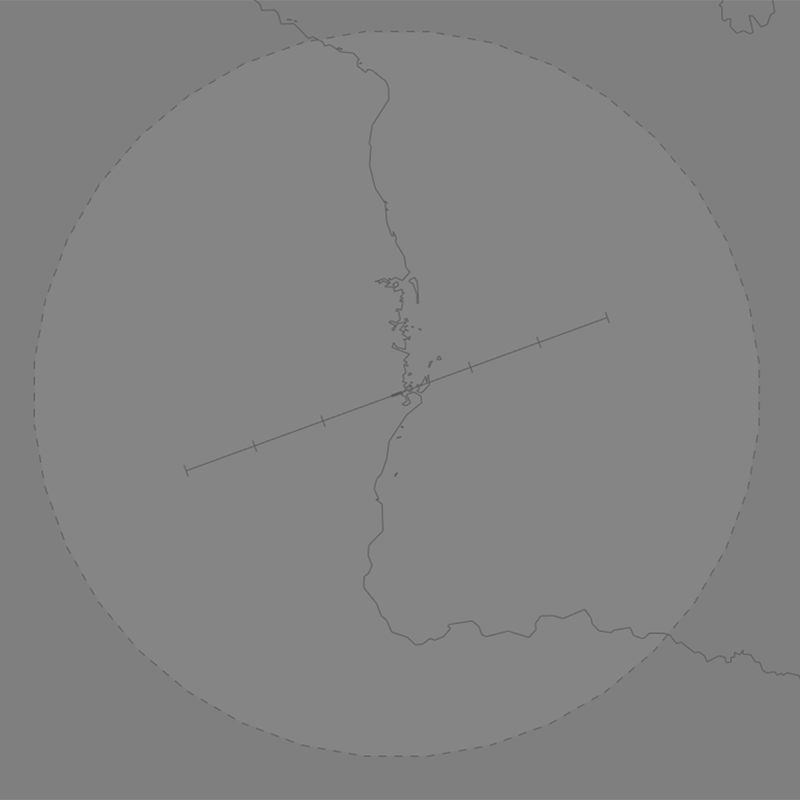

--8<-- "includes/abbreviations.md"

## Positions

| Name                    | Callsign         | Frequency | Login ID    |
| ----------------------- | --------- | ---------------- | --------- |
| **Madang ADC** | **Madang Tower** | **118.100** | **AYMD_TWR**	| 
| **Madang ATIS**	| | **127.800** | **AYMD_ATIS** |

## Airspace
The Madang ADC is responsible for the Class F airspace `SFC` to `A200` within the Madang ATZ.

<figure markdown>
{ width="700" }
</figure>

Refer to the [PNG Local instructions](../) for more information about Class F/ATZ operations.

### Circuit Direction
| Runway | Direction |
| ------ | ----------|
| 07     | Right     |
| 25     | Left      |
