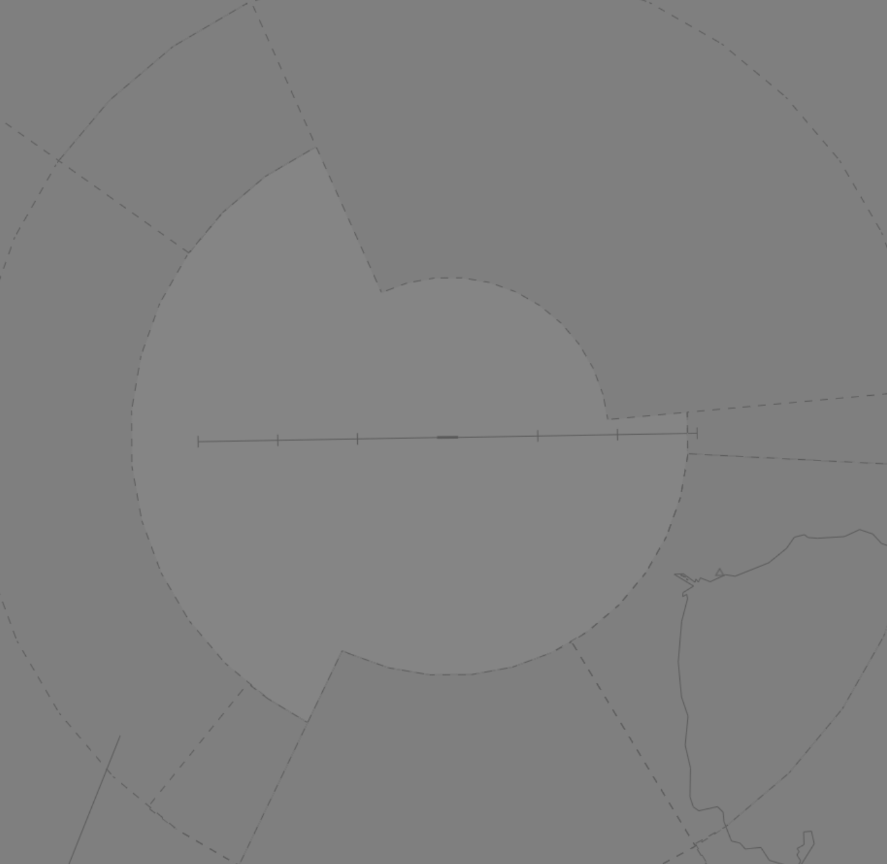
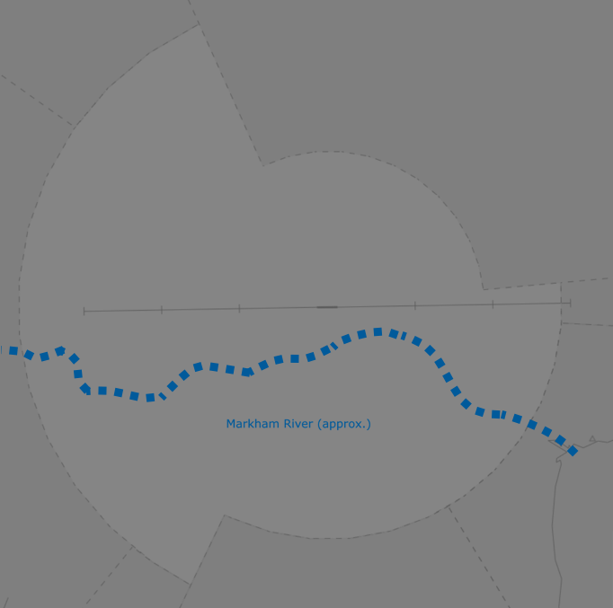
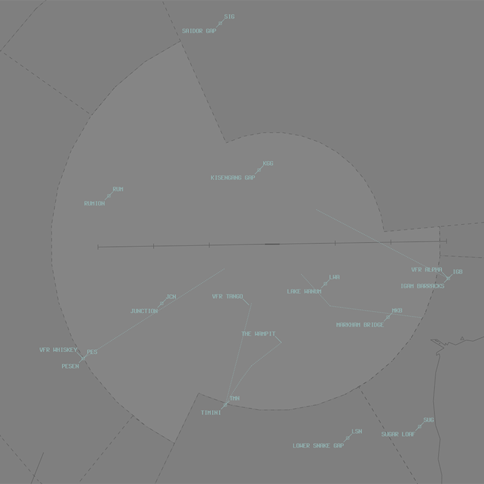

--8<-- "includes/abbreviations.md"

## Positions

| Name | Callsign | Frequency | Login ID |
| ---- | ------- | --------- | -------- |
| **Nadzab ADC**  | **Nadzab Tower** | **121.700** | **AYNZ_TWR** | 
| **Nadzab ATIS** | | **128.100** | **AYNZ_ATIS** | 

## Airspace
AYNZ ADC is responsible for the Class C Airspace within the AYNZ CTR `SFC` to `A060`.

<figure markdown>
{ width="700" }
    <figcaption>Nadzab ADC Airspace</figcaption>
</figure>
<!---
## Manoeuvring Area
### Responsibility
### Standard Taxi Routes
### Taxiway Restrictions--->
## Separation
### Surveillance
Surveillance coverage can be expected to be available at all levels in the AYNZ CTR. Although AYNZ ADC is **not permitted** to use surveillance for separation, AYPM may assist by establishing surveillance separation standards via coordination.

### Lateral Separation Points
The Markham River runs East-West through the AYNZ CTR south of the Runway 09/27 centreline.

<figure markdown>
{ width="700" }
    <figcaption>The Markham River within the AYNZ CTR</figcaption>
</figure>

Its prominence and location makes it a convenient option to implement a [geographic feature separation standard](../../../separation-standards/visual/#geographic-features).

## Local Procedures
### Standard Departure Clearances
In lieu of a SID, departing aircraft may be issued with a **Standard Departure Clearance** (SDC). Aircraft cleared via an SDC will depart the circuit visually, and then intercept the track specified by five miles. 

AYNZ ADC will clear relevant departures via the appropriate coded SDC, write the departure name in the Global Ops Field.

!!! phraseology
    **AYNZ ADC:** "...cleared to Guam via Departure 35 then PIKOK flight planned route..." 

A list of the Standard Departure Clearances is available in the [AIP Flight Supplement](#charts).

## VFR Operations
### Departure/Arrival Gates
Aircraft should report at the standard VFR Departure/Arrival Gates.

<figure markdown>
{ width="500" }
  <figcaption>AYNZ VFR Departure/Arrival Gates</figcaption>
</figure>

| Direction from AYNZ | Code | Name | Dep/Arr |
| ------------------- | ---- | ---- | ------- |
| North | SIG | Saidor Gap | Both |
| North | KGG | Kisengang Gap | Both |
| East | IBG | Igam Barracks | Both |
| Southeast | LWA | Lake Wanum | Both |
| Southeast | SUG | Sugar Loaf | Both |
| Southeast | SAL | Salamaua | Both |
| Southeast | MKB | Markham Bridge | Both |
| South | LSN | Lower Snake Gap | Both |
| South | TMN | Timini | Both |
| Southwest | PES | Pesen | Both |
| West | RUM | Rumion | Both |
| West | JCN | Junction | Both |

### Inbound/Outbound Routes
| Victor | Inbound | Outbound |
| ------ | ------- | -------- |
| Alpha | IBG-Ngaro Post Office | Ngaro Post Office-IBG |
| Mike | Lae-MKB-Umsis-Mt Ngaroneno | Mt Ngaroneno-Umsis-MKB-Lae |
| The Wampit | TMN to Gabensis following the Lae-Bulolo Road | Gabensis to TMN following Lae-Bulolo Road |
| Tango | Mari-TMN | TMN-Mari |
| Whiskey | Track NZ VOR 237 Radial inbound, remaining south of Watut River | Track 237 NZ radial outbound, remaining south of Watut River |

## Helicopter Operations
### Helipads and Landing Areas
There are no controlled helipads at AYNZ. While most helicopters operate in Lae outside the AYNZ CTR, there is a private helipad within the CTR at the Crossroads Hotel, 12.9NM southeast of the ARP. 

Helicopters using this helipad be instructed to 'report on the ground'/'report when airbourne' in lieu of an explicit clearance.

!!! important
	The Crossroads helipad sits less than 1NM northeast of the LARID-NZ. Helicopters using the pad **are not** laterally separated from aircraft tracking LARID-NZ *or* from aicraft on the VOR approach to Runway 27. AYNZ ADC must ensure an alternate separation standard is in place at all times.
	
<!--- ## Runway Modes
### Runway Selection
### Special Runway Operations
### Circuits -->

## SID Selection
There are no SIDs at AYNZ. In **VMC by day**, all aircraft shall be assigned a **visual departure**. 

Otherwise:

- IFR aircraft departing via **MUDIX** shall be assigned the **GOROKA 1** or **GOROKA 2** **DME departure**.
- IFR aircraft departing via **LARID** shall be assigned the **LAE** **DME departure**.
- IFR aircraft not departing via **MUDIX** or **LARID** should be assigned an [SDC](#standard-departure-clearances) and/or sector **DME departure**.

<!--- ## ATIS --->

## Coordination
### Departures
[Next](../../../controller-skills/coordination.md#next) coordination is required from AYNZ ADC to AYNZA for all aircraft **entering AYNZA CTA**.

The Standard Assignable Level from **AYNZ ADC** to **AYNZA** is:

| Aircraft | Level |
| -------- | ----- |
| All | The lower of `A050` and `RFL` |
   
### Arrivals
#### Arrivals
AYNZA will **heads-up** coordinate all arrivals/overfliers to AYNZ ADC.

- Aircraft on an instrument approach will be cleared for the approach prior to handoff to AYNZ ADC, unless AYNZ ADC nominates a restriction.
- Aircraft on a visual approach will be coordinated, but will receive their approach clearance and circuit joining instructions from AYNZ ADC.

!!! phraseology
    **AYNZA** -> **AYNZ ADC**: "Via LARID for the RNAV, PXB.”  
    **AYNZ ADC** -> **AYNZA**: "PXB." 

## Charts
!!! abstract "Reference"
    Charts can be found on the [PNG AIP Flight Supplement](https://www.niuskypacific.com.pg/aip-flight-supplements/){target=new}.
