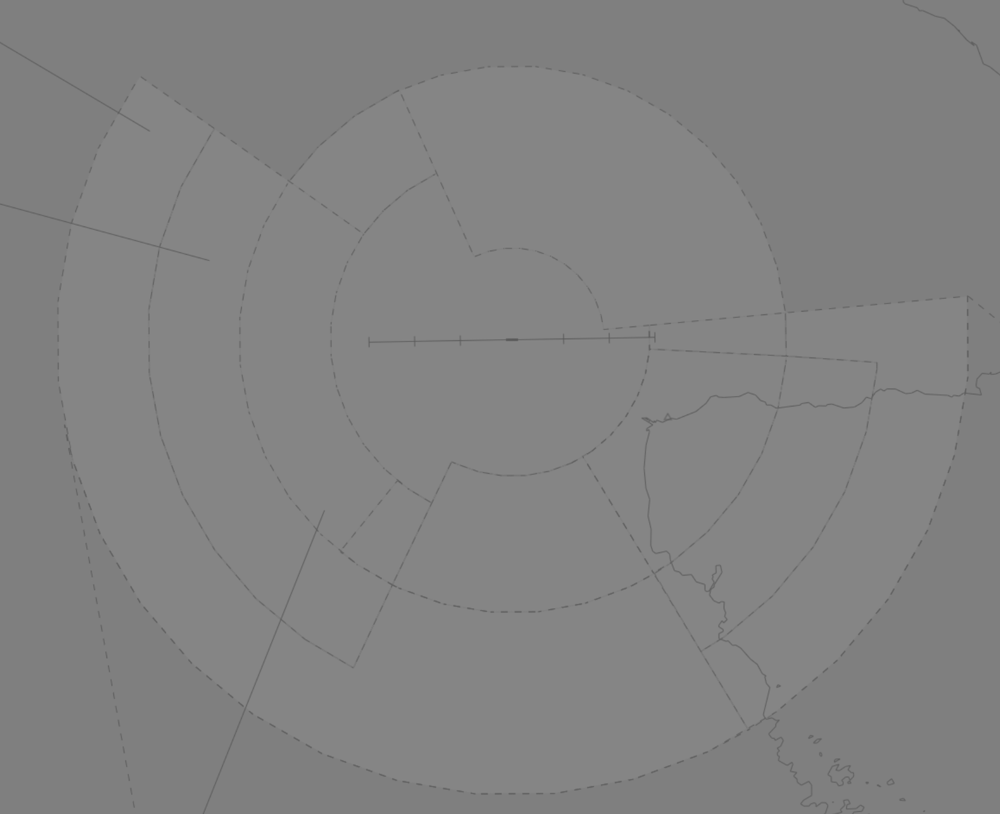

--8<-- "includes/abbreviations.md"

## Positions

| Name | ID | Callsign | Frequency | Login ID |
| ---- | ---- | ------ | --------- | -------- |
| **Nadzab Approach** | **AYNZA** | **Nadzab Approach** | **118.600** | **AYNZ_APP** | 

## Airspace
AYNZA is responsible for the Class C Airspace within the AYNZ TMA `A060` to `F245`.

<figure markdown>
{ width="700" }
    <figcaption>Nadzab TMA Airspace</figcaption>
</figure>
Airspace `SFC` to `BCTA` is considered Class F. Refer to the [PNG Local instructions](../) for more information about Class F operations.
<!--- ### Reclassifications
### Airspace Division
### Special Positions --->
## Separation
### Surveillance
Surveillance coverage can be expected to be available at all levels in the AYNZ TMA. Although AYNZA is **not permitted** to use surveillance for separation, AYPM may assist by establishing surveillance separation standards via coordination.

## Local Procedures
### Approach Selection
In **VMC by day**, all aircraft shall be assigned a visual approach.

In all other situations:

- IFR aircraft shall be assigned either the **RNAV** or the **VOR/DME** approach.
<!--- ##  Departure/Arrival Procedures
## Tower Offline Procedures
## Runway Modes
## Helicopter Operations
## Flow --->
## Coordination  
### Enroute
#### Departures
All aircraft going to AYPM CTA must be **Heads-up** Coordinated by AYNZA prior to the boundary.

The Standard Assignable Level from **AYNZA** to **AYPM** is:

| Aircraft | Level |
| -------- | ----- |
| All | The lower of `F240` and `RFL` |

#### Arrivals
AYPM will **heads-up** coordinate all arrivals/overfliers to AYNZA.

!!! phraseology
    **AYPM** -> **AYNZA**: "Via WESTERN GPS Arrival, TOK8409.”  
    **AYNZA** -> **AYPM**: "TOK8409."
	
The Standard Assignable level from AYPM to AYNZA is `F250`. Any other level must be prior coordinated.
	
### AYNZ ADC
#### Airspace
AYNZ ADC is responsible for the Class C Airspace within the AYNZ CTR `SFC` to `A060`.

#### Departures
[Next](../../../controller-skills/coordination.md#next) coordination is required from AYNZ ADC to AYNZA for all aircraft **entering AYNZA CTA**.

The Standard Assignable Level from **AYNZ ADC** to **AYNZA** is:

| Aircraft | Level |
| -------- | ---- |
| All | The lower of `A050` and `RFL` |

#### Arrivals
AYNZA will **heads-up** coordinate all arrivals/overfliers to AYNZ ADC.

- Aircraft on an instrument approach will be cleared for the approach prior to handoff to AYNZ ADC, unless AYNZ ADC nominates a restriction.
- Aircraft on a visual approach will be coordinated, but will receive their approach clearance and circuit joining instructions from AYNZ ADC.

!!! phraseology
    **AYNZA** -> **AYNZ ADC**: "Via LARID for the RNAV, PXB.”  
    **AYNZ ADC** -> **AYNZA**: "PXB." 

## Charts
!!! abstract "Reference"
    Charts can be found on the [PNG AIP Flight Supplement](https://www.niuskypacific.com.pg/aip-flight-supplements/){target=new}.
