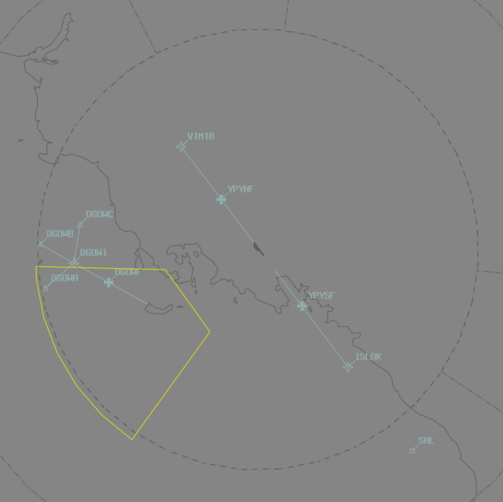

--8<-- "includes/abbreviations.md"

## Positions

| Name                      | ID | Callsign         | Frequency | Login ID    |
| ------------------------- | ----- | --------- | ---------------- | --------- |
| **Port Moresby Approach** | **AYPYA** | **Jacksons Radar** | **125.800** | **AYPY_APP**	| 

## Airspace
AYPYA is responsible for the Class C Airspace within the AYPY CTR `A020` to `A150`.
<figure markdown>
{ width="700" }
    <figcaption>Port Moresby TCU Airspace</figcaption>
</figure>

Airspace `SFC` to `BCTA` is considered Class F. Refer to the [PNG Local instructions](../) for more information about Class F operations.

<!--### Reclassifications
### Airspace Division
### Special Positions
## Separation
### Responsibility -->
## Local Procedures
### Daugo Training Area
The AYD901 (Daugo) Danger Area is in the south-west AYPY CTR, `SFC` to `A040`, and is used for flight training and practice approaches.

<figure markdown>
{ width="700" }
    <figcaption>AYD901 (Daugo) Danger Area</figcaption>
</figure>

When activated, the airspace is administered by AYPYA. Aircraft will be cleared to enter the Training Area via the **GPS Approach** and advised to report overhead `DGOWH` after conducting the mandatory missed approach.

### Terrain
**Very high terrain** exists to the North-East of the field, with the MVA up to `F155`. Use *caution* when vectoring, and ensure that terrain separation is maintained at **all times**.

!!! tip
    The *biggest risk* to terrain separation is vectoring in the **north and east** (Potential conflict areas are shaded below). Avoid vectoring in these areas, and do not assign below `A060` until aircraft are within **30nm** of the field.

<figure markdown>
{ width="700" }
  <figcaption>AYPY RTCC</figcaption>
</figure>
<!--## Departure/Arrival Procedures
## Tower Offline Procedures --->

## Runway Modes
### Parallel Runway Operations
Simultaneous parallel runway operations, including PROPS and SODROPS, are not authorised at AYPY. Arrivals for parallel runways should be sequenced so that their approaches are not simultaneous and separation is maintained.

<!--- ## Helicopter Operations
## Flow --->

## Coordination
### Enroute
#### Departures
Voiceless for aircraft:

- Tracking via a Procedural SID terminus^; and
- Assigned the lower of `A150` or the `RFL`.

!!! note
    ^Aircraft are *not required* to be tracking via the **SID procedure**, simply tracking via any of the terminus waypoints (Regardless of *departure airport* or *assigned SID*) is sufficient to meet the criteria for **voiceless coordination**

All other aircraft going to AYPM CTA must be **Heads-up** Coordinated by AYPYA prior to the boundary.

#### Arrivals
Voiceless coordination for all aircraft:

- With ADES **AYPY**; and  
- Assigned a STAR; and  
- Assigned `A140`.

All other aircraft coming from AYPM CTA must be **Heads-up** coordinated to AYPYA.

### AYPY ADC
#### Airspace 
AYPY ADC is responsible for the Class C Airspace within the AYPY CTR `SFC` to `A020`.

#### Auto Release
'Next' coordination is **not** required from AYPY ADC for aircraft that are:

- Departing from a runway nominated on the ATIS; and  
- Assigned the standard assignable level; and  
- Assigned a **Procedural** SID.

All other aircraft require a 'Next' call to AYPYA.

| Aircraft | Level |
| -------- | ----- |
| All | The lower of `A050` and `RFL` |

#### Overfliers
AYPYA will heads-up coordinate arrivals/overfliers from AYPYA to AYPY ADC prior to **5 mins** from the boundary.
VFR aircraft require a level readback.  

## Charts
!!! abstract "Reference"
    Charts can be found on the [PNG AIP Flight Supplement](https://www.niuskypacific.com.pg/aip-flight-supplements/){target=new}.