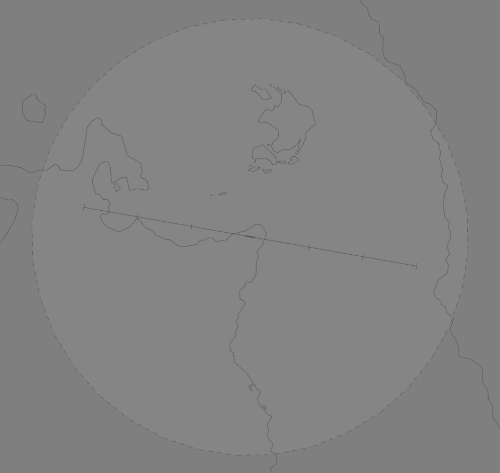

--8<-- "includes/abbreviations.md"

## Positions

| Name                    | Callsign         | Frequency | Login ID    |
| ----------------------- | --------- | ---------------- | --------- |
| **Tokua (Rabul) ADC**	| **Tokua Tower** | **118.200** | **AYTK_TWR** | 
| **Tokua (Rabul) ATIS**	| | 	**128.000** | **AYTK_ATIS**	 | 

## Airspace
ADC is responsible for the **Tokua ATZ**; consisting of Class F airspace `SFC` to `A200` within a **25nm** Radius of AYTK ARP.

<figure markdown>
{ width="700" }
</figure>

Refer to the [PNG Local instructions](../) for more information about Class F/ATZ operations.

### Circuit Direction
| Runway | Direction |
| ------ | ----------|
| 10     | Left      |
| 28     | Right     |
