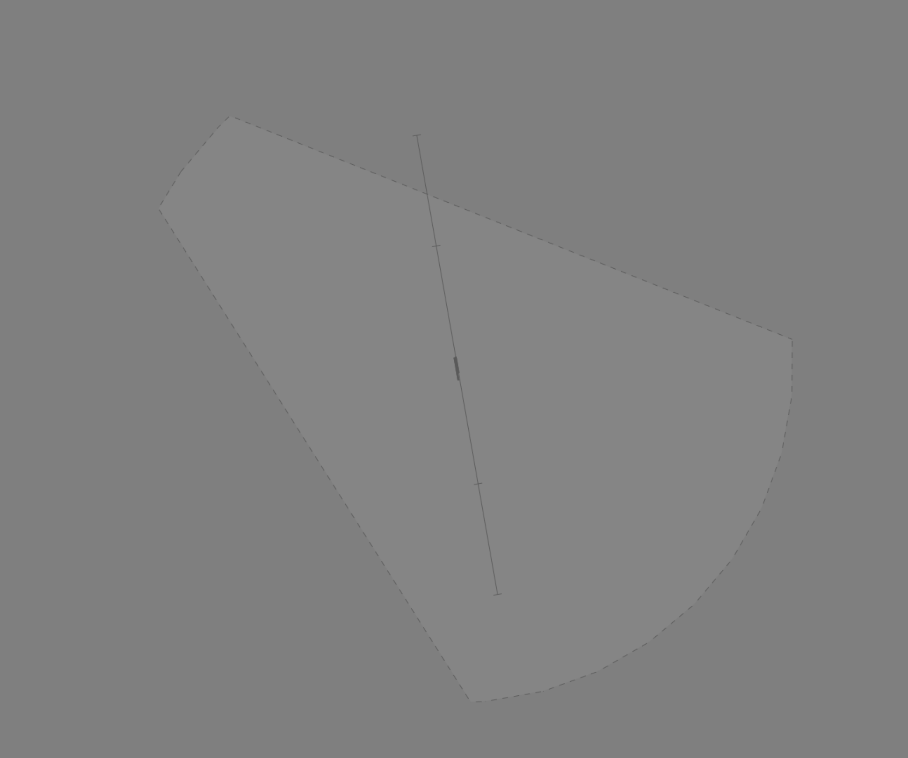
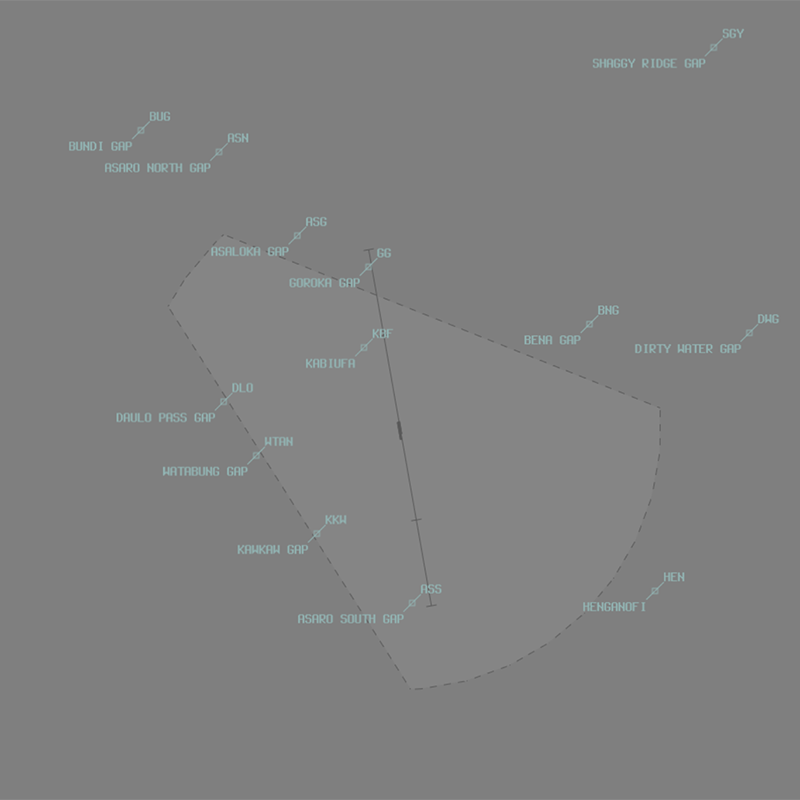

--8<-- "includes/abbreviations.md"

## Positions

| Name                    | Callsign         | Frequency | Login ID    |
| ----------------------- | --------- | ---------------- | --------- |
| **Goroka ADC** | **Goroka Tower**	| **118.700** | **AYGA_TWR** | 
| **Goroka ATIS**	| | **134.000** | **AYGA_ATIS**	 | 

## Airspace
ADC is responsible for the **Goroka ATZ**; consisting of Class F airspace `SFC` to `A200`.

<figure markdown>
{ width="700" }
</figure>

Refer to the [PNG Local instructions](../) for more information about Class F/ATZ operations.

<!---
## Maneuvering Area
### Responsibility
### Standard Taxi Routes
### Taxiway Restrictions
## Separation
### Responsibility
## Lateral Separation Points
## Local Procedures
## VFR operations
## Local Procedures-->
## VFR Operations
### Departure/Arrival Gates
Aircraft should report at the standard VFR Departure/Arrival Gates.

<figure markdown>
{ width="500" }
  <figcaption>AYGA VFR Departure/Arrival Gates</figcaption>
</figure>

| Direction from AYGA| Code | Name | Dep/Arr |
| ------------------- | ---- | ---- | ------- |
| North | ASG | Asaloka Gap North | Both |
| North | GG | Goroka Gap | Both |
| North | KBF | Kabiufa | Both |
| North | ASN | Asaro North Gap | Both |
| Northeast | BNG | Bena Gap | Both |
| Northeast | DWG | Dirty Water Gap | Both |
| Southeast | HEN | Henganofi | Both |
| South | ASS | Asaro South Gap | Both |
| Southwest | KKW | Kawkaw Gap | Both |
| West | WAN | Watabung Gap | Both |
| Northwest | DLO | Daulo Pass Gap | Both |
| Northwest | BUG | Bundi Gap | Both |

## Helicopter Operations
### Helipads and Landing Areas
There are no controlled helipads at AYGA. Multiple uncontrolled helipads have been established on the south apron by private operators.

These helipads are outside the controlled maneuvering area and do not receive explicit takeoff/landing clearance. Helicopters using these helipads be instructed to 'report on the ground'/'report when airbourne' in lieu of an explicit takeoff/landing clearance.

## Runway Modes
Due to high terrain to the north of the airport, the only authorised runway mode is reciprocal runway operations on Runway **17R/35L**

| Mode | Arrivals | Departures |
| ---- | -------- | ---------- |
| 1 - 17D/35A | **35L** | **14R** |

Runway **17L/35R** is predominantly used as a taxiway, though AYGA ADC can allow ad-hoc take-offs and landings on *pilot request*.

### Special Runway Operations
#### Parallel Runway Operations
Simultaneous parallel runway operations, including PROPS and SODROPS, are not authorised at AYGA. 

<!---
## SID Selection
## ATIS
--->
## Coordination
### Departures and Arrivals
As per [Standard coordination procedures](../../controller-skills/coordination/#octa-coordination), coordination between AYGA ADC and AYPM is **not required**. However, a **5 minute** change parameter applies to any aircraft that change level, route, or taxi within **5 minutes** of the next sector's airspace.

### Overfliers
As per [Standard coordination procedures](../../controller-skills/coordination/#octa-coordination), coordination between AYGA ADC and AYPM is **not required**. However, a **5 minute** change parameter applies to any aircraft that change level, route, or taxi within **5 minutes** of the next sector's airspace.

IFR aircraft may either be handed off to AYGA ADC frequency by AYPM, or held on the AYPM frequency following coordination if there is no relevant traffic.

!!! phraseology
    *DEF tracking YABAL H409 NZ*  
    **AYPM** -> **AYGA ADC**: "via MUDIX, DEF, any traffic or frequency requirements?"  
    **AYGA ADC** -> **AYPM**: "DEF, No reported IFR traffic, no frequency requirements."  
    AYPM CTR will put *"AYGA NFR NIT"* in the label data, and the aircraft will remain on the ENR frequency.

## Charts
!!! abstract "Reference"
    Charts can be found on the [PNG AIP Flight Supplement](https://www.niuskypacific.com.pg/aip-flight-supplements/){target=new}.