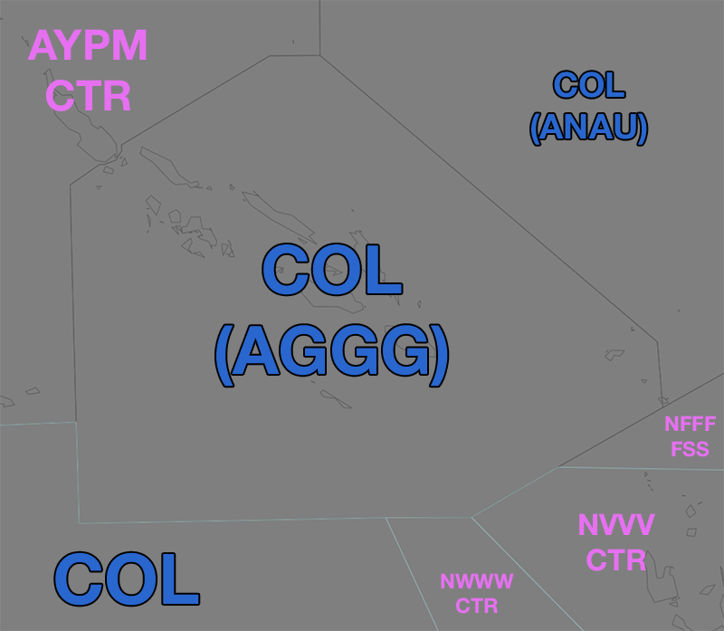
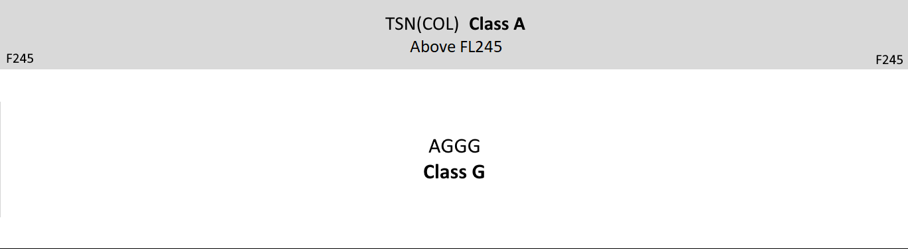

--8<-- "includes/abbreviations.md"

## Altimetry

### Transition Altitude 

In the Honiara FIR the transition altitude is 13,000 ft (`A130`).

### Transition Level

In the Honiara FIR the transition level is 15,000 ft (`F150`).

## Airspace
<figure markdown>
{ width="700" }
  <figcaption>AGGG FIR boundaries</figcaption>
</figure>

The Honiara FIR does not have any local ATS. All ATS above `F245` is provided by [TSN (COL)](../../oceanic/Positions/TSN/#coral-col).

<figure markdown>
{ width="700" }
  <figcaption>AGGG airspace diagram</figcaption>
</figure

Airspace below `F245` is classified as Class G. Traffic in these areas must monitor the advisory frequency.