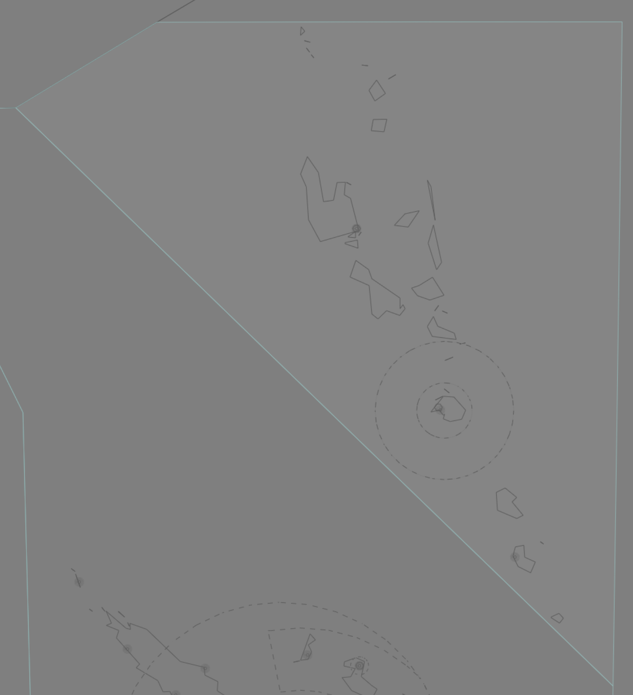

--8<-- "includes/abbreviations.md"

## Positions

| Name                    | Callsign         | Frequency | Login ID    |
| ----------------------- | --------- | ---------------- | --------- |
| **Port Vila Centre**	| **Vila Centre**| **120.700** | **NVVV_CTR** | 

## Airspace
<figure markdown>
{ width="700" }
  <figcaption>NVVV Centre Airspace</figcaption>
</figure>

<!--- ## Reclassifications - No reclassification, NVVV must top-down --->
<!--- ## Special Positions
## Extending --->
## CPDLC
The Primary Communication Method for NVVV_CTR is Voice.

[CPDLC](../../../client/cpdlc) may be used in lieu when applicable.

The CPDLC Station Code is `NVVV`.

!!! tip
    Even though NVVV_CTR's Primary Communication Method is Voice, CPDLC may be used for Overfliers.

<!--- ## Sector Responsibilities
## Sequencing
## Runway Modes--->
## Surveillance Coverage
There are no radar services in NVVV_CTR's airspace. The sector is entirely [procedural](../../../separation-standards/procedural/).
<!--## STAR Clearances
## STAR Clearance Expectation -->
## Coordination
### NVVV ADC
#### Departures
[Next](../../controller-skills/coordination.md#next) coordination is required from NVVV ADC to NVVV_CTR for all aircraft **entering NVVV CTA**.

The Standard Assignable level from **NVVV ADC** to **NVVV_CTR** is:

| Aircraft | Level |
| -------- | ----- |
| All | The lower of `A090` and `RFL` |

### Arrivals/Overfliers
NVVV_CTR will heads-up coordinate arrivals/overfliers from Class D to NVVV ADC. 

The Standard Assignable level from NVVV_CTR to NVVV ADC is `A100`, any other level must be prior coordinated.

Refer to [Class D Tower Separation Standards](../../../separation-standards/classd) for more information.

### Nadi Oceanic
#### Departures
Voiceless for all aircraft:
- Assigned the lower of `F240` or the `RFL`.

#### Arrivals
Voiceless for all aircraft:
- With ADES **NVVV**; and
- Assigned `F250`.

### Pacific Oceanic (NWWW/TSN(COL))
As per [Standard coordination procedures](../../controller-skills/coordination/#pacific-units), Voiceless, no changes to route or CFL within **15 mins** to boundary.