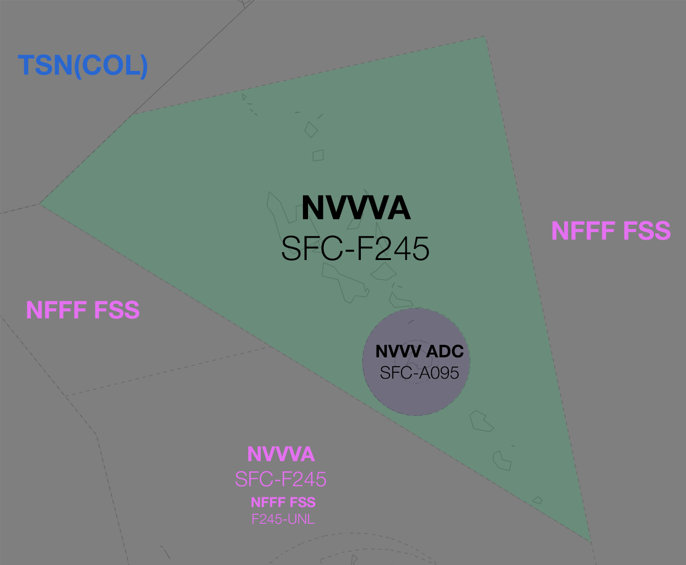

--8<-- "includes/abbreviations.md"

## Positions

| Name                      | Callsign  | Frequency | Login ID    |
| ------------------------- | --------- | ---------------- | --------- |
| **Port Vila Tower (TCU)**	| **Vila Tower** | **120.700** | **NVVV_APP** | 

## Airspace
<figure markdown>
{ width="700" }
  <figcaption>NVVV TCU Airspace</figcaption>
</figure>

The vertical limits of the NVVV Sector of the Nadi FIR are `SFC` to `F245`.

<!--- ## Sector Responsibilities
## Sequencing
## Runway Modes--->
## Surveillance Coverage
There are no radar services in NVVVA's airspace. The sector is entirely [procedural](../../../separation-standards/procedural/).
<!--## STAR Clearances
## STAR Clearance Expectation -->
## Coordination
### NVVV ADC
#### Departures
[Next](../../controller-skills/coordination.md#next) coordination is required from NVVV ADC to NVVVA for all aircraft **entering NVVV CTA**.

The Standard Assignable level from **NVVV ADC** to **NVVVA** is:

| Aircraft | Level |
| -------- | ----- |
| All | The lower of `A090` and `RFL` |

### Arrivals/Overfliers
NVVVA will heads-up coordinate arrivals/overfliers from Class D to NVVV ADC. 

The Standard Assignable level from NVVVA to NVVV ADC is `A100`, any other level must be prior coordinated.

Refer to [Class D Tower Separation Standards](../../../separation-standards/classd) for more information.

### Nadi Oceanic
#### Departures
Voiceless for all aircraft:

- Assigned the lower of `F240` or the `RFL`.

#### Arrivals
Voiceless for all aircraft:

- With ADES **NVVV**; and
- Assigned `F250`.

### NWWWA
All aicraft transiting between NWWWA CTA and NVVVA CTA must be heads-up coordinated.

!!! phraseology
    **NWWWA** -> **NVVVA**: "via LEDIT, TPC915"  
    **NVVVA** -> **NWWWA**: "TPC915, F160"

### Pacific Oceanic (TSN(COL))
The vertical limits of CTA within TSN and NWWWA/NVVVA mean it is not possible for an aircraft to transit directly from either TCU into TSN CTA and vice versa. As per [Standard coordination procedures](../../../controller-skills/coordination/#octa-coordination) no coordination is required, provided there are no changes to route or level within **5 mins** to boundary.