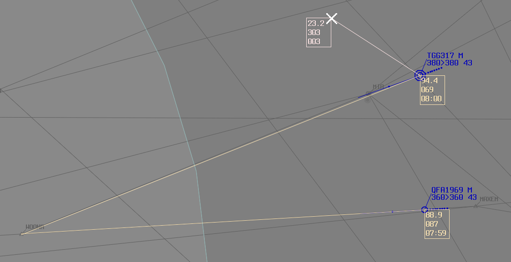
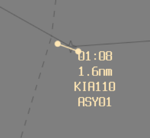
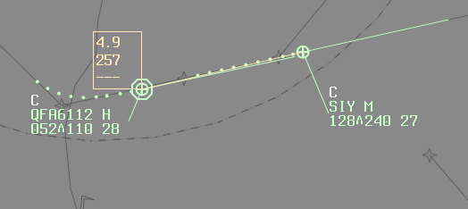

--8<-- "includes/abbreviations.md"

# Separation Assurance
Colloquially, separation assurance could be described as:

*"If you turn away from the screen for 5 minutes, no standard could possibly be infringed"*

Officially, `MATS 10.1.1.1.1` defines Separation assurance as:  

*"(Assuring) separation through the process of [assessing traffic, identifying conflicts](#assessing-traffic-and-identifying-conflicts), [planning to ensure separation](#planning-to-ensure-separation), [executing the plan and monitoring the situation](#execute-the-plan-and-monitor-the-situation) to ensure the standard is not infringed"*

Here are some techniques to help aid with each of those elements.

## Assessing traffic and Identifying conflicts
There are 3 main tools for assessing conflicts using vatSys.

### Bearing-Range Line (BRL) Tool

<figure markdown>
{width="700" }
  <figcaption>BRL Tool</figcaption>
</figure>

The BRL Tool displays Distance, Bearing, and Estimates.

The Estimate shown is based on the aircraft's **Current Ground Speed**. It does not take in to account *winds*, *climb/descent profiles*, or *turns in an aircraft's route*.

It has a plethora of practical applications, including, but not limited to:

- Measuring distance between two aircraft
- Measuring distance between an aircraft and another aircraft's route
- Measuring distance between two aircraft's routes
- Measuring distance between an aircraft route and another sector's airspace
- Measuring distance between multiple aircraft and the initial approach fix
- Measuring a Bearing
- Calculating an ETA
- Many more!

### System Estimates
System Estimates use an aircraft's flight planned route and planned TAS to calculate the estimate for all waypoints on their route. These can be displayed on an aircraft's route in vatSys.

<figure markdown>
{width="700"}
  <figcaption>System Estimates</figcaption>
</figure>

The System Estimates are useful for assessing **longitudinal conflicts** (same tracks), including aircraft in a sequence for the same runway.

### Closest Approach Tool
The Closest Approach Tool calculates what **position** and **time** two aircraft will be closest to each other. It uses the two aircraft's flight planned routes and performance data.

<figure markdown>
{width="500" }
  <figcaption>Closest Approach Tool</figcaption>
</figure>

The Closest Approach tool is useful for aircraft with intersecting flight paths between **45°** and **180°**.

At shallow angles of less than 45°, it can be a bit more unreliable, and distance based checking (such as using the BRL) is more suitable.

#### Rules of Thumb
To allow for factors that can affect the tool, such as wind, aircraft speeds, climb/descent rates, etc, a bit of fat must be added to the 3nm/5nm separation standards for assessment purposes. Some rules of thumb are listed below.

##### TCU

| Closest Approach Distance | Interpretation | Action |
| ----------- | ----------------- | ----------------- |
| Less than **8nm** | The aircraft have *potential* to be in lateral conflict. | Apply **another form of separation** (ie, Vertical, or additional lateral), or prove lateral separation using another tool. |
| Between **8nm** and **15nm** | The aircraft will *most likely not* be in lateral conflict. | If it is quiet, **monitor closely** using a BRL. If it is busy, **apply another form of separation**.  |
| Greater than **15nm** | The aircraft will *not* be in lateral conflict. | - |

##### Enroute

| Closest Approach Distance | Interpretation | Action |
| ----------- | ----------------- | ----------------- |
| Less than **15nm** | The aircraft have *potential* to be in lateral conflict. | Apply **another form of separation** (ie, Vertical, or additional lateral), or prove lateral separation using another tool. |
| Between **15nm** and **20nm** | The aircraft will *most likely not* be in lateral conflict. | If it is quiet, **monitor closely** using a BRL. If it is busy, apply **another form of separation**. |
| Greater than **20nm** | The aircraft will *not* be in lateral conflict. | - |

## Planning to ensure separation
This is where you decide the method for separation assurance. Are you going to implement a restriction to reach a certain altitude by a certain point? Are you going to place a BRL between the aircraft to monitor closing speed? Are you going to anchor a BRL at the point where lateral conflict is infringed, to monitor the aircraft vertically clear? Are you going to give one aircraft a vector to keep clear? There are several different ways to approach resolving these conflicts, so choose the one that best suits the situation, and that you are comfortable with.

## Execute the plan and Monitor the situation
Executing the plan may involve passing instructions to pilots, coordinating with other controllers, and using system tools (eg BRL, Closest Approach), as necessary. Monitoring the situation is all about using the system tools to your advantage, some examples include:

- After passing a speed restriction to an aircraft to slow down, watching to make sure the GS has reduced.  
- Anchoring a BRL between 2 aircraft to see if the distance between is opening or closing.  
- Using a BRL and velocity vectors to measure distances between conflicts in 1 min, 2 mins, 3 mins, so on.  

<figure markdown>
{ width="700" }
  <figcaption>Monitoring Tools</figcaption>
</figure>

The BRL Tool has many uses, and is critical to the act of separation assurance.

## Level Check
Unless a level has been "locked in" for an aircraft entering your airspace, for example:

- Being inside a change parameter (eg 50nm);
- Receiving heads-up coordination; or
- Being A Standard assignable level;

Their CFL **cannot** be used for separation purposes. Certain aircraft may require additional time to plan restrictions, identify conflicts, etc (For example, as **ELW**, an aircraft cutting across the YMML departure/arrival path at F230), and this is where a **level check** may be useful. If you want to "lock in" a level for an aircraft coming from an adjacent sector, use the following phraseology:

!!! phraseology
    **ELW** -> **YWE**: "Level Check, VOZ456, F360"  
    **YWE** -> **ELW**: "VOZ456, F360"  

Any changes to VOZ456's level would now need to be coordinated by YWE, so no surprises!

Level checks are also useful for when you have identified a conflict, and you need to assign a **different level** to the one currently assigned by the controlling sector in order to assure separation.

!!! phraseology
    **BIK** -> **SDS**: "JST123, Assigned F200 due crossing traffic"  
    **SDS** -> **BIK**: "JST123, F200"  

When using the level check technique, bear in mind the sector that you're coordinating with may have no idea what a Level Check is. Use plain english as required to get the message across (and be nice 😊).

## Level Management
### Climbing/Descending
All climb/descent instructions **must** be treated like a *block clearance*. That is to say, two aircraft that may be within 3nm/5nm of each other, **must not** be in **vertical conflict**.

Simply assigning levels that are 1000ft apart **achieves nothing**, unless both aircraft are maintaining those levels already.

For example, the two aircraft below **do not** have separation assurance:

<figure markdown>
{ width="700" }
  <figcaption>No Separation Assurance</figcaption>
</figure>

The two aircraft below **do** have separation assurance:

<figure markdown>
{ width="700" }
  <figcaption>Separation Assurance</figcaption>
</figure>

### Minimising Instructions
When issuing a climb or descent instruction, ask yourself: *"What altitude/level can be assigned which results in the smallest number of transmissions?"*

A common habit is to see controllers issuing the instruction *"When ready, descend to F250"*, despite there being no reason to do so.

It is best to always assign the *lowest possible level* on descent when taking in to account:

- **CTA Protection**;
- **Terrain**; and
- **Conflicts**

This reduces controller workload by reducing the number of calls required to facilitate an aircraft's descent, and reduces the likelihood of an aircraft having their descent profile interrupted if you get distracted and/or busy.

!!! phraseology
    VOZ888 is tracking from Sydney to Melbourne via the Q29 airway to LIZZI for the LIZZI8A arrival runway 34. There are no conflicts on their route ahead, and the CTA LL is `A085`.

    "VOZ888, when ready, descend via the STAR to A090, QNH 1009."

!!! note
    An appropriate time to assign F250 for descent would be, for example, an aircraft tracking on the Y59 airway to YSSY, when CB_APP is online (since they own the CB TMA up to F245). In this example, you would not assign lower than F250 until the aircraft is 2.5nm clear of the CB TMA.  
    Do not assign levels through another sector's airspace without coordination, even if it would take a 20,000ft/min descent rate to clip the airspace! Either wait until the aircraft is 2.5nm clear, or coordinate with the sector.

#### Leaving CTA Descending
Another common practice is to see controllers issue an intermediate descent to the CTA LL, and/or the Class C LL, prior to issuing a clearance to leave controlled airspace descending.

This is **entirely unnecessary**, and just uses up additional talking time, and increases controller workload.

!!! note
    **ARL:** "QLK4D, When ready descend to F130"  
    ...  
    **ARL:** "QLK4D, Descend to A090, Area QNH 1013"  
    ...  
    **ARL:** "QLK4D, Leave controlled airspace descending, No Reported IFR Traffic"  

    3 Calls, that could have all been condensed in to:

    **ARL:** "QLK4D, When ready, Leave controlled airspace descending, No Reported IFR Traffic. Area QNH 1013"

#### STAR Level Restrictions
Further transmissions can be saved in the busy TMA, with the use of *"Descend via STAR"* phraseology when CTA protection is in place, **only** where Level Restrictions exist on the STAR assuring aircraft remain inside CTA.

!!! phraseology
    RXA4652 is tracking via ODALE for the ODALE7 STAR to runway 34R. CTA LL is `A075`, but the STAR has built-in CTA protection (At or Above A080 at **KABLO**)

    "RXA4652, Sydney Approach, runway 34R, descend via the STAR to A060"

!!! warning "Important"
    **Only** use SID/STAR Level Restrictions to assure separation with CTA, Terrain, and Conflicts, when you are **very familiar** with the airspace.
    
    **VERY FEW SIDs/STARs DO THIS!**
    
    You cannot assume that any given SID/STAR will automatically separate from these things, unless you know exactly **how** and **where** that separation is achieved.