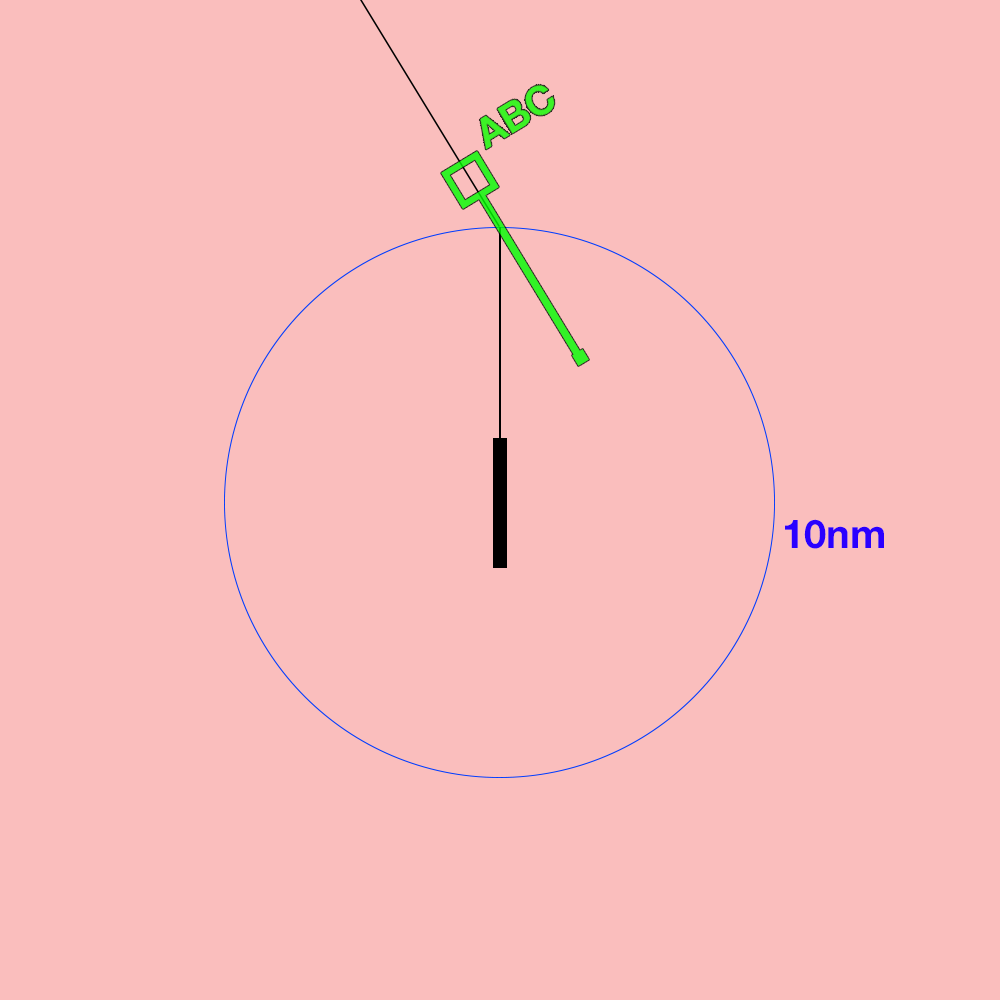
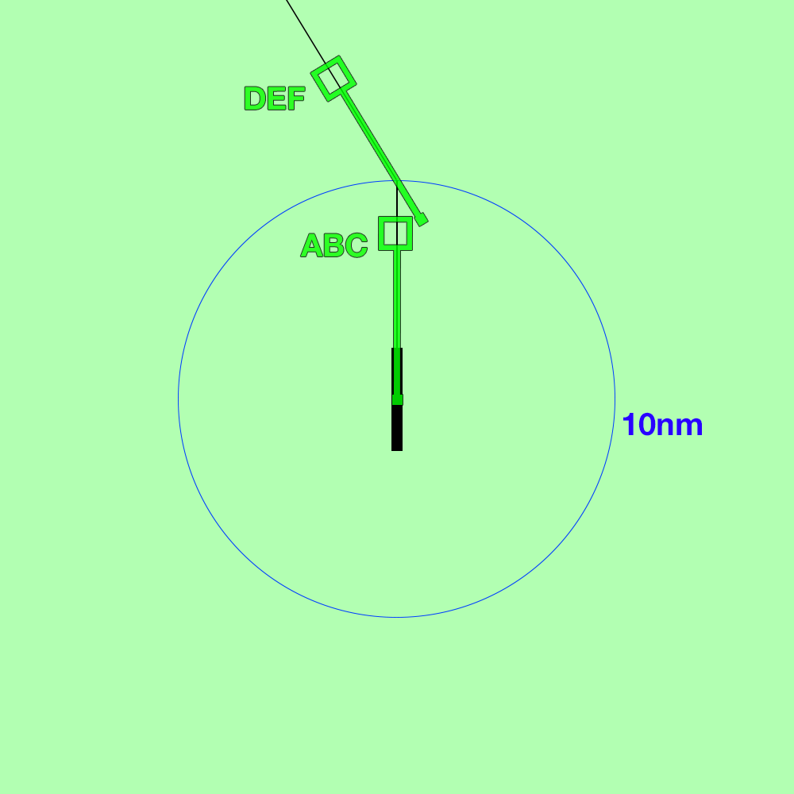

--8<-- "includes/abbreviations.md"

## Introduction
Procedural separation in the vicinity of an aerodrome requires careful thought and pre-planning. When inbound coordination is performed by the overlying enroute/TCU controller, ADC shall consider the effect of the inbound aircraft on any other aircraft operating in the airspace (or about to become airborne) and pre-plan the best separation standard to use. If necessary, sequencing instructions should be relayed to the overlying controller to ensure sufficient spacing exists with other aircraft.

!!! phraseology
    **ENR** -> **ADC**: "Via KADSI, RXA6416"  
    **ADC** -> **ENR**: "RXA6416, `A080`"  

    *After assessing the conflict:*  

    **ADC** -> **ENR**: "RXA6416, request you track them via CFSSG, cross CFSSG at or after time 50"  
    **ENR** -> **ADC**: "RXA6416, track via CFSSG, cross CFSSG at or after time 50"  

### Recommended Separation Standards
Every traffic picture is different and controllers will need to utilise a mix of separation standards to provide efficient, separated sequences. The following sections outline recommended starting points for various traffic scenarios.

#### Arrival Streams
If current meteorological conditions preclude the use of visual separation, IFR aircraft should be sequenced to allow each to conduct an instrument approach and land before the next arrives at the IAF.

!!! tip
    Sequencing arrivals **5 minutes** apart at the IAF will generally provide enough time to facilitate successive approaches. Smaller, slower aircraft may require more spacing.

Where visual separation is possible, the sequence may be tightened provided ADC can [visually acquire](#visually-acquired-aircraft) each aircraft as they conduct the approach.

!!! example
    With a cloud base of 3,200ft AGL, ADC should expect to sight aircraft at roughly 10nm. Successive RNP approaches may be conducted with vertical separation maintained until each leading aircraft is sighted, when the following aircraft may be descended and cleared for the approach.

#### Departure Streams
If current meteorological conditions preclude the use of visual separation, IFR aircraft should be departed at [2 min](#2-min) or [5 min](#5-min) intervals (with any necessary speed restrictions imposed on following aircraft). Alternatively, ADC may issue amended departure radials to aircraft to build [lateral separation](#lat-sep-table) and depart the following aircraft when a standard exists.

Where visual separation is possible, ADC should utilise this within 10nm of the aerodrome until a lateral or vertical standard exists. This will generally allow an increase in departure rate.

#### Mixed Traffic
Vertical separation is likely to be the most effective standard between mixed traffic (both arrivals and departures). The [lat sep table](#lat-sep-table) is a useful tool for maintaining lateral separation and the [45 degree segregated flight paths](#45-segregated-flight-paths) can be used to separate arrivals from departures.

Visual separation is particularly useful when conditions allow, particularly in allowing aircraft to depart while arrivals approach the aerodrome.

### Airspace
Remember that in [Class D Airspace](../../controller-skills/classofairspace), IFR aircraft are separated from IFR and SVFR, and SVFR is separated from SVFR when visibility is not VMC. **No separation** is provided for VFR aircraft, even though it is controlled airspace. The Tower Controller provides more of a *"segregation"* service (ie, providing reasonable opportunity for the aircraft to separate themselves), as well as providing traffic information.

<figure markdown>
{ width="800" }
  <figcaption>Class D Tower Airspace Diagram</figcaption>
</figure>

### Surveillance
Although surveillance standards cannot be used for separation at Class D Towers, overlying TCU/Enroute controllers can use their surveillance standards to help Class D towers achieve separation, when procedural separation is a bit awkward or impractical.

!!! phraseology
    **AY ADC** -> **BLA**: "Can you advise when QLK208D is 5nm clear of DSB?"  
    **BLA** -> **AY ADC**: "Affirm, will do"  
    ...  
    **BLA** -> **AY ADC**: "QLK208D, 5nm clear of DSB"  
    **AY ADC** -> **BLA**: "QLK208D, 5nm clear of DSB, thanks"

## Lateral
### Lat Sep Table
Lateral Separation works off the basis off establishing a *Lateral Separation Point* (Lat Sep point). That is, when given an angle that 2 tracks intersect at, a distance at which lateral separation is considered to exist procedurally. These figures are detailed in the table below:

| Tracks intersecting at | Lat Sep point |
| ------------- | ------------------ |
| 0°-15° | No lateral separation |
| 16°-44° | 11nm |
| 44°-135° | 8nm |
| 136°-180° | No lateral separation |

In a more visual form, ABC can be considered to be laterally separated from aircraft in the green areas, and not laterally separated from aircraft in the red areas. This only applies to intersecting angles **at the crossing point**, and both aircraft tracking directly to/from the crossing point.

<figure markdown>
{ width="700" }
  <figcaption>Lateral Separation Diagram</figcaption>
</figure>

### 45° Segregated Flight Paths
#### Straight-in
- Can be applied between departures and arrivals when the departing aircraft's flight path and the arrival aircraft's flight path are at least 45° clear of each other, and, for a straight-in approach, the arriving aircraft is at least **5nm** from the arrival runway threshold

<figure markdown>
{ width="700" }
  <figcaption>Segregated Flight Paths - Straight-in (Prior to 5nm)</figcaption>
</figure>

<figure markdown>
{ width="700" }
  <figcaption>Segregated Flight Paths - Straight-in (After 5nm)</figcaption>
</figure>

#### Visual, DME/GNSS, Circle to land
- Can be applied between departures and arrivals when the departing aircraft's flight path and the arrival aircraft's flight path are at least 45° clear of each other, and, for a Visual, DME/GNSS or Circle to land approach, the arriving aircraft is at least **10nm** from the airfield

<figure markdown>
{ width="700" }
  <figcaption>Segregated Flight Paths - Visual, DME/GNSS, Circle to land (Prior to 10nm)</figcaption>
</figure>

<figure markdown>
{ width="700" }
  <figcaption>Segregated Flight Paths - Visual, DME/GNSS, Circle to land (After 10nm)</figcaption>
</figure>

### Conflict Area
Two aircraft are considered to be in lateral conflict when they are within the relevant *Circular Error of Position* (CEP) distance of each other. The *Conflict Area tool* can help identify the region in which the aircraft lose lateral separation assurance along their cleared routes.

The CEP is dependent on an aircraft's navigation capability, which is described in their flight plan remarks by the `NAV/xxx` descriptor.

#### NAVCAPs
All aircraft have a NAVCAP, associated with a ***Circular Error of Position***. This helps determine which number to select when using the Conflict Area Tool:

| NAVCAP Code | Meaning | Circular Error of Position (CEP) |
| ---- | ----------- | -------- |
| A | All | 7nm |
| 2 | RNP2 | 7nm |
| 4 | RNP4 | 14nm |
| 5 | RNAV5 | 14nm |
| T | RNAV10 | 14nm |
| Z | None | 30nm |

The minimum number you must select when using the tool, is equal to: **Aircraft 1 CEP + Aircraft 2 CEP + 1nm**

!!! example
    Aircraft 1 NAVCAP: 4  
    Aircraft 2 NAVCAP: Z  
    14+30+1=**45**  

!!! example
    Aircraft 1 NAVCAP: 2  
    Aircraft 2 NAVCAP: A  
    7+7+1=**15**  

!!! tip
    The best scenario is to have 2 aircraft that are RNP2 approved. "Feed the beast" in order to get what you want, that is to say "QFA12, confirm you are RNP2 approved?", and they'll probably say yes. Enter `NAV/RNP2` in the flight plan remarks, and you can use a 7nm CEP.

#### Separation
With each CEP calculated and the conflict area determined, controllers must ensure another separation standard is in place before the aircraft enter the conflict area.

### Definite Passing
Aircraft on reciprocal tracks (or converging/diverging tracks at least 90 degrees apart) are laterally separated when there is at least 10nm between them. The distance may be measured with reference to a DME or waypoint.

## Departures
### 2 min
| Conditions | |
| ------------- | ------------------ |
| a) The aircraft are climbing to vertically separated levels; b) Both aircraft report reaching the cruising level; c) If the following aircraft is climbing to a lower level than the preceding aircraft, and reaches that level first, apply another form of separation immediately; and d) climb and cruising IAS of the following aircraft is at least **10 kt slower** and not more than **90%** of the climb and cruising IAS or Mach number of the leading aircraft. | <figure markdown>
{ width="600" }
</figure> |

### 5 min
| Conditions | |
| ------------- | ------------------ |
| a) Both aircraft report reaching the cruising level; b) If the following aircraft reaches that level first, apply another form of separation immediately; and c) climb and cruising IAS of the following aircraft is at least **10 kt slower** and not more than **90%** of the climb and cruising IAS or Mach number of the leading aircraft. | <figure markdown>
{ width="600" }
</figure> |

### 10 min
| Conditions | |
| ------------- | ------------------ |
| a) Both aircraft report reaching the cruising level; b) If the following aircraft reaches cruising level first, apply another form of separation immediately; and c) climb IAS of the following aircraft is less than or equal to the climb IAS of the leading aircraft. | <figure markdown>
{ width="600" }
</figure> |

## Arrivals
### 10nm
| Conditions | |
| ------------- | ------------------ |
| a) Both aircraft are **inbound**, and the leading aircraft is within **20nm** of a controlled aerodrome; and b) The aircraft are assigned vertically separated levels. | <figure markdown>
{ width="600" }
</figure> |

### Visually Acquired Aircraft
Two aircraft may be considered to be separated if the second aircraft is beyond the view of the controller (i.e. greater than 10nm from the aerodrome), provided:

- the first aircraft has been sighted by the tower controller within 10nm, and
- a landing/missed approach can be effected clear of conflict

In practice, this allows controllers to reduce the spacing between successive arrivals via an instrument approach provided the weather conditions will allow the controller to visually acquire each aircraft within 10nm of the aerodrome and before the following aircraft commences the approach.

<figure markdown>
{ width="700" }
  <figcaption>Visually Acquired Aircraft (Prior to 10nm)</figcaption>
</figure>

<figure markdown>
{ width="700" }
  <figcaption>Visually Acquired Aircraft (After 10nm)</figcaption>
</figure>

## Vertical
### 1000ft
- Between any aircraft

## See Also
- [Visual Separation](../visual)  
- [Procedural Separation](../procedural)

