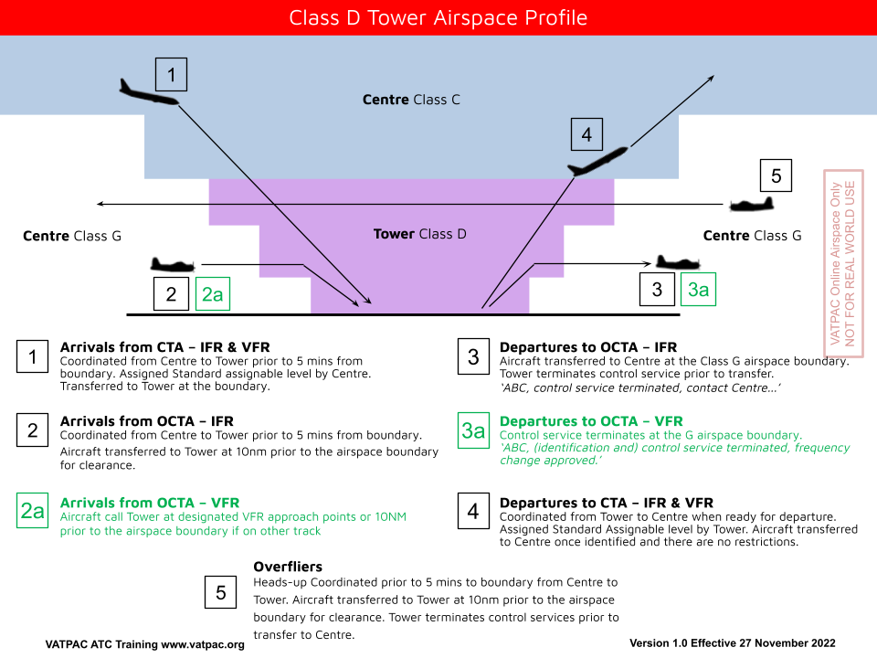

--8<-- "includes/abbreviations.md"

## Airspace
Remember that in [Class D Airspace](../../controller-skills/classofairspace), IFR aircraft are separated from IFR and SVFR, and SVFR is separated from SVFR when not VMC. **No separation** is provided for VFR aircraft, even though it is controlled airspace. The Tower Controller provides more of a *"Segregation"* service (ie, providing reasonable opportunity for the aircraft to separate themselves), as well as providing traffic information.

<figure markdown>
{ width="800" }
  <figcaption>Class D Tower Airspace Diagram</figcaption>
</figure>

## Procedural Separation
At [Tamworth](../../aerodromes/tamworth), [Coffs Harbour](../../aerodromes/Coffs), [Hamilton Island](../../aerodromes/Hammo), and [Sunshine Coast](../../aerodromes/sunshinecoast) Towers, surveillance coverage cannot be guaranteed at all levels. Therefore, [Procedural Separation](../procedural) must be implemented prior to losing surveillance identification of an aircraft, if [Visual Separation](../visual) cannot be assured below the height at which surveillance coverage will be lost. For more information, refer to Local Instructions.

## 45° Segregated Flight Paths
### Straight-in
- Can be applied between departures and arrivals when the departing aircraft's flight path and the arrival aircraft's flight path are at least 45° clear of each other, and, for a straight-in approach, the arriving aircraft is at least **5nm** from the arrival runway threshold

<figure markdown>
{ width="700" }
  <figcaption>Segregated Flight Paths - Straight-in</figcaption>
</figure>

### Visual, DME/GNSS, Circle to land
- Can be applied between departures and arrivals when the departing aircraft's flight path and the arrival aircraft's flight path are at least 45° clear of each other, and, for a Visual, DME/GNSS or Circle to land approach, the arriving aircraft is at least **10nm** from the airfield

<figure markdown>
{ width="700" }
  <figcaption>Segregated Flight Paths - Visual, DME/GNSS, Circle to land</figcaption>
</figure>

## Vertical

### 1000ft
- Between any aircraft

## See Also
- [Visual Separation](../visual)  
- [Procedural Separation](../procedural)

