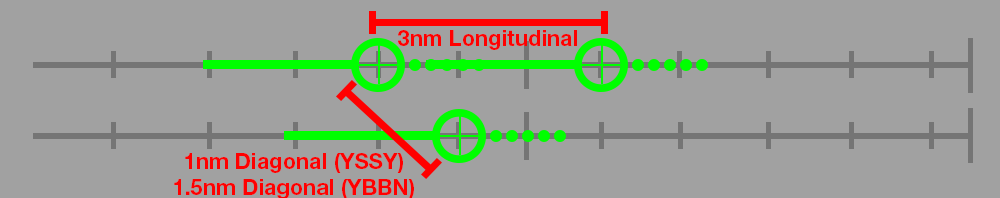

--8<-- "includes/abbreviations.md"

The following page applies to Parallel Runway Operations at [YSSY](../../terminal/sydney/#parallel-runway-operations) and [YBBN](../../terminal/brisbane/#parallel-runway-operations).

## Dependent Approaches
- Approaches are any combination of:  
    - a Precision approach procedure; and  
    - an RNP AR approach

- **1000ft** or **3nm** separation is maintained until aircraft are established:  
    - inbound on the final approach course or track; or  
    - on an RNP AR APCH that will not cross the adjacent parallel runway final approach course or track

- Minimum Diagonal separation between successive aircraft on adjacent final approach courses or tracks is:  
    - **1.5nm** at [YBBN](../../terminal/brisbane/#parallel-runway-operations)  
    - **1nm** at [YSSY](../../terminal/sydney/#parallel-runway-operations)

<figure markdown>
{ width="700" }
  <figcaption>Diagonal Separation Diagram</figcaption>
</figure>

## Independent Visual Approaches
- When vectoring an aircraft to intercept the final course, ensure that the final vector permits the aircraft to intercept at an angle not greater than 30 degrees.

- **1000ft** or **3nm** separation is maintained until:  
    - one aircraft is established within the furthest IAF when both aircraft are established on their respective localiser or GLS final approach course in visual conditions; or  
    - one aircraft is established on the localiser or GLS final approach course in visual conditions and the other is established on a heading to intercept final inside the furthest IAF with the runway reported in sight; or  
    - both aircraft are established on a heading to intercept final inside the furthest IAF with the runway reported in sight

## Independent Departures
Departures may be considered "Independent" (ie, no Separation standard required between departures on adjacent parallel runways), provided the departure tracks diverge by at least **10 degrees**.