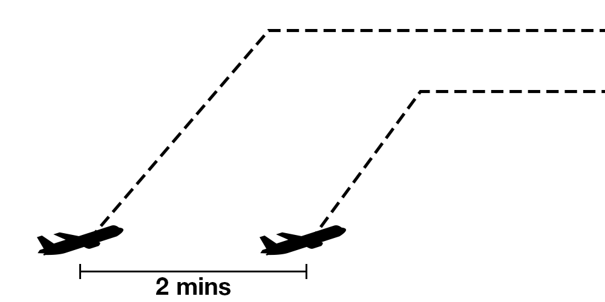
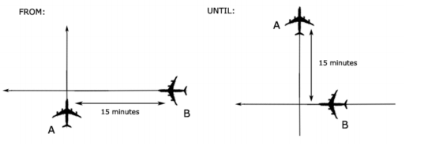
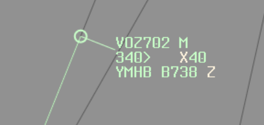
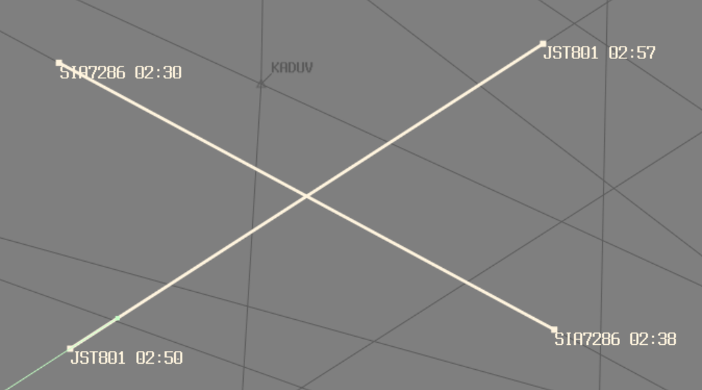
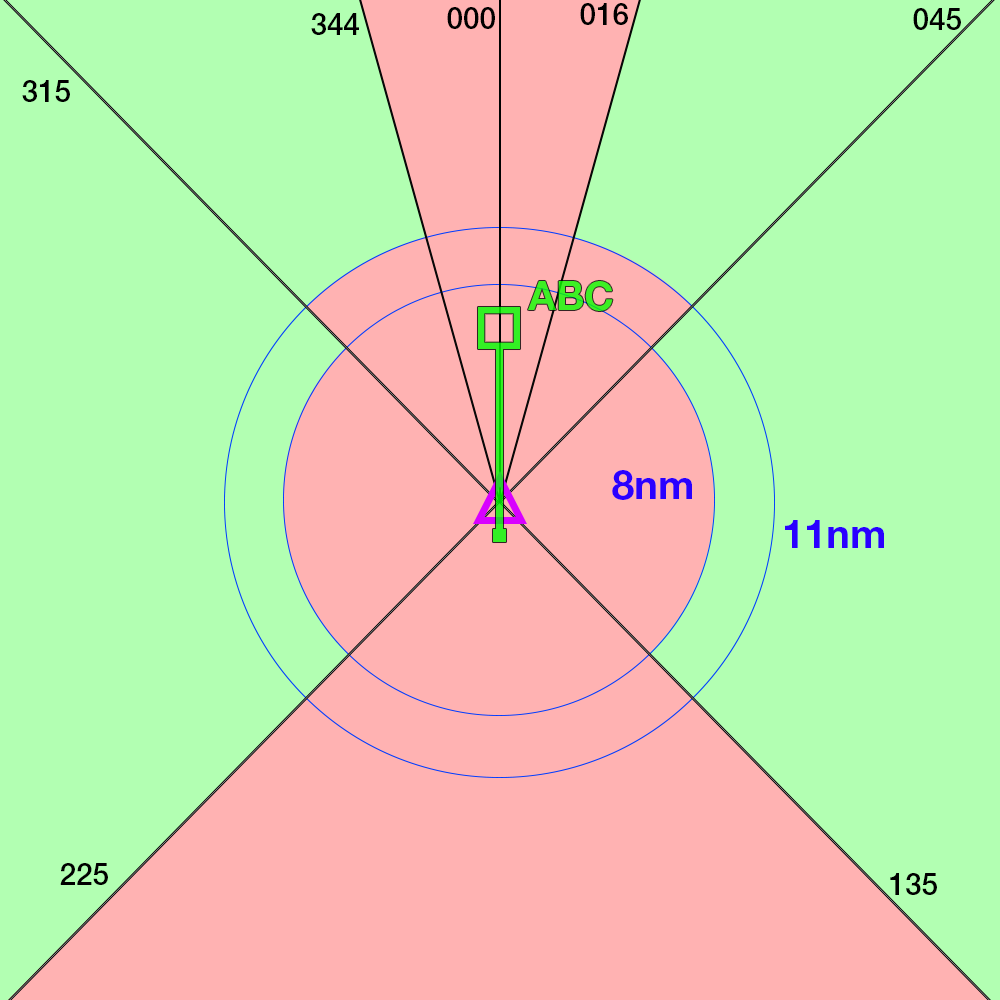

--8<-- "includes/abbreviations.md"

## Departures
### 2 min
| Conditions | |
| ------------- | ------------------ |
| a) The aircraft are climbing to vertically separated levels; b) Both aircraft report reaching the cruising level; c) If the following aircraft is climbing to a lower level than the preceding aircraft, and reaches that level first, apply another form of separation immediately; and d) climb and cruising IAS of the following aircraft is at least 10 kt slower and not more than 90% of the climb and cruising IAS or Mach number of the leading aircraft. | <figure markdown>
{ width="600" }
</figure> |

### 5 min
| Conditions | |
| ------------- | ------------------ |
| a) Both aircraft report reaching the cruising level; b) If the following aircraft reaches that level first, apply another form of separation immediately; and c) climb and cruising IAS of the following aircraft is at least 10 kt slower and not more than 90% of the climb and cruising IAS or Mach number of the leading aircraft. | <figure markdown>
{ width="600" }
</figure> |

### 10 min
| Conditions | |
| ------------- | ------------------ |
| a) Both aircraft report reaching the cruising level; b) If the following aircraft reaches cruising level first, apply another form of separation immediately; and c) climb IAS of the following aircraft is less than or equal to the climb IAS of the leading aircraft. | <figure markdown>
{ width="600" }
</figure> |

## Arrivals
### 10nm
| Conditions | |
| ------------- | ------------------ |
| a) Both aircraft are inbound and the leading aircraft is within 20 NM of a controlled aerodrome with DME or a published waypoint; and b) The aircraft are assigned vertically separated levels. | <figure markdown>
{ width="600" }
</figure> |

## Longitudinal

<figure markdown>

</figure>

Longitudinal separation shall only be applied between aircraft on same or reciprocal tracks.

Longitudinal time separation must be established by using pilot estimates and ensuring that the time between two aircraft is equal or greater than the longitudinal time separation minimum.  

!!! Example
    "ABC, Cross ALPHA at time 1051 or later"  
    "DEF, Hold at BRAVO to leave BRAVO at time 2215 or later"

### Time
#### Same Track
Aircraft that are on the same track, including situations where one aircraft is climbing or descending through the level of another, are to be separated by **10 minutes**
<figure markdown>

</figure>

#### Reciprocal Track
Aircraft flying on reciprocal tracks may only be separated vertically. Such separation must exist **at least 10 minutes** prior to the estimated time of passing
<figure markdown>

</figure>

After the estimated time of passing, aircraft may not climb or descend through the level of the opposite direction aircraft until **10 minutes** after the estimated time of passing. It is possible to reduce this requirement if definite passing has been achieved, and this will be explained later in this section.

### Distance
#### Distance Reports
Distance standards cannot be applied using the Bearing-Range Line Tool, since the position displayed on the scope is just an estimation of where the aircraft is.  
Instead, it must be done using actual reports from the aircraft.  

The lead aircraft must be tracking directly to/from the aid. Always ask the lead aircraft for their distance report prior to the following aircraft.  

Distance checks must be conducted as per the following table:

| If | Conduct Distance checks at intervals of not less than |
| ------------- | ------------------ |
| No speed control has been applied | 15 mins |
| Speed control has been applied to limit closing to less than or equal to 35kts or Mach 0.06 | 15 mins |
| There is closing of more than 35kts or Mach 0.06 | The standard is not valid |
| Speed control has been applied to have opening or stable distance | 30 mins |

#### Same track
##### 20nm
| Conditions | |
| ------------- | ------------------ |
| | <figure markdown>
{ width="600" }
</figure> |

#### Reciprocal track
##### 5nm Definite Passing
| Conditions | |
| ------------- | ------------------ |
| Reports indicate that the aircraft have passed and the distance is opening | <figure markdown>
{ width="600" }
</figure> |

##### Sight and Pass
| Conditions | |
| ------------- | ------------------ |
| a) Both aircraft report sighting and passing the other by day (and in Oceanic airspace by night); b) Both aircraft are above A100; and c) You ensure there is no possibility of incorrect identification by either aircraft. | <figure markdown>
{ width="600" }
</figure> |

##### Opposite sides of visual fix
| Conditions | |
| ------------- | ------------------ |
| a) Both aircraft report passing the same visual fix; and b) The visual fix must be a prominent topographical feature within 10,000 FT of the levels of each aircraft | <figure markdown>
{ width="600" }
</figure> |

## Lateral

### Time-based crossing track
Aircraft that are on crossing tracks, including situations where one aircraft is climbing or descending through the level of another, are to be separated by **15 minutes** at the point of intersection
<figure markdown>

</figure>

Where a difference 15 minutes does not exist at the crossing point, vertical separation shall be applied from the time at which the second aircraft is 15 minutes from the crossing point until the first aircraft is 15 minutes past the crossing point.
<figure markdown>

</figure>

### Conflict Area
The Quickest and easiest way to assess lateral conflict scenarios is with the *Conflict Area tool*. Unfortunately, whilst its quick and easy to *use*, it's fairly complex and long to understand the rules and concepts.  
The first thing to note, is that there are many different unusual remarks and equipment codes that pilots file on VATSIM, primarily because not everyone knows what they mean. A little bit of background knowledge is required to understand these concepts.

#### NAVCAPs
All aircraft have a NAVCAP, associated with a ***Circular Error of Position***. This determines which number to select when using the Conflict Area Tool:

| NAVCAP Code | Meaning | Circular Error of Position (CEP) |
| ---- | ----------- | -------- |
| A | All | 7nm |
| 2 | RNP2 | 7nm |
| 4 | RNP4 | 14nm |
| 5 | RNAV5 | 14nm |
| T | RNAV10 | 14nm |
| Z | None | 30nm |

<figure markdown>
{ width="300" }
  <figcaption>NAVCAP Z Example</figcaption>
</figure>

<figure markdown>
{ width="300" }
  <figcaption>NAVCAP 2 Example</figcaption>
</figure>

The minimum number you must select when using the tool, is equal to: **Aircraft 1 CEP + Aircraft 2 CEP + 1nm**

!!! example
    Aircraft 1 NAVCAP: 4  
    Aircraft 2 NAVCAP: Z  
    14+30+1=**45**  

!!! example
    Aircraft 1 NAVCAP: 2  
    Aircraft 2 NAVCAP: A  
    7+7+1=**15**  

!!! tip
    The best scenario is to have 2 aircraft that are RNP2 approved. "Feed the beast" in order to get what you want, that is to say "QFA12, confirm you are RNP2 approved?", and they'll probably say yes. Enter `NAV/RNP2` in the flight plan remarks, and you can use a 7nm CEP.

#### Working with Conflict Area

<figure markdown>
{ width="300" }
  <figcaption>Conflict Area Example 1</figcaption>
</figure>

Once you've established the Conflict area, you now know the area in which the aircraft are in **lateral conflict**. You can now either separate from the conflict area using a Time Standard, or a Distance Standard:  
**Time standard** (**5 minutes** prior to time shown at entry, or **5 minutes** after time shown at exit); or  
**Distance standard** (Use BRL to measure a distance to/from a waypoint that is outside of the conflict area, and use it to implement a vertical standard after exiting, or prior to entering the lateral conflict area)

#### Time Standard (5 in, 5 out)

Using the time standard, aircraft are considered to have entered the conflict area **5 minutes prior** to the estimate shown, and to have left the conflict area **5 minutes after** the estimate shown.

<figure markdown>
{ width="600" }
<figcaption>Conflict Area Example 2</figcaption>
</figure>

!!! example
    JST801 estimate for entering conflict area: **0250**  
    JST801 **enters lateral conflict** 0250-5: **0245**  
    JST801 estimate for leaving conflict area: **0257**  
    JST801 **leaves lateral conflict** 0257+5: **0302**  
    JST801 is considered to be **in the conflict area** from time **0245** until time **0302**  
    SIA7286 estimate for entering conflict area: **0230**  
    SIA7286 **enters lateral conflict** 0230-5: **0225**  
    SIA7286 estimate for leaving conflict area: **0238**  
    SIA7286 **leaves lateral conflict** 0238+5: **0243**  
    SIA7286 is considered to be **in the conflict area** from time **0225** until time **0243**  
    SIA7286 **leaves lateral conflict** prior to the time that JST801 **enters lateral conflict**. Therefore, the 2 aircraft are **not** in lateral conflict

When aircraft **are** in lateral conflict, a vertical standard must be applied for that period.

!!! example
    "Climb to reach (vertically separated level) by (prior to entering lateral conflict)"  
    "Expect requested level at (time aircraft leaves lateral conflict)"  

#### Distance Standard
Use BRL to measure a distance to/from a waypoint that is outside of the conflict area, and use it to implement a vertical standard after exiting, or prior to entering the lateral conflict area

!!! example
    "Climb to reach (vertically separated level) by (GNSS distance outside entry of conflict area)"  
    "Report (GNSS distance outside exit of conflict area) for requested level"  

### Lat Sep Table
Lateral Separation works off the basis off establishing a *Lateral Separation Point* (Lat Sep point). That is, when given an angle that 2 tracks intersect at, a distance at which lateral separation is considered to exist procedurally. These figures are detailed in the table below:

| Tracks intersecting at | Lat Sep point |
| ------------- | ------------------ |
| 0°-15° | No lateral separation |
| 16°-44° | 11nm |
| 44°-135° | 8nm |
| 136°-180° | No lateral separation |

In a more visual form, ABC can be considered to be laterally separated from aircraft in the green areas, and not laterally separated from aircraft in the red areas. This only applies to intersecting angles **at the crossing point**, and both aircraft tracking directly to/from the crossing point.

<figure markdown>
{ width="700" }
  <figcaption>Lateral Separation Diagram</figcaption>
</figure>

This can be used to plan restrictions as required when surveillance coverage cannot be assured.

## Vertical

### 1000ft
- Between any aircraft at or below `F290`  
- Between 2 RVSM-approved aircraft at or below `F410`

### 2000ft
- Between any aircraft that is experiencing Severe Turbulence at any level  
- Between all aircraft above `F410`  
- Between `F290` and `F410` inclusive;  
    - When at least 1 aircraft is not RVSM-approved  
    - Between military formation aircraft, regardless of RVSM status

### 3000ft
- When at least one aircraft is supersonic