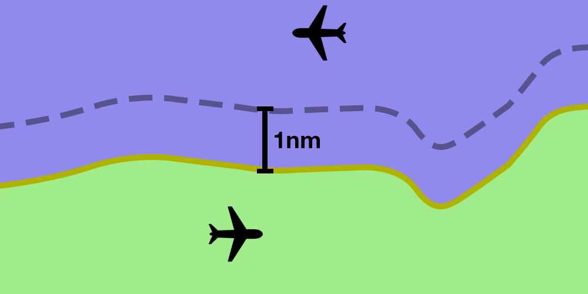

--8<-- "includes/abbreviations.md"

## Visual Separation
### ATC Responsibility
ADC controllers can conduct "pseudo-visual" separation between aircraft under the following conditions:

- ADC controllers only  
- Projected flight paths do not conflict  
- Within 5nm of AD  
- Both aircraft below the cloud base  
- Visibility >8km

This separation technique can be supplemented with Tower View linked to a flight simulator. More info on that can be found [here](https://forums.vatsim.net/topic/29161-tips-and-tricks/){target=new}

This technique is useful for situations such as:

- Procedural towers processing aircraft at altitudes below usable surveillance
- Making more efficient use of runways at major aerodromes by allowing departures to roll with aircraft on final
- Processing VFR aircraft arriving or departing during a busy established sequence (e.g. helicopter operations at Sydney)
- To assist the TCU controller in separating aircraft close to the airfield

### Pilot Responsibility
Pilots can be given responsibility to maintain own separation with other aircraft provided:

- Both aircraft are operated at or below `A100`; and  
- One pilot reports the other aircraft in sight; and  
- That pilot accepts responsibility for maintaining own separation with that aircraft

Pilots will continue to follow ATC instructions but the controller will no longer be responsible for maintaining a separation standard between the two aircraft.  If the pilot loses sight of the aircraft, an alternative separation standard will need to be used.  

Where an aircraft is instructed to maintain own separation with an IFR aircraft, traffic information should be passed to the IFR aircraft, including advice of assignment of separation responsibility to the other aircraft. 

This technique is useful for situations such as:

- VFR aircraft manoeuvring behind another aircraft on approach to land (e.g. helicopter operations at Sydney)
- Allowing aircraft to conduct airwork in a position which would normally conflict with other aircraft
- Providing track shortening or expedited clearances where a delay would normally occur due to other aircraft

!!! phraseology
    *RSCU203 is a VFR helicopter who wishes to depart from Royal Prince Alfred Hospital, which sits directly under the YSSY RWY 16L approach path.*  
    **SY ADC:** "RSCU203, report sighting a Jetstar A320 on a 6nm final RWY 16L"  
    **RSCU203:** "Traffic sighted, RSCU203"  
    **SY ADC:** "RSCU203, are you able to maintain own separation with the Jetstar A320?"  
    **RSCU203:** "Affirm, RSCU203"  
    **SY ADC:** "RSCU203, maintain own separation with the Jetstar A320, caution wake turbulence, report airborne"  
    **RSCU203:** "Maintain own separation with the Jetstar A320, wilco, RSCU203"  
    **SY ADC:** "JST219, traffic is a helicopter becoming airborne from RPA, approximately 4nm final, maintaining own separation with you, runway 16L, cleared to land"

## Geographic Features
Two aircraft are considered to be *laterally separated* where one or both are operating with visual reference to a fixed geographic feature, such as a coastline, river, large highway, etc.

A **1nm** buffer must be applied to one aircraft's tracking.

<figure markdown>
{ width="600" }
  <figcaption>Both aircraft operating with visual reference to a common geographic feature</figcaption>
</figure>

!!! example
    **Aircraft A** operating **1nm East** of the Pacific Highway  
    is *laterally separated* from  
    **Aircraft B** operating *West* of the Pacific Highway.  

    **Aircraft C** operating *North* of the Murray River  
    **is not** laterally separated from  
    **Aircraft D** operating *South* of the Murray River.

!!! phraseology
    *RXA6418 (SAAB 340) is inbound to YCFS from the south and has reported visual. They are vertically separated from an outbound aircraft who is departing to the south.*  
    **CFS ADC:** "RXA6418, track to remain 1nm offshore, report established"  
    **RXA6418:** "Track to remain 1nm offshore, RXA6418"  

    **RXA6418:** "RXA6418, established 1nm offshore"  
    *RXA6418 is now separated from aircraft operating over land, allowing ADC to issue further descent.*  
    **CFS ADC:** "RXA6418, descend to A050"  
    **RXA6418:** "Descend A050, RXA6418"  

    *Once both aircraft have passed and/or another separation standard is available (e.g. vertical separation), the geographic feature standard can be relaxed.*  
    **CFS ADC:** "RXA6418, cancel the offshore requirement, track for downwind runway 21, cleared visual approach"