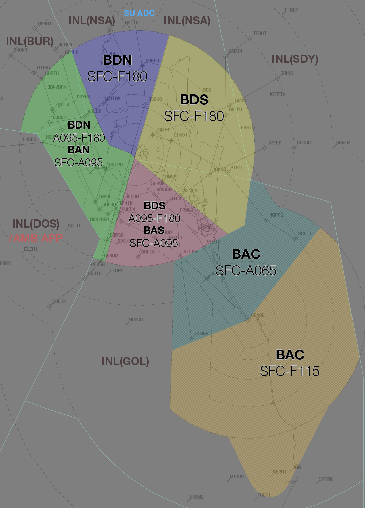

--8<-- "includes/abbreviations.md"

## Positions

| Name               | ID      | Callsign       | Frequency        | Login Identifier              |
| ------------------ | --------------| -------------- | ---------------- | --------------------------------------|
| **Brisbane Approach North**    |**BAN**| **Brisbane Approach**   | **124.400**         | **BN_APP**                                   |
| Brisbane Approach South†   |BAS| Brisbane Approach   | 125.600          | BN-S_APP                                 |
| Brisbane Departures North†    |BDN| Brisbane Departures  | 133.450         | BN_DEP          |
| Brisbane Departures South†   |BDS| Brisbane Departures | 118.450          | BN-S_DEP         |
| Brisbane Finals† |BMN| Brisbane Finals   | 119.250          | BN-F_APP                               |
| Gold Coast Approach† |BAC| Brisbane Approach  | 123.500          | CG_APP                               |
| Brisbane Flow†        |BFL|                |          | BN-FLW_CTR                               |

† **Non-standard position** – may only be used in accordance with VATPAC Ratings and Controller Positions Policy (link)
## Airspace
The Brisbane TMA covers the area shown below, SFC-FL185. (vatSys screenshot)  
BN TCU is responsible for the Brisbane TMA, except:  
a) AF CTR when **AF TWR** is online;  
b) any airspace released to an external unit (e.g. tower) either by NOTAM or as negotiated.

AF CTR reverts to Class G when **AF TWR** is offline, and is administered by the relevant BN TCU controller.  
BN TCU is responsible for the provision of ADC, SMC and ACD responsibilities when **BN TWR** is offline.      
#### Airspace Structural Arrangements

Pursuant to Section 3 of the [VATPAC Ratings and Controller Positions Policy](https://cdn.vatpac.org/documents/policy/Controller+Positions+and+Ratings+Policy+v5.2.pdf){target=new}, **“North”**/**”West”** positions shall assume the airspace of corresponding **“South”**/**”East”** positions when the latter are inactive (e.g. **BAN** assumes **BAS** airspace), and vice versa.

## Parallel Runway Operations - Runway Selection
Aircraft shall be assigned the following runways for arrival when PROPS are in progress:

| Aircraft tracking | Runway  |
| ----------------| --------- |
| via BLAKA   | 01R/19L     |
| via ENLIP | 01L/19R |
| via GOMOL | 01R/19L |
| via MORBI | 01L/19R |
| via SMOKA | 01L/19R |
| via TEBOT | 01R/19L |
| via UGTUG | 01R/19L |
| via WOODY | 01L/19R |
| Other aircraft: |
| From the NORTH and WEST | 01L/19R |
| From the SOUTH and EAST | 01R/19L |

## AF TWR Offline
Due to the low level of CTA (A015) in the AF CTR when **AF TWR** is offline, it is best practice to give airways clearance to aircraft at the holding point, to ensure departing aircraft can have uninterrupted climb.

!!! example
    **ABC** -> **BN TCU**: "Brisbane Approach, ABC, PC12, POB 8, IFR, Taxiing YBAF for YBSU, Runway 28R" `AIP GEN 3.4`  
    **BN TCU** -> **ABC**: "ABC, Brisbane Approach, Squawk 3601, No Reported IFR Traffic, Call me Ready at the Holding Point for Airways Clearance"  
    **ABC** -> **BN TCU**: "Squawk 3601, Wilco, ABC"  
    **ABC** -> **BN TCU**: "ABC, Ready Runway 28R, Request clearance"  
    **BN TCU** -> **ABC**: "ABC, Cleared to YBSU via BN, Flight Planned Route. Make Visual right turn DCT BN, Climb to A030"  
    **ABC** -> **BN TCU**: "Cleared to YBSU via BN, Flight Planned Route. Make Visual right turn DCT BN, Climb to A030, ABC" 
## Airspace Division

The divisions of the airspace between **BAN**, **BAS**, **BDS**, **BDN**, **BAC** and **BMN** change based on the Runway Mode.

!!! note
    The following diagrams do not include non BN TCU areas of responsibility such as AF CTR or CG TWR

### 01 PROPS
<figure markdown>
{ width="700" }
  <figcaption>01 PROPS TCU Structure</figcaption>
</figure>

### 19 PROPS
<figure markdown>
{ width="700" }
  <figcaption>19 PROPS TCU Structure</figcaption>
</figure>

### SODPROPS
<figure markdown>
{ width="700" }
  <figcaption>SODPROPS TCU Structure</figcaption>
</figure>

