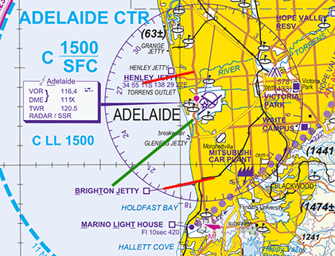

--8<-- "includes/abbreviations.md"

## Positions

| Name               | ID      | Callsign       | Frequency        | Login ID              |
| ------------------ | --------------| -------------- | ---------------- | --------------------------------------|
| **Adelaide Approach East**    |**AAE**| **Adelaide Approach**   | **118.200**         | **AD_APP**                                   |
| Adelaide Approach West :material-information-outline:{ title="Non-standard position"}    |AAW| Adelaide Approach  | 124.200         | AD-W_APP          |
| Adelaide Flow :material-information-outline:{ title="Non-standard position"}        |AFL|                |          | AD_FMP                              |

!!! abstract "Non-Standard Positions"
    :material-information-outline: Non-standard positions may only be used in accordance with [VATPAC Air Traffic Services Policy](https://vatpac.org/publications/policies){target=new}.  
    Approval must be sought from the **bolded parent position** prior to opening a Non-Standard Position, unless [NOTAMs](https://vatpac.org/publications/notam){target=new} indicate otherwise (eg, for events).

## Airspace
The Vertical limits of the AD TCU are `SFC` to `F245`.

### Reclassifications
#### PF CTR
PF CTR reverts to Class G when **PF ADC** is offline, and is administered by the relevant AD TCU controller.

See also: [PF ADC Offline](#pf-adc-offline).

#### ED CTR
ED CTR reverts to Class G when **ED ADC** is offline, and is administered by the relevant AD TCU controller.  

### Airspace Division
!!! note
    The following diagram does not include non AD TCU areas of responsibility such as PF CTR or ED CTR

<figure markdown>
{ width="700" }
  <figcaption>AD TCU Structure</figcaption>
</figure>

## Local Procedures 
### Scenic Coastal Flights
VFR aircraft may transit the control zone tracking coastal north or southbound, generally at `A005`. **AD TCU** is responsible for ensuring these aircraft remain separated from aircraft arriving/departing at YPAD and may delegate this responsibility to **AD ADC**.  

Coordinate the aircraft with ADC, including the use of the appropriate clearance limit in the table below, then issue airways clearance. Before the aircraft reaches the clearance limit, transfer them to ADC who will manage their transit of the extended runway centreline.  The clearance limits in the table below will ensure that coastal aircraft remain clear of the runway 05 approach path and runway 23 departure/missed approach path. 

| Direction of Travel | Clearance Limit |
| --- | --- |
| Northbound | BTJ |
| Southbound | HNLY |

<figure markdown>
{ width="500" }
  <figcaption>Clearance Limits (red) and Approach/Departure Path (green)</figcaption>
</figure>

!!! phraseology
    **CEY:** "Adelaide Approach, CEY, Cessna 172, 4nm south of PNL, 1,000ft, received charlie, request coastal northbound"  
    **AD TCU:** "CEY, Adelaide Approach, squawk 0542, remain clear of class C airspace"  
    **CEY:** "Squawk 0542, remain OCTA, CEY"  

    **TCU** -> **ADC**: "South of PNL, CEY, for coastal northbound, 500ft, clearance limit BTJ"  
    **ADC** -> **TCU**: "CEY"  

    **AD TCU:** "CEY, identified, cleared coastal offshore northbound, not above 500ft, clearance limit BTJ"  
    **CEY:** "Cleared coastal offshore northbound, not above 500ft, clearance limit BTJ, CEY"  

    *Before CEY reaches BTJ:*  
    **AD TCU:** "CEY, contact Adelaide Tower, 120.5"  
    **CEY:** "120.5, CEY"

Once the aircraft has transited the extended runway centreline and is clear of potential conflict with YPAD, ADC will transfer them back to the TCU.

## Departure and Arrival Procedures
### Arrival 
#### Jets
Jet aircraft will be assigned the relevant Alpha or Zulu STAR to Runway 23 or 05.

#### Non-Jets
Non-Jet aircraft will be processed via a combination of:

- Non-jet Victor STARs for VSA
- Alpha/Zulu STARs for IAP
- No STAR, expecting vectors or direct tracking for VSA or IAP

!!! tip
    Refer to the [TBD page](../enroute/Melbourne%20Centre/TBD.md#ypad-star-assignment) for more details on the ATIS conditions and feeder fix combinations which will determine how each aircraft is processed.

Non-jet aircraft processed via direct tracking for a VSA should be vectored or cleared as necessary to join a circuit leg (generally final or downwind).

## Offline Towers
### PF ADC Offline
Due to the low level of CTA at YPPF, it is best practice to give airways clearance to aircraft at the holding point, to ensure departing aircraft can have uninterrupted climb.

!!! phraseology
    **ABC**: "Adelaide Approach, ABC, PC12, POB 8, IFR, taxiing YPPF for YPAG, Runway 21R"   
    **AD TCU**: "ABC, Adelaide Approach, Squawk 3601, no reported IFR traffic, report ready at the holding point for airways clearance"  
    **ABC**: "Squawk 3601, wilco, ABC"  

    **ABC**: "ABC, ready Runway 21R, request clearance"  
    **AD TCU**: "ABC, cleared to YPAG via DOLVU, flight planned route, PARAFIELD1 departure, climb via SID to A040"   
    **ABC**: "Cleared to YPAG via DOLVU, flight planned route, PARAFIELD1 departure, climb via SID to A040, ABC"  
    **AD TCU**: "ABC, assigned heading right 360, report airborne"  
    **ABC**: "Assigned right 360, wilco, ABC"

## Flow 
### Local Knowledge
- With **Visual approaches** in use, Non-Jets should be issued the relevant **Non-Jet STAR**.
    - If **delays** are required, additional track miles may be obtained by issuing the relevant **Alpha/Zulu STAR**.
- Where no **Non-Jet Victor STAR** is available (eg, via **DRINA** or **KLAVA**), Non-Jets may be issued **No Star**, and instructed to join the circuit in VMC, to reduce track miles.
- With **RWY 12** in use for arrivals, non-jets from the West should be assigned RWY 12 by default. Additional track miles may be obtained by assigning RWY 05/23.
- Otherwise, non-jet aircraft from the west may be issued RWY 12 (or RWY 30 from the east on pilot request) to reduce track miles.
- A competent pilot may be issued the appropriate Victor/Xray/Whiskey STAR in lieu of the Alpha STAR to reduce track miles.

!!! tip
    When flowing using the Arrivals List Window, AFL may use the abbreviations listed in the [TBD page](../../enroute/Melbourne%20Centre/TBD/#ypad-star-assignment) to prescribe certain STARs and Runways.

### Flow Tables
The tables below give an estimated time **in minutes** from the **Feeder Fix** to the **Threshold**.

=== "Jets"                       
    | STAR          | RWY 05 | RWY 23 |
    | ------------- | :----: | :----: |
    | **ATNAR A/Z** | 13     | 16     |
    | **ATNAR V**   | 12^    | 14     |
    | **ATNAR W**   | 12^    | -      |
    | **BUGSU A/Z** *AGROS transition* *KLAVA transition* *MARGO transition* |  15 16 14     |  16 17 15     |
    | **BUGSU V** *AGROS transition* *KLAVA transition* *MARGO transition* |  14 15 13     |  14 15 13     |
    | **BUGSU W** *AGROS transition* *KLAVA transition* *MARGO transition* |  14 15 13     |  - - -     |
    | **DRINA A/Z** | -      | 14     |
    | **DRINA V**   | -      | 13     |
    | **INTOG V/X/Z** | 14     | -      |
    | **KAKLU A/Z** | 16     | 12^    |
    | **KAKLU V/X** | 15     | -      |
    | **RAYNA A/Z** *Feeder Fix: ERITH* *Feeder Fix: KLAVA* |  - - |  13 13 | 
    | **RAYNA V** *Feeder Fix: ERITH* *Feeder Fix: KLAVA* |  - - |  12 12 | 

=== "DH8D"
    | Arrival            | RWY 05 | RWY 12 | RWY 23 | RWY 30 |
    | ------------------ | :----: | :----: | :----: | :----: |
    | **ATNAR A/Z STAR** | 13     | -      | 16     | -      |
    | **ATNAR V STAR**   | 12^    | -      | 14     | -      |
    | **ATNAR W STAR**   | 12^    | -      | -      | -      |
    | **ATPIP STAR** *Feeder Fix: INTOG - Circuit Join* *Feeder Fix: INTOG - IAP*  |  13 - |  13 17 |  15 - |  12 13 |
    | **BEVSO STAR** *Circuit Join* *IAP*  |  13 17 |  13 15 |  12 12 |  13 16 |
    | **BUGSU A/Z STAR** *AGROS transition* *KLAVA transition* *MARGO transition* |  15 16 14     |  - - - |  16 17 15     |  - - - |
    | **BUGSU V STAR** *AGROS transition* *KLAVA transition* *MARGO transition* |  14 15 13     |  - - - |  14 15 13     |  - - - |
    | **BUGSU W STAR** *AGROS transition* *KLAVA transition* *MARGO transition* |  14 15 13     |  - - -     |  - - -     |  - - -     |
    | **DRINA A/Z STAR** | -      | -      | 14     | -      |
    | **DRINA V STAR**   | -      | -      | 13     | -      |
    | **ELROX V STAR**   | 10^    | 10^    | 12^    | -      |
    | **GULFS V STAR** *Feeder Fix: ATNAR*   |  12^ |  11^ |  12 |  - |
    | **INTOG V/X/Z STAR** | 14     | -      | -      | -      |
    | **KAKLU A/Z STAR** | 16     | -      | 12^    | -      |
    | **KAKLU V/X STAR** | 15     | -      | -      | -      |
    | **PAMMY V STAR** *AGROS transition* *MARGO transition*  |  12 12\^ |  11\^ 10\^ |  12\^ 11\^ |  -  -|
    | **RAYNA A/Z STAR** *Feeder Fix: ERITH* *Feeder Fix: KLAVA* |  - - |  - - |  13 13 |  - - |
    | **RAYNA V STAR** *Feeder Fix: ERITH* *Feeder Fix: KLAVA* |  - - |  - - |  12 12 |  - - | 
    | **SURGN STAR** *Feeder Fix: KAKLU - Circuit Join* *Feeder Fix: KAKLU - IAP* |  12\^ - |  12\^ 15 |  11\^ - |  12\^ 13 |
    | **No STAR - Circuit Join** *Feeder Fix: AGROS* *Feeder Fix: ATNAR* *Feeder Fix: DRINA* *Feeder Fix: ELROX* *Feeder Fix: KLAVA* *Feeder Fix: MARGO*  |  12 12\^ 13 - 16 12\^ |  11\^ 11\^ 12\^ - 12\^ 10\^ |  12 13 12 - 12\^ 12\^ |  12\^ 12\^ 11\^ 11\^ 13 11\^ |
    | **No STAR - Direct to IAF** *Feeder Fix: AGROS* *Feeder Fix: ATNAR* *Feeder Fix: ELROX* *Feeder Fix: MARGO* |  - - 10\^ - |  11\^ 11\^ 11\^ 11\^ |  - - 16 - |  17 17 14 16 |

=== "Non-Jets"
    | Arrival            | RWY 05 | RWY 12 | RWY 23 | RWY 30 |
    | ------------------ | :----: | :----: | :----: | :----: |
    | **ATNAR A/Z STAR** | 14     | -      | 19     | -      |
    | **ATNAR V STAR**   | 14^    | -      | 16     | -      |
    | **ATNAR W STAR**   | 14^    | -      | -      | -      |
    | **ATPIP STAR** *Feeder Fix: INTOG - Circuit Join* *Feeder Fix: INTOG - IAP*  |  15 - |  14 19 |  15 - |  14 14 |
    | **BEVSO STAR** *Circuit Join* *IAP*  |  15 19 |  15 17 |  14 14 |  15 18 |
    | **BUGSU A/Z STAR** *AGROS transition* *KLAVA transition* *MARGO transition* |  16 18 15     |  - - - |  18 19 17     |  - - - |
    | **BUGSU V STAR** *AGROS transition* *KLAVA transition* *MARGO transition* |  16 17 15     |  - - - |  15 17 14     |  - - - |
    | **BUGSU W STAR** *AGROS transition* *KLAVA transition* *MARGO transition* |  16 17 15     |  - - -     |  - - -     |  - - -     |
    | **DRINA A/Z STAR** | -      | -      | 16     | -      |
    | **DRINA V STAR**   | -      | -      | 15     | -      |
    | **ELROX V STAR**   | 11^    | 12^    | 13^    | -      |
    | **GULFS V STAR** *Feeder Fix: ATNAR*   |  13^ |  13^ |  14 |  - |
    | **INTOG V/X STAR** | 15     | -      | -      | -      |
    | **INTOG Z STAR**   | 16     | -      | -      | -      |
    | **KAKLU A/Z STAR** | 18     | -      | 13^    | -      |
    | **KAKLU V/X STAR** | 17     | -      | -      | -      |
    | **PAMMY V STAR** *AGROS transition* *MARGO transition*  |  14 13\^ |  13\^ 12\^ |  13\^ 12\^ |  -  -|
    | **RAYNA A/Z STAR** *Feeder Fix: ERITH* *Feeder Fix: KLAVA* |  - - |  - - |  14 14 |  - - |
    | **RAYNA V STAR** *Feeder Fix: ERITH* *Feeder Fix: KLAVA* |  - - |  - - |  14 14 |  - - | 
    | **SURGN STAR** *Feeder Fix: KAKLU - Circuit Join* *Feeder Fix: KAKLU - IAP* |  13\^ - |  13\^ 17 |  13\^ - |  13\^ 14 |
    | **No STAR - Circuit Join** *Feeder Fix: AGROS* *Feeder Fix: ATNAR* *Feeder Fix: DRINA* *Feeder Fix: ELROX* *Feeder Fix: KLAVA* *Feeder Fix: MARGO*  |  14 13\^ 14 - 15 13\^ |  13\^ 13\^ 14\^ - 13\^ 12\^ |  14 15 14 - 13\^ 13\^ |  14\^ 14\^ 13\^ 13\^ 15 13\^ |
    | **No STAR - Direct to IAF** *Feeder Fix: AGROS* *Feeder Fix: ATNAR* *Feeder Fix: ELROX* *Feeder Fix: MARGO* |  - - 11\^ - |  13\^ 13\^ 12\^ 12\^ |  - - 18 - |  20 20 16 19 |

#### Corrections
| Situation | Correction |
| ----- | ----- |
| Assigned a reduced speed | +1 min, *except ^* | 
| Over 40kt of head/tailwind component | +1 min for headwind -1 min for tailwind |

#### Assumptions
- Nil wind
- The feeder fix for all STARs is the waypoint coinciding with the title of the STAR (or transition, if applicable), except:
    - The feeder fix for the ATPIP STAR is **INTOG**
- Aircraft issued a *Circuit Join* will be vectored/cleared to a 5nm final or a downwind join of the circuit
- Non-jet aircraft issued the ATPIP, BEVSO, or SURGN STARs will be processed for either a circuit join or IAP (as dictated by the flow table comment)
- Aircraft via INTOG for the RWY 23 IAP will be rerouted via DRINA for the DRINA STAR

### Calculator

The following calculator will generate a landing time from a feeder fix ETA, or the reverse.

=== "Landing Time"
    

=== "Feeder Fix Time"
    

## Coordination
### Enroute
#### Departures
Voiceless for all aircraft:
 
- Tracking via a Procedural SID terminus; and  
- Assigned the lower of `F240` or the `RFL`

!!! note
    Aircraft are *not required* to be tracking via the **SID procedure**, simply tracking via any of the terminus waypoints (Regardless of *departure airport* or *assigned SID*) is sufficient to meet the criteria for **voiceless coordination**

All other aircraft going to TBD CTA must be **Heads-up** Coordinated by AD TCU prior to the boundary.

!!! phraseology
    **AD TCU** -> **TBD**: "PFY1234, request DCT LOLLS"  
    **TBD** -> **AD TCU**: "PFY1234, concur DCT LOLLS"  

#### Arrivals
Voiceless for all aircraft:

- With ADES **YPAD**; and  
- Assigned a STAR; and  
- Assigned `A090`

All other aircraft coming from TBD CTA will be **Heads-up** Coordinated to AD TCU.

### AD ADC
#### Auto Release
[Next](../controller-skills/coordination.md#next) coordination is **not** required to AD TCU for aircraft that are:   

  - Departing from a runway nominated on the ATIS; and  
  - Assigned the standard assignable level; and  
  - Assigned a **Procedural** SID

All other aircraft require a Next call to AD TCU.

The Standard Assignable level from AD ADC to AD TCU is:  

| Aircraft | Level |
| -------- | ----- |
| Jets | `A050` |
| Non-Jets | The lower of `A040` and `RFL` |

### AD TCU Internal
All aircraft transiting between internal AD TCU boundaries must be heads-up coordinated.

!!! phraseology
    **AAW** -> **AAE**: "via AD, FD123"  
    **AAE** -> **AAW**: "FD123, A090"   

Boundary coordination is not required between AAW and AAE for aircraft arriving or departing tracking via the 05/23 extended centreline.

### PF ADC
#### Airspace
PF ADC is responsible for the Class D airspace in the PF CTR `SFC` to `A015`.

Refer to [Reclassifications](#pf-ctr) for operations when PF ADC is offline.

#### Departures
[Next](../controller-skills/coordination.md#next) coordination is required from PF ADC to AD TCU for all aircraft **entering AD TCU CTA**.

The Standard Assignable level from **PF ADC** to **AD TCU** is:

| Aircraft | Level |
| ----- | ---- |
| All | The lower of `A030` and `RFL` |

#### Arrivals/Overfliers
AD TCU will heads-up coordinate arrivals/overfliers from Class C to PF ADC prior to **5 mins** from the boundary.  
IFR aircraft will be cleared for the coordinated approach (Instrument or Visual) prior to handoff to PF ADC, unless PF ADC nominates a restriction.  
VFR aircraft require a level readback.

!!! phraseology
    **AAW** -> **PF ADC**: "via PAL, YTS"  
    **PF ADC** -> **AAW**: "YTS, A010"

### ED ADC
#### Departures
[Next](../controller-skills/coordination.md#next) coordination is required from ED ADC to AD TCU for all aircraft.

The Standard Assignable level from **ED ADC** to **AD TCU** is:

| Aircraft | Level |
| -------- | ----- |
| All | The lower of `A040` and `RFL` |

#### Arrivals/Overfliers
AD TCU must [Heads-up](../controller-skills/coordination.md#heads-up) coordinate all arrivals/overfliers to ED ADC.

!!! phraseology
    **AD TCU** -> **ED ADC**: "To the west, PLE, for the ILS-Z"  
    **ED ADC** -> **AD TCU**: "PLE, ILS-Z"

Inbound aircraft must be cleared for an instrument or visual approach prior to handoff to ED ADC, unless ADC nominates a restriction.