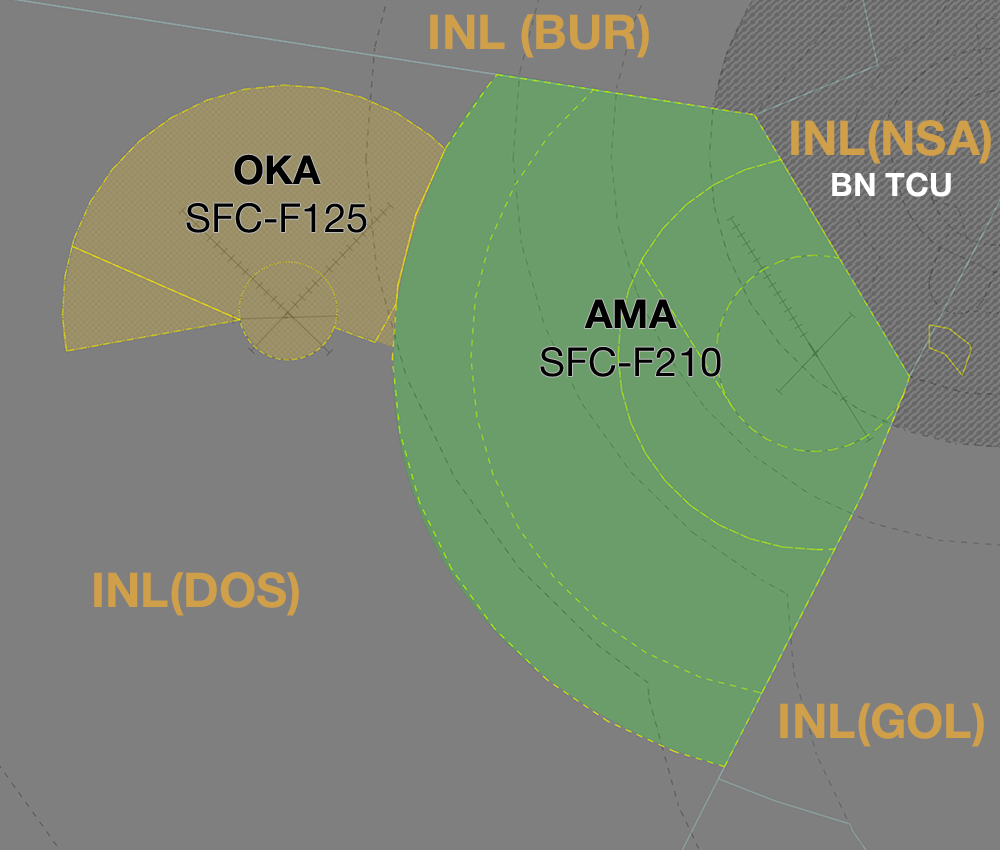
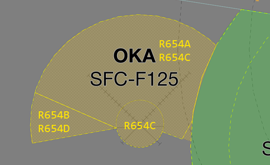

--8<-- "includes/abbreviations.md"

## Positions

| Name                          | ID      | Callsign                | Frequency   | Login ID      |
| ----------------------------- | ------- | ----------------------- | ----------- | ------------- |
| **Amberley Approach**         | **AMA** | **Amberley Approach**   | **126.200** | **AMB_APP**   |
| **Oakey Approach**            | **OKA** | **Oakey Approach**      | **125.400** | **OK_APP**    |

## Airspace
The vertical limits of the AMB TCU are `SFC` to `F210`.

The vertical limits of the OK TCU are `SFC` to `F125`.

<figure markdown>
{ width="700" }
  <figcaption>AMB/OK TCU Structure</figcaption>
</figure>

### Airspace Division

=== "AMB TCU"
    **AMA** owns the airspace contained within:

    - R625A (`A015`-`A085`)  
    - R625B (`A025`-`A085`)  
    - R625C (`A045`-`A085`)  
    - R625D (`A085`-`F210`)

    <figure markdown>
    { width="550" }
    <figcaption>AMB TCU Restricted Areas</figcaption>
    </figure>

    **AMB ADC** owns the Class C airspace in the AMB CTR from `SFC` to `A015`. 

=== "OK TCU"
    **OKA** owns the airspace contained within:

    - R654A (`SFC`-`A065`)  
    - R654B (`SFC`-`A065`)  
    - R654C (`A065`-`F125`)  
    - R654D (`A065`-`F125`)  

    <figure markdown>
    { width="550" }
    <figcaption>OK TCU Restricted Areas</figcaption>
    </figure>

    **OK ADC** owns the Class C airspace within 5 DME of the OK VOR from `SFC` to `A030`.

## Extending
AMA may extend to OKA and vice versa; callsigns remain the same. See [Controller Skills](../controller-skills/extending.md) for details.

## Local Procedures 
### YAMB
#### Coded Clearances
High performance military jet aircraft with planned operations in offshore SUA, or intending to depart to the east, will be assigned a Coded Clearance departure. These aircraft may arrive back to YAMB via the same corridor. These Coded Clearances provide a standardised corridor avoiding civilian traffic in the adjacent airspace. 

!!! tip
    Descriptions of the coded clearances are available in the [FIHA AD2 Supps](https://ais-af.airforce.gov.au/australian-aip){target=new}.

##### Departures
Aircraft will depart the circuit visually and track overhead YAMB to begin tracking for their initial waypoint. Aircraft cleared the BYRON1 must turn to the west on departure, and may set course for their inital waypoint within 10TAC AMB, remaining within the lateral limits of the AMB CTR in order to meet the inital constraint at `COWIE`.

AMB ACD will clear relevant departures via the appropriate coded clearance departure, update the FDR route field with the respective tracking points, and write the departure name in the Global Ops Field. 

The routes are shown below:

| Departure | Initial Constraint | Route |
| --------- | ----------| --------- |
| Northern 3 | `F190` by BINUP | BINUP MURJO BOBED LESKO MOSSI, or BINUP MURJO BOBED LESKO ADNUK |
| Central 3 | `F190` by BINUP | BINUP MURJO BOBED VIRGE |
| Byron 1 | `F190` by COWIE | COWIE KIWEE ZANET LOTMA SEMAJ | 

!!! important
    Ensure that aircraft meet the `F190` requirement by the first waypoint to ensure separation assurance is maintained with civil aircraft in the adjacent airspace.

##### Arrivals
Aircraft will be cleared for the coded clearance by **INL**/**NSA**, with the procedure terminating at the AMB TMA airspace boundary.

#### Civil Training Area
Civil operators (including Australian Air Force Cadets) conduct flying operations within the South Western Training Area (SWTA), located between the 10DME and 20DME arcs to the southwest of the AMB CTR. The SWTA is divided in half by the Rosewood-Mt Walker-Aratula Road into SWTA Alpha (north) and SWTA Bravo (south). The training area is classified Class G airspace but some pilots may request to climb into CTA to facilitate flight training (such as stall practice).

!!! tip
    Consider restricting an aircraft operating in the CTA above the SWTA to either SWTA Alpha or Bravo where doing so would provide lateral segregation from other traffic operating in the AMB CTA.

##### Outbound Aircraft
Aircraft outbound from YAMB for the SWTA will exit the CTR at `A025` via the following waypoints:

| **Duty Runway** | **Routing** |
|-----------------|------------ |
| 15              | MTWK        |
| 33              | CLVT        |
| 04 or 22        | As required |

##### Inbound Aircraft
Inbound aircraft will contact AMB TCU when ready to return to YAMB. They shall be cleared via the following waypoints, at either `A015` or `A025` (as desired):

| **Duty Runway** | **Routing** |
|-----------------|------------ |
| 15              | CLVT        |
| 33              | MTWK        | 
| 04 or 22        | As required |

Transfer these aircraft to ADC approaching the boundary.   

!!! phraseology  
    **ASTR203**: "Amberley Approach, ASTR203, 13nm southwest, A015, inbound, received Golf, request clearance"     
    **AMA**: "ASTR203, Amberley Aproach, cleared to YAMB via MTWK, maintain A015"  
    **ASTR203**: "Cleared to YAMB via MTWK, maintain A015, ASTR203"  
       
    **AMA**: "ASTR203, contact Amberley Tower, 118.3"  
    **ASTR203**: "118.3, ASTR203"  

### YBOK

#### Oakey Flying Training Area

##### Flying Training Areas

R654A, B, C and D are divided into the Western, North West and North East FTAs. These areas are the primary location for military helicopters conducting operations.

<figure markdown>
{ width="600" }
  <figcaption>Flying Training Areas</figcaption>
</figure>

##### Ops Normal

Aircraft shall report established once within the FTAs, and nominate an Ops Normal time. If the pilot does not volunteer an Ops Normal time, ATC shall provide one.

!!! phraseology
    **FRTL31:** "Oakey Approach, FRTL31, established western training area"    
    **OKA:** "FRTL31, call ops normal time 30"  
    **FRTL31:** "Ops normal time 30, FRTL31"  

##### Transit

Aircraft may wish to transit from their existing FTA to another FTA. In this case, they shall be cleared to their requested FTA, via their existing LFA, not above `A030`.

!!! phraseology
    **CYCP90:** "Oakey Approach, CYCP90, request northeast training area"  
    **OKA:** "CYCP90, recleared northeast training area, via northwest training area, not above A030"  
    **CYCP90:** "Recleared northeast training area, via northwest training area, not above A030, CYCP90"

## Departure and Arrival Procedures

### Departures

By default, aircraft will be cleared to transit to their requested FTAs by tracking direct. Aircraft outbound from YBOK for FTAs will depart the CIRA visually and track direct to their FTA.

### Arrivals

Inbound aircraft will contact OK TCU when ready to return to YBOK. They shall be cleared to YBOK direct, not above `A030`, and be instructed to contact ADC at 5 miles.

!!! phraseology
    **KNGT43:** "Oakey Approach, helicopter KNGT43, operations complete in northeast training area, request RTB YBOK"      
    **OKA:** "KNGT43, Oakey Approach, cleared to YBOK direct, not above A030, at 5 miles, contact Oakey Tower, 120.1"    
    **KNGT43:** "Cleared to YBOK direct, not above A030, at 5 miles, contact Oakey Tower, 120.1, KNGT43"  

## Coordination
### Enroute
#### Departures
All aircraft from AMB/OK TCU to INL(All) require [Heads-up](../controller-skills/coordination.md#heads-up) coordination prior to the boundary, however, as soon as practical (when is the aircraft becomes airborne) is preferred. 

#### Arrivals/Overfliers
All aircraft transiting from INL to **AMB TCU** and **OK TCU** must be [Heads-up](../controller-skills/coordination.md#heads-up) coordinated prior to **20nm** from the boundary. Operations within **AMB TCU** are fairly ad-hoc, so there are no standard assignable levels. GOL/DOS/BUR and **AMA**/**OKA** controller must agree on a suitable level during coordination.

!!! phraseology
    **GOL** -> **AMA**: "via HUUGO, PUMA11, will be assigned A090"  
    **AMA** -> **GOL**: "PUMA11, A090"  

### AMB/OK ADC
#### Departures
[Next](../controller-skills/coordination.md#next) coordination is required from AMB ADC to AMB TCU for all aircraft.

The Standard Assignable Level from  **AMB ADC** to **AMB TCU** is:  

| Assigned Departure | Level |
| ------------------ | ----- |
| Procedural SID | The lower of `F180` and `RFL` |
| Coded Departure | `F190` |

[Next](../controller-skills/coordination.md#next) coordination is required from OK ADC to OK TCU for all aircraft.

The Standard Assignable level from **OK ADC** to **OK TCU** is:

| Aircraft | Level |
| -------- | ----- |
| Fixed-wing | The lower of `F120` and `RFL` |
| Rotary-wing | The lower of `A030` and `RFL` |

### BN TCU
All aircraft transiting from **BN TCU** to **AMB TCU** and vice versa must be [Heads-up](../controller-skills/coordination.md#heads-up) coordinated prior to the boundary. 

!!! phraseology
    **AMA** -> **BDN**: "via BN, DRGN02"  
    **BDN** -> **AMA**: "DRGN02, `F140`"  

For aircraft arriving into AMB TCU there is no standard assignable level.

!!! phraseology
    **BDN** -> **AMA**: "via WACKO, STAL13, what level can I assign?"  
    **AMA** -> **BDN**: "STAL13, `A100`"  
    **BDN** -> **AMA**: "`A100`, STAL13"  

### AMB/OK Internal
All aircraft transiting between the AMB/OK TCU boundary must be heads-up coordinated.

!!! phraseology
    **OKA** -> **AMA**: "via AGIVA, ANGL32"  
    **AMA** -> **OKA**: "ANGL32, A025"   

## Charts
!!! abstract "Reference"
    Additional charts to the AIP may be found in the RAAF TERMA document, available towards the bottom of [RAAF AIP page](https://ais-af.airforce.gov.au/australian-aip){target=new}
