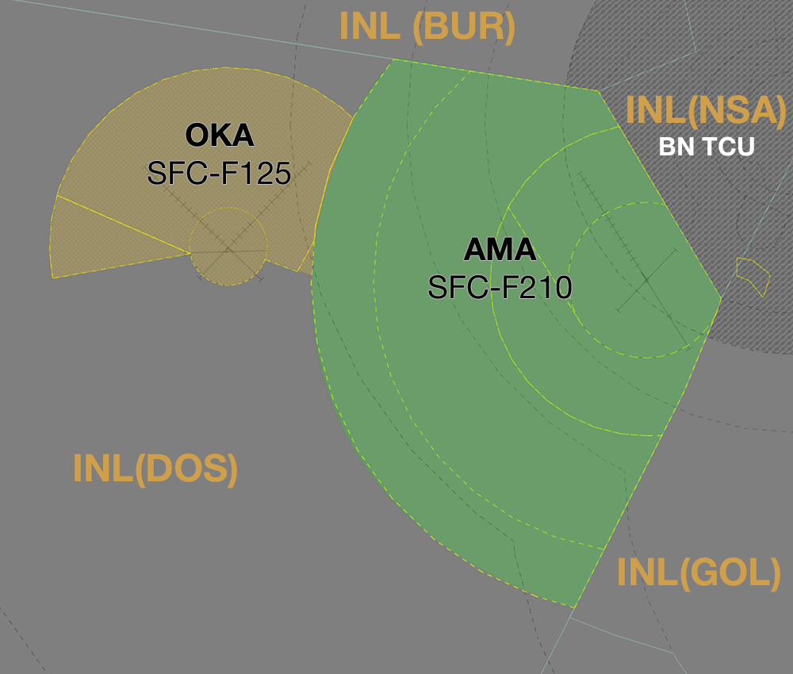
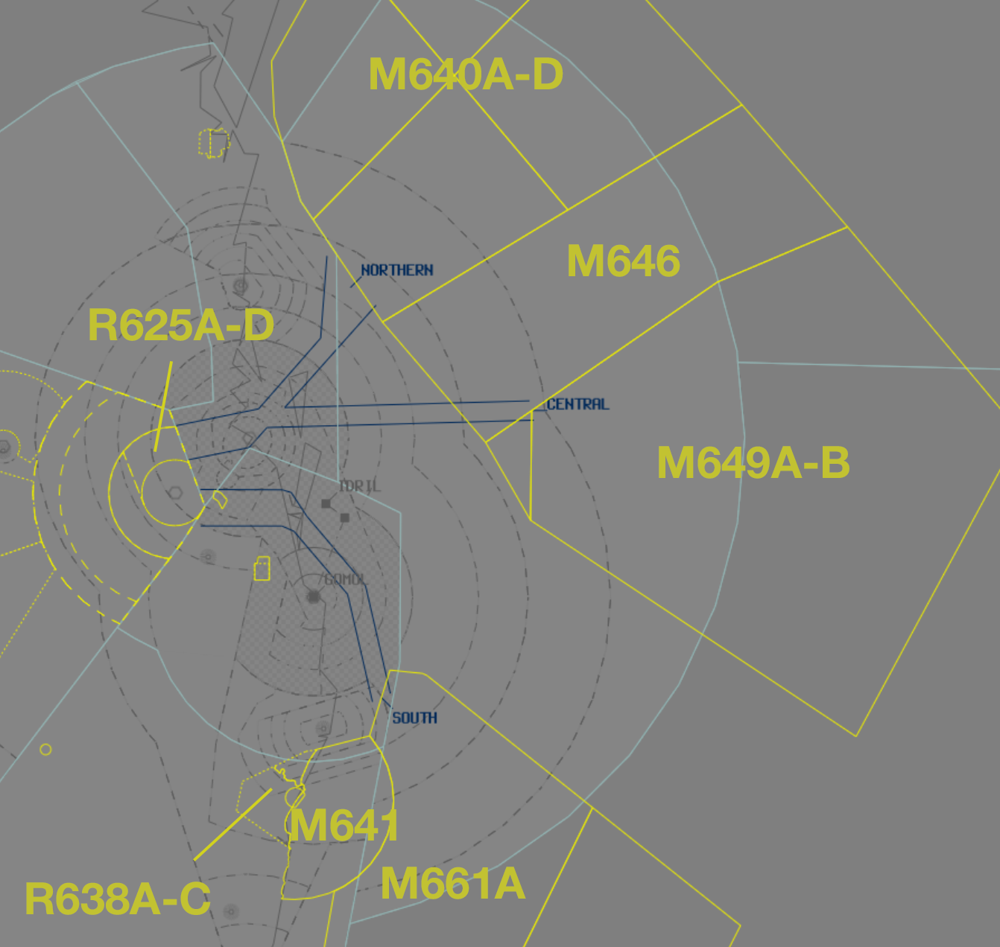
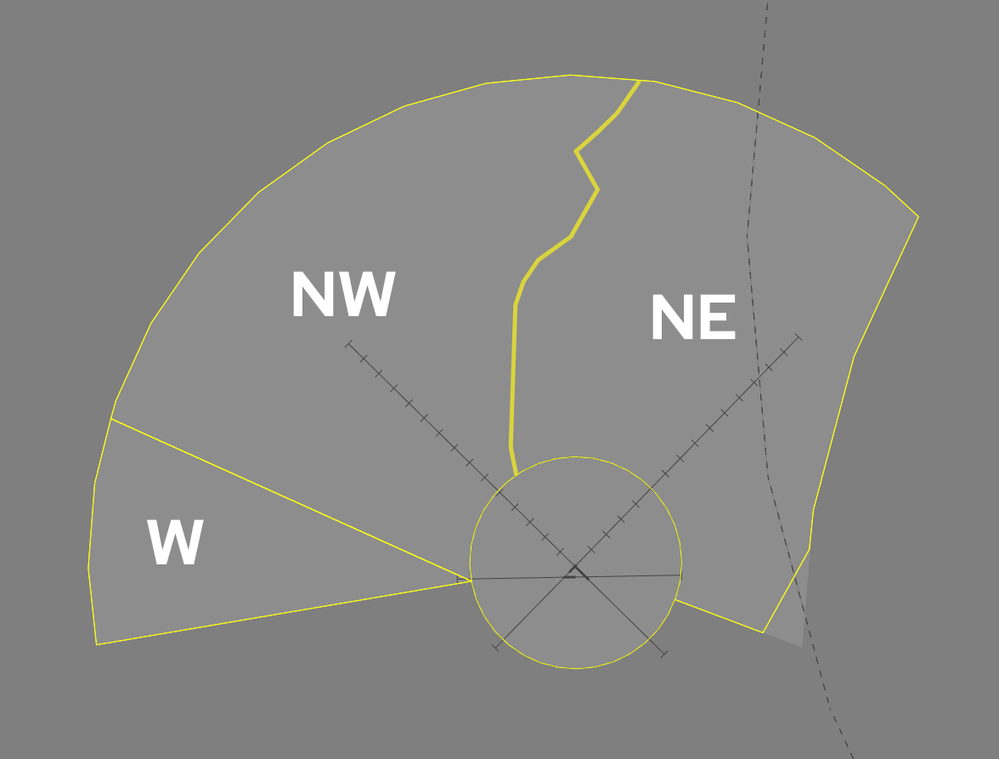

--8<-- "includes/abbreviations.md"

## Positions

| Name                          | ID      | Callsign                | Frequency   | Login ID      |
| ----------------------------- | ------- | ----------------------- | ----------- | ------------- |
| **Amberley Approach**         | **AMA** | **Amberley Approach**   | **126.200** | **AMB_APP**   |
| **Oakey Approach**            | **OKA** | **Oakey Approach**      | **125.400** | **OK_APP**    |

!!! note
    Amberley TCU is a [military TCU](../../controller-skills/military/#military-aerodromes) and procedures can differ significantly to those in a civil TCU. Ensure you are familiar with the [military controller skills](../../controller-skills/military) necessary to provide a quality service.

## Airspace
The vertical limits of the AMB TCU are `SFC` to `F210`. The vertical limits of the OK TCU are `SFC` to `F125`.

<figure markdown>
{ width="700" }
  <figcaption>AMB/OK TCU Structure</figcaption>
</figure>

### AMB ADC
**AMB ADC** owns the Class C airspace in the AMB CTR from `SFC` to `A015`. 

### OK ADC
**OK ADC** owns the Class C airspace within 5 DME of the OK VOR from `SFC` to `A030`.

### Extending
AMA may extend to OKA and vice versa; callsigns remain the same. See [Controller Skills](../../controller-skills/extending/#terminal-area) for details.

### Restricted Area Activations
When **AMA** is online, the following [restricted areas](../../controller-skills/sua/#restricted-areas) are [activated](../../controller-skills/sua/#activation-of-sua) by default, and reclassified as Class C airspace.

- R625A (`A015`-`A085`)  
- R625B (`A025`-`A085`)  
- R625C (`A045`-`A085`)  
- R625D (`A085`-`F210`)

When **OKA** is online, the following [restricted areas](../../controller-skills/sua/#restricted-areas) are [activated](../../controller-skills/sua/#activation-of-sua) by default, and reclassified as Class C airspace.

- R654A (`SFC`-`A065`)  
- R654B (`SFC`-`A065`)  
- R654C (`A065`-`F125`)  
- R654D (`A065`-`F125`)  

#### SUA in Enroute Airspace
Military operations taking place in SUA in enroute airspace are outside the jurisdiction of AMB/OK TCU.

Upon receiving [airways clearance coordination from ACD](#acd-to-tcu) of an aircraft intending to operate in a currently inactive SUA in enroute airspace, AMB/OK TCU must give **heads up** coordination to relevant enroute controllers.

This gives the enroute controller sufficient time to assess the request, make necessary adjustments to any aircraft in the area currently, and activate the SUA; or alternately to refuse the activation request before the aircraft is in the air.

!!! phraseology
    *CRNG21 is requesting clearance to operate in the M640A-D restricted area.*  
    **AMB ACD** -> **AMA**: "CRNG21 requests clearance to M640A-D”  
    **AMA** -> **AMB ACD**: "Standby, call you back."  
     
    **AMA** -> **DOS**: "On the groud YAMB, CRNG21, requests activation of M640A-D `A050-F600`, from 0300 until 0500. [My onwards](../../../controller-skills/coordination/#onwards-coordination) with SDY.”  
    **DOS** -> **AMA**: "CRNG21, your onwards with SDY."   
    **AMA** -> **DOS**: "CRNG21."  
        
    **AMA** -> **SDY**: "On the groud YAMB, CRNG21, requests activation of M640A-D `A050-F600`, from 0300 until 0500. [My onwards](../../../controller-skills/coordination/#onwards-coordination) with DOS.”  
    **DOS** -> **AMA**: "CRNG21, expect activation of M640A-D `A050-F600`, from 0300 until 0500. Your onwards with DOS."   
    **AMA** -> **DOS**: "CRNG21." 
      
    **AMA** -> **AMB ACD**: "CRNG21, clearance approved."   
    **AMB ACD** -> **AMA**: "Clearance approved, CRNG21"  
	
!!! note
    The requirement to coordinate activation of an SUA is in **addition** to existing coordination requirements. [**Heads-up** coordination](#departures) is still required for these aircraft if they do not meet the voiceless coordination criteria.

## Local Procedures
### Initial Pitch Procedures
The [intial points](../../controller-skills/military/#initial-and-pitch) at YAMB are aligned with Engine Test Cell 2 at the following locations.

| RWY  | Initial Point | Altitude |
| ---- | ------------- | -------- |
| 15   | 5NM downwind  | `A020`   |
| 33   | 5NM downwind  | `A020`   |

### Military Gates
There are numerous [military gates](../../controller-skills/military/#military-gates) established throughout the AMB/OK TCU to facilitate entry and exit to adjoining SUA.

<figure markdown>
{ width="700" }
  <figcaption>AMB/OK SUA Gates</figcaption>
</figure>

If the pilot **does not** nominate a gate, or nominates a gate that does not provide access to their intended SUA, AMB/OK ACD should clear the aircraft to depart via the **appropriate gate**.

| Intended SUA    | TCU Exit Gate       |
| --------------- | ------------------- |
| M640A-D         | [Northern Corridor](#northern-corridor) |
| M646            | [Central Corridor](#central-corridor) |
| M649A-B         | [Central Corridor](#central-corridor) |
| M661A-B         | [Byron Corridor](#byron-corridor) |
| R639A-D         | BEACH               | 

!!! tip
    [Coordination requirements](#acd-to-tcu) exist between ACD and TCU when aircraft are requesting clearance to operate in an SUA that has not been activated. Controllers performing the role of ACD should ensure they coordinate with TCU before providing clearance
    
### Military Corridors
There are three [military corridors](../../controller-skills/military/#military-corridors) established around the 
AMB TCU to facilitate transit of military aircraft between the TCU and adjoining SUAs.

<figure markdown>
{ width="700" }
  <figcaption>AMB TCU Military Corridors</figcaption>
</figure>

These corridors are located **outside** the jurisdiction of AMB TCU.

#### Northern Corridor
The **Northern Corridor** is used by aircraft to transit civilian enroute airspace between the AMB TCU and the M640A-D MOAs.

Aircraft departing to the areas will be cleared the **NORTHERN 5** coded clearance by ACD, aircraft returning to the airport will be cleared the **NORTHERN 6** coded clearance by INL(SDY).

Aircraft transiting the Northern corridor should be assigned the appropriate altitude to ensure separation with opposite direction traffic while transiting to their desired restricted area.

| Coded Clearance | Altitude |
| --------------- | -------- |
| NORTHERN 5      | `F190` at BINUP, `F260` at MURJO  |
| NORTHERN 6      | `F270` at MOSSI/ADNUK, `F200` at ANKED |

!!! note
    Aircraft tracking via the NORTHERN coded clearance does **not** constitute a voiceless coordination route between AMB TCU and INL(NSA). Aircraft should still be heads-up coordinated prior to **5 minutes** to the boundary, unless coordinated otherwise.

#### Central Corridor
The **Central Corridor** is used by aircraft to transit civilian enroute airspace between the AMB TCU and the M646 and M649A-B MOAs.

Aircraft departing to the areas will be cleared the **CENTRAL 5** coded clearance by ACD, aircraft returning to the airport will be cleared the **CENTRAL 6** coded clearance by INL(SDY).

Aircraft transiting the Central corridor should be assigned the appropriate altitude to ensure separation with opposite direction traffic while transiting to their desired restricted area.

| Coded Clearance | Altitude |
| --------------- | -------- |
| CENTRAL 5       | `F190` at BINUP, `F260` at MURJO  |
| CENTRAL 6       | `F280` at VIRGE, `F200` at ANKED |

!!! note
    Aircraft tracking via the CENTRAL coded clearance does **not** constitute a voiceless coordination route between AMB TCU and INL(NSA). Aircraft should still be heads-up coordinated prior to **5 minutes** to the boundary, unless coordinated otherwise.
    
#### Byron Corridor
The **Byron Corridor** is used by aircraft to transit civilian enroute airspace between the AMB TCU and the [Evans Head SUAs](../../enroute/brisbane/INL/#m661a-b-m641-and-r638a-c-evans-head).

Aircraft departing to the areas will be cleared the **BYRON 1** coded clearance by ACD, aircraft returning to the airport will be cleared the **BYRON 2** coded clearance by INL(SDY).

Aircraft transiting the Byron corridor should be assigned the appropriate altitude to ensure separation with opposite direction traffic while transiting to their desired restricted area.

| Coded Clearance | Altitude |
| --------------- | -------- |
| BYRON 1         | `F190` at COWIE, `F260` at KIWEE  |
| BYRON 2         | `F270` at SEMAJ, `F200` and TUGUN |

!!! note
    Aircraft tracking via the BYRON coded clearance does **not** constitute a voiceless coordination route between AMB TCU and INL(GOL). Aircraft should still be heads-up coordinated prior to **5 minutes** to the boundary, unless coordinated otherwise.

### Training Areas 
#### Civil Training Area
Civil operators (including Australian Air Force Cadets) conduct flying operations within the South Western Training Area (SWTA), located between the 10DME and 20DME arcs to the southwest of the AMB CTR. The SWTA is divided in half by the Rosewood-Mt Walker-Aratula Road into SWTA Alpha (north) and SWTA Bravo (south). The training area is classified Class G airspace but some pilots may request to climb into CTA to facilitate flight training (such as stall practice).

!!! tip
    Consider restricting an aircraft operating in the CTA above the SWTA to either SWTA Alpha or Bravo where doing so would provide lateral segregation from other traffic operating in the AMB CTA.

##### Outbound Aircraft
Aircraft outbound from YAMB for the SWTA will exit the CTR at `A025` via the following waypoints:

| **Duty Runway** | **Routing** |
|-----------------|------------ |
| 15              | MTWK        |
| 33              | CLVT        |
| 04 or 22        | As required |

##### Inbound Aircraft
Inbound aircraft will contact AMB TCU when ready to return to YAMB. They shall be cleared via the following waypoints, at either `A015` or `A025` (as desired):

| **Duty Runway** | **Routing** |
|-----------------|------------ |
| 15              | CLVT        |
| 33              | MTWK        | 
| 04 or 22        | As required |

Transfer these aircraft to ADC approaching the boundary.   

!!! phraseology  
    **ASTR203**: "Amberley Approach, ASTR203, 13nm southwest, A015, inbound, received Golf, request clearance"     
    **AMA**: "ASTR203, Amberley Aproach, cleared to YAMB via MTWK, maintain A015"  
    **ASTR203**: "Cleared to YAMB via MTWK, maintain A015, ASTR203"  
       
    **AMA**: "ASTR203, contact Amberley Tower, 118.3"  
    **ASTR203**: "118.3, ASTR203"  

#### Oakey Flying Training Area
R654A, B, C and D are divided into the Western, North West and North East FTAs. These areas are the primary location for military helicopters conducting operations.

<figure markdown>
{ width="600" }
  <figcaption>Flying Training Areas</figcaption>
</figure>

##### Ops Normal

Aircraft shall report established once within the FTAs, and nominate an Ops Normal time. If the pilot does not volunteer an Ops Normal time, ATC shall provide one.

!!! phraseology
    **FRTL31:** "Oakey Approach, FRTL31, established western training area"    
    **OKA:** "FRTL31, call ops normal time 30"  
    **FRTL31:** "Ops normal time 30, FRTL31"  

##### Transit

Aircraft may wish to transit from their existing FTA to another FTA. In this case, they shall be cleared to their requested FTA, via their existing FTA, not above `A030`.

!!! phraseology
    **CYCP90:** "Oakey Approach, CYCP90, request northeast training area"  
    **OKA:** "CYCP90, recleared northeast training area, via northwest training area, not above A030"  
    **CYCP90:** "Recleared northeast training area, via northwest training area, not above A030, CYCP90"

## Departure and Arrival Procedures

### Departures

By default, aircraft will be cleared to transit to their requested FTAs by tracking direct. Aircraft outbound from YBOK for FTAs will depart the CIRA visually and track direct to their FTA.

### Arrivals

Inbound aircraft will contact OK TCU when ready to return to YBOK. They shall be cleared to YBOK direct, not above `A030`, and be instructed to contact ADC at 5 miles.

!!! phraseology
    **KNGT43:** "Oakey Approach, helicopter KNGT43, operations complete in northeast training area, request RTB YBOK"      
    **OKA:** "KNGT43, Oakey Approach, cleared to YBOK direct, not above A030, at 5 miles, contact Oakey Tower, 120.1"    
    **KNGT43:** "Cleared to YBOK direct, not above A030, at 5 miles, contact Oakey Tower, 120.1, KNGT43"  

## Coordination
### Enroute
#### Departures
All aircraft from AMB/OK TCU to INL(All) require [Heads-up](../controller-skills/coordination.md#heads-up) coordination prior to the boundary, however, as soon as practical (when is the aircraft becomes airborne) is preferred. 

#### Arrivals/Overfliers
All aircraft transiting from INL to **AMB TCU** and **OK TCU** must be [Heads-up](../controller-skills/coordination.md#heads-up) coordinated prior to **20nm** from the boundary. Operations within **AMB TCU** are fairly ad-hoc, so there are no standard assignable levels. GOL/DOS/BUR and **AMA**/**OKA** controller must agree on a suitable level during coordination.

!!! phraseology
    **GOL** -> **AMA**: "via HUUGO, PUMA11, will be assigned A090"  
    **AMA** -> **GOL**: "PUMA11, A090"  

### AMB/OK ADC
#### Departures
[Next](../controller-skills/coordination.md#next) coordination is required from AMB ADC to AMB TCU for all aircraft.

The Standard Assignable Level from  **AMB ADC** to **AMB TCU** is:  

| Assigned Departure | Level  |
| ------------------ | ------ |
| Coded Clearance    | `F190` |
| All others         | The lower of `F180` and `RFL` |

[Next](../controller-skills/coordination.md#next) coordination is required from OK ADC to OK TCU for all aircraft.

The Standard Assignable level from **OK ADC** to **OK TCU** is:

| Aircraft | Level |
| -------- | ----- |
| Fixed-wing | The lower of `F120` and `RFL` |
| Rotary-wing | The lower of `A030` and `RFL` |

#### ACD to TCU
The controller assuming responsibility of **ACD** shall give [heads-up](../../controller-skills/coordination/#airways-clearance) coordination to AMA/OKA (or the enroute controller responsible for the AMB/OK TCU) prior to the issue of a clearance to an aircraft intending to operate in an SUA that **has not** been activated. 

!!! phraseology
    **AMB ACD** -> **AMA**: "CRNG21 requests clearance to M640A-D.”  
    **AMA** -> **AMB ACD**: "CRNG21, clearance approved."

Most military operations will take place in SUA adjoining the [TCU in enroute airspace](#sua-in-enroute-airspace). AMB/OK TCU must coordinate the activation of these SUAs with the relevant enroute controllers **prior** to approving any clearances.

### BN TCU
All aircraft transiting from **BN TCU** to **AMB TCU** and vice versa must be [Heads-up](../controller-skills/coordination.md#heads-up) coordinated prior to the boundary. 

!!! phraseology
    **AMA** -> **BDN**: "via BN, DRGN02"  
    **BDN** -> **AMA**: "DRGN02, `F140`"  

For aircraft arriving into AMB TCU there is no standard assignable level.

!!! phraseology
    **BDN** -> **AMA**: "via WACKO, STAL13, what level can I assign?"  
    **AMA** -> **BDN**: "STAL13, `A100`"  
    **BDN** -> **AMA**: "`A100`, STAL13"  

### AMB/OK Internal
All aircraft transiting between the AMB/OK TCU boundary must be heads-up coordinated.

!!! phraseology
    **OKA** -> **AMA**: "via AGIVA, ANGL32"  
    **AMA** -> **OKA**: "ANGL32, A025"   

## Charts
!!! abstract "Reference"
    In addition to the civilian `ERSA` and `AIP` publications, [the RAAF AIP website](https://ais-af.airforce.gov.au/australian-aip){target=new} contains the necessary charts (available in the TERMA) and description of procedures (in each airports' FIHA).