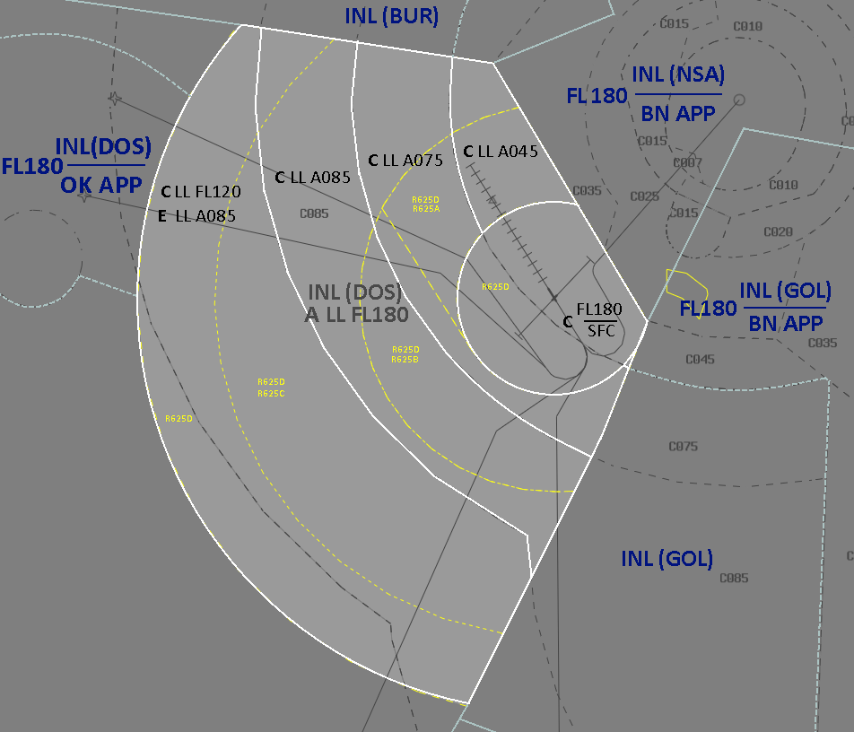
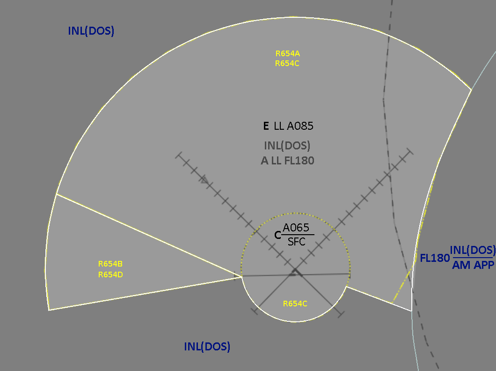

--8<-- "includes/abbreviations.md"

--8<-- "includes/abbreviations.md"

## Positions

| Name               | Callsign       | Frequency        | Login Identifier              |
| ------------------ | -------------- | ---------------- | --------------------------------------|
| Amberley TCU   | Amberley Approach   | 126.200        | AM_APP                                   |
| Oakey TCU   | Oakey Approach | 125.400        | OK_APP                                   |

## Airspace
### AM TCU
#### Restricted Areas
By Default YAMB owns all of the R625 Restricted Areas, detailed below:

- R625A (`A015`-`A085`)  
- R625B (`A025`-`A085`)  
- R625C (`A045`-`A085`)  
- R625D (`A085`-`F210`)  

### Optional, as required
AM APP can negotiate further airspace releases from surrounding ENR sectors to facilitate planned military operations of the following Restricted Areas:

- R650A (`A050`-`A100`)  
- R650B (`A050`-`F600`)  
- R662A (`A050`-`F600`)  
- R662B (`A050`-`F600`)  
- R671A (`F125`-`F245`)  
- R671B (`F240`-`F600`)

!!! note
    See [VATPAC Notams](https://vatpac.org/publications/notam){target=new} for active NOTAMs which may affect military operations.

#### Diagram

<figure markdown>
{ width="952" }
  <figcaption>AM TCU Airspace Diagram</figcaption>
</figure>

### AM ADC
AM ADC owns the Class C airspace in the AM CTR within 10nm of the YAMB ARP from `SFC` to `A015`. 

### OK TCU
#### Restricted Areas
By Default YBOK owns all of the R625 Restricted Areas, detailed below:

- R654A (`SFC`-`A065`)  
- R6545B (`SFC`-`A065`)  
- R654C (`A065`-`F125`)  
- R654D (`A065`-`F125`)  

#### Diagram

<figure markdown>
{ width="1060" }
  <figcaption>OK TCU Airspace Diagram</figcaption>
</figure>

### OK ADC
OK ADC owns the CLass C airspace within 5 DME of the OK VOR from `SFC` to `A025`. This airspace is the circuit area.

## YAMB Aerodrome
### Coded Departures (Fast Jets)
Visual Departures are commonly requested which are often in the form of a coded departure (e.g. BYRON7 departure), which can be found in the AD2 Sups Page for Amberley. These coded departures provide a corridor with altitude constraints to join the Military Training Areas east of Brisbane avoiding civilian traffic inbound to Brisbane. 

Aircraft will make a visual departure in the circuit direction and fly overhead YAMB to begin tracking for their initial waypoint.

!!! example
    WOLF03 was assiged the BYRON7 departure with their intial clearance.  
    **AM ADC**: "WOLF03, make left turn, reach `F190` by COWIE, cleared for takeoff"  
    **WOLF03**: "Make left turn, reach `F190` by COWIE, cleared for takeoff, WOLF03"  

| Departure | Initial Constraint | Route |
| --------- | ----------| --------- |
| Northern 1 | `F190` at BINUP | BINUP MURJO BOBED LESKO MOSSI/ADNUK (Transition) |
| Central 1 | `F190` at BINUP | BINUP MURJO BOBED VIRGE |
| Byron 7 | `F190` at BINUP | COWIE KIWEE ZANET LOTMA SEMAJ |

!!! note
    Charts for the Coded Departures may be in YAMB AD2 Supplements 6.2.25.11 available here: [RAAF AIP page](https://ais-af.airforce.gov.au/australian-aip){target=new}

## Charts
!!! note
    Additional charts to the AIP may be found in the RAAF TERMA document, available towards the bottom of [RAAF AIP page](https://ais-af.airforce.gov.au/australian-aip){target=new}

## YAMB Coordination
### AMB ADC

'Next' coordination is required from AM ADC to AM TCU for all aircraft.

!!! example
    **AM ADC** -> **AM TCU**: "Next, ASY01, runway 33"  
    **AM TCU** -> **AM ADC**: "ASY01, Assigned Heading Right 030, unrestricted"  
    **AM ADC** -> **AM TCU**: "Assigned Heading Heading Right 030, ASY01"  

### Enroute
#### Departures
Departing aircraft require heads up coordiantion to INL(All) as soon as practical (aircraft becomes airborne in most cases). Note since there are no assignable level assign the most pracitcal (ie. `F180` due airspace celling or coordinate higher for high performance jets).

!!! example
    **AM TCU** -> **DOS**: "DRGN02, with your concurrence assigned `F180`"  
    **DOS** -> **AM TCU**: "DRGN02, `F180`"  

!!! example
    BUCK03 is assigned the BYRON 7 coded departure. 
    **AM TCU** -> **DOS**: "BUCK03, with your concurrence assigned `F260`, Byron 7 departure."  
    **DOS** -> **AM TCU**: "BUCK03, `F260`"  

#### Arrivals/Overlfies
All aircraft transiting from GOL/DOS/BUR to **AM TCU** and **OK TCU** must be heads-up coordinated prior to **20nm** from the boundary. Operations within **AMB TCU** are fairly ad-hoc, so there are no standard assignable levels, simply whatever the GOL/DOS/BUR and **AM TCU**/**OK TCU** controller agree on.

!!! example
    **GOL** -> **AMB TCU**: "via HUUGO, PUMA11, will be assigned A090"  
    **AMB TCU** -> **GOL**: "PUMA11, A090"  

## YBOK Coordination
Next coordination is required from **OK ADC** to **OK TCU**.
Heads up coordination is also required for arrivals and departures between **OK TCU** and **DOS(INL)**